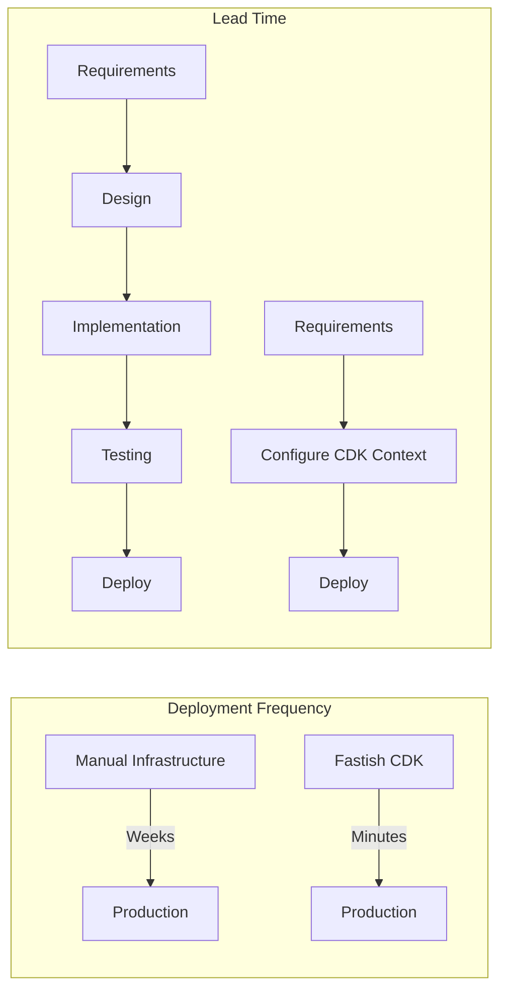
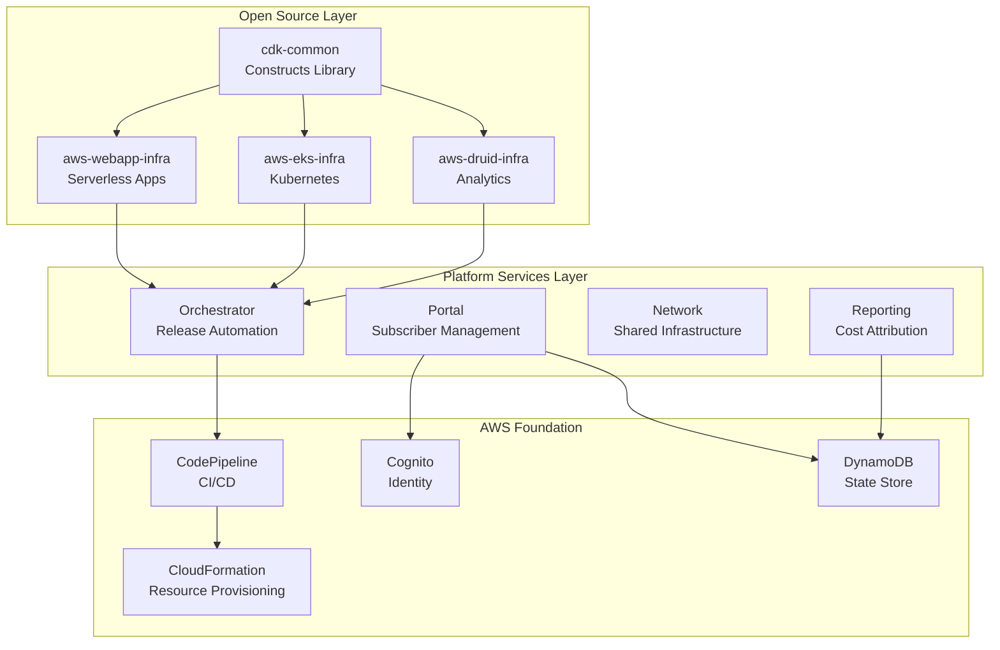
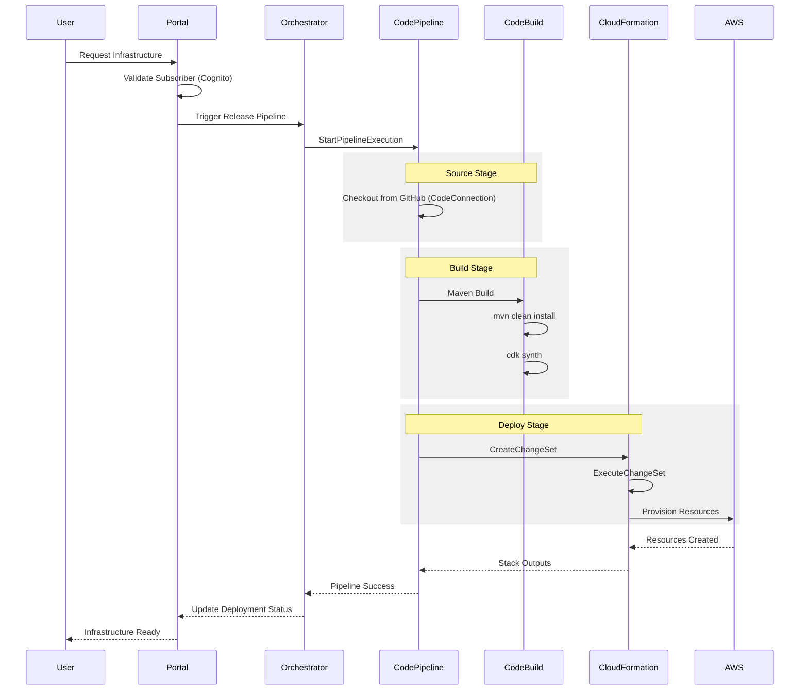
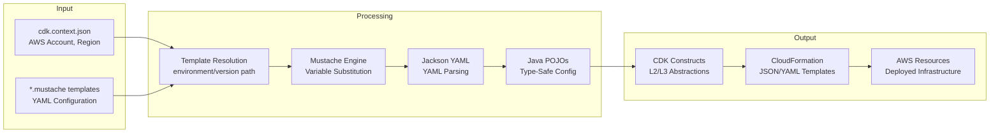
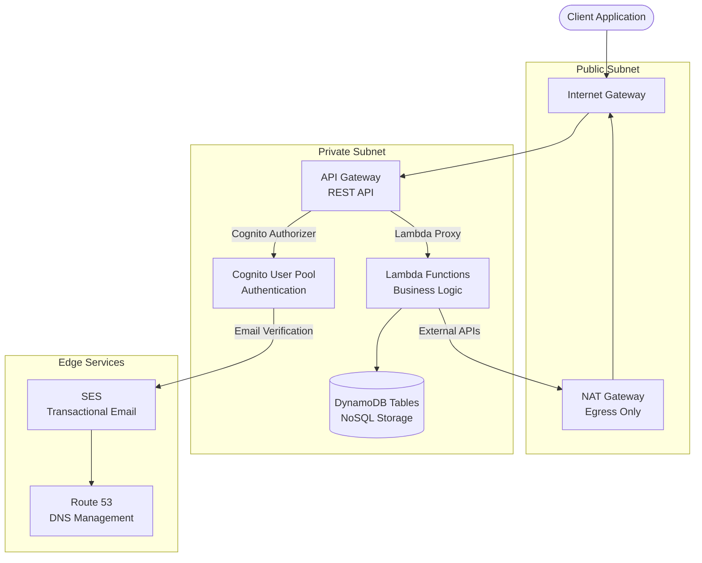
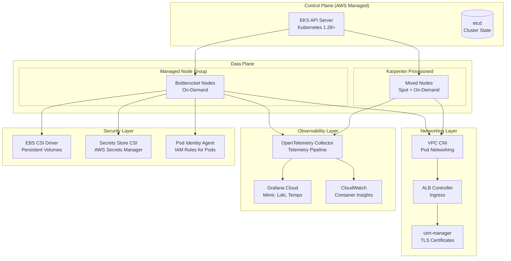
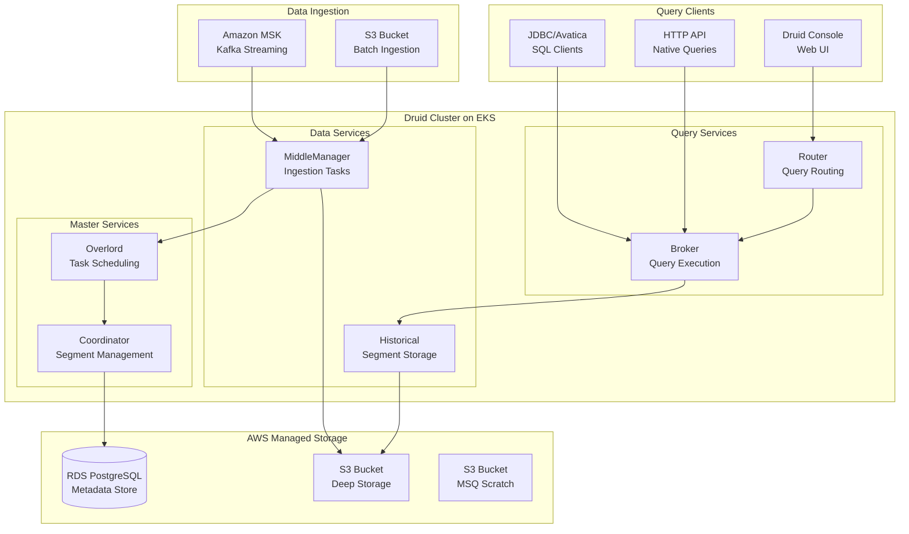
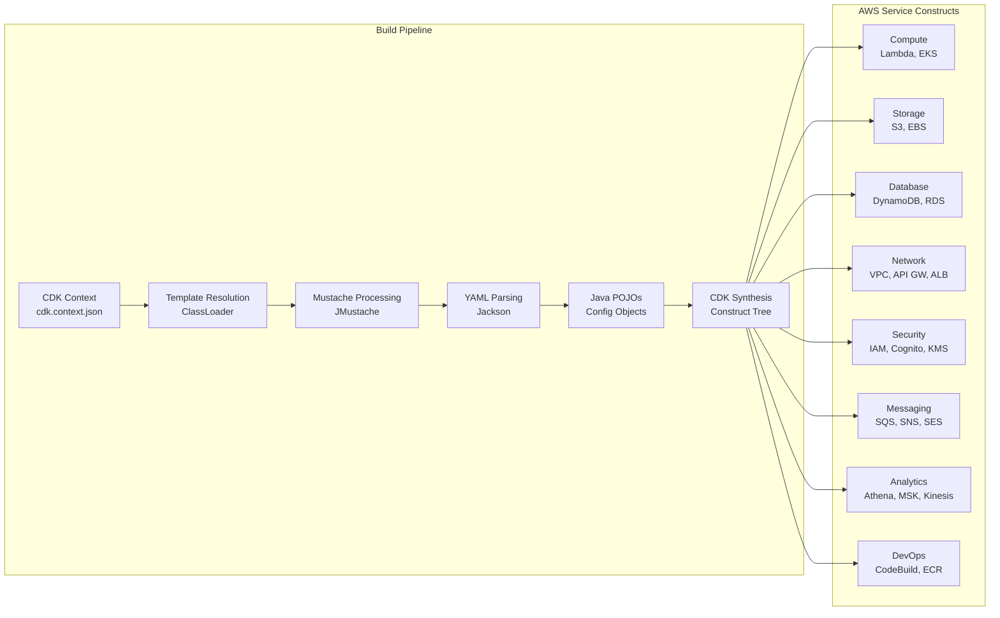
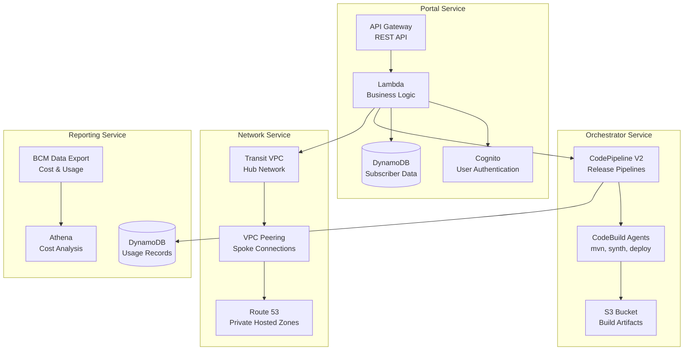
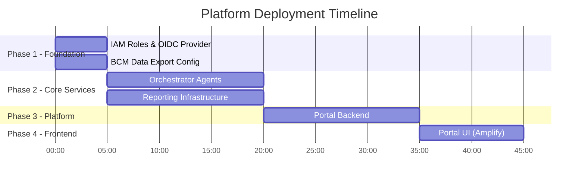

# Fastish Documentation

<div align="center">

*AWS infrastructure automation platform delivering production-ready cloud infrastructure through codified patterns and automated deployment pipelines.*

[](https://aws.amazon.com/cdk/)
[](https://www.oracle.com/java/)
[](https://aws.amazon.com/cloudformation/)
[](https://opensource.org/licenses/MIT)

**[Getting Started](#quick-start)** · **[Documentation](#documentation)** · **[Examples](examples/README.md)** · **[Changelog](CHANGELOG.md)**

</div>

---

**Last Updated**: 2024-01 · **Version**: 1.0.0

---

## Overview

Fastish is an infrastructure-as-a-service platform that reduces time-to-production for AWS workloads. The platform encodes infrastructure decisions into reusable [AWS CDK](https://aws.amazon.com/cdk/) constructs and [CloudFormation](https://aws.amazon.com/cloudformation/) templates, enabling engineering teams to deploy compliant, well-architected infrastructure without deep AWS expertise.

The platform implements patterns from the [AWS Well-Architected Framework](https://aws.amazon.com/architecture/well-architected/) across all five pillars:

| Pillar | Implementation | Reference |
|--------|----------------|-----------|
| **Operational Excellence** | Infrastructure as code, automated deployments, runbooks | [OPS Pillar](https://docs.aws.amazon.com/wellarchitected/latest/operational-excellence-pillar/welcome.html) |
| **Security** | Least privilege IAM, encryption, network isolation | [SEC Pillar](https://docs.aws.amazon.com/wellarchitected/latest/security-pillar/welcome.html) |
| **Reliability** | Multi-AZ deployments, auto-scaling, health checks | [REL Pillar](https://docs.aws.amazon.com/wellarchitected/latest/reliability-pillar/welcome.html) |
| **Performance Efficiency** | Right-sizing, caching, serverless where appropriate | [PERF Pillar](https://docs.aws.amazon.com/wellarchitected/latest/performance-efficiency-pillar/welcome.html) |
| **Cost Optimization** | Spot instances, on-demand scaling, cost allocation tags | [COST Pillar](https://docs.aws.amazon.com/wellarchitected/latest/cost-optimization-pillar/welcome.html) |

---

## DORA Metrics Impact

Fastish infrastructure automation directly improves [DORA (DevOps Research and Assessment)](https://dora.dev/) metrics, the industry-standard measure of software delivery performance established by [Google Cloud's State of DevOps research](https://cloud.google.com/devops/state-of-devops):

| Metric | Definition | Without Fastish | With Fastish | Improvement |
|--------|------------|-----------------|--------------|-------------|
| **Deployment Frequency** | How often code is deployed to production | Weekly/Monthly | On-demand | 10-30x increase |
| **Lead Time for Changes** | Time from commit to production | Days to weeks | 30-45 minutes | 95%+ reduction |
| **Change Failure Rate** | Percentage of deployments causing failures | 15-45% | <5% | Codified patterns |
| **Mean Time to Recovery** | Time to restore service after incident | Hours | Minutes | IaC + rollback |

### How Fastish Improves Each Metric



**Deployment Frequency** ([DORA Definition](https://dora.dev/guides/dora-metrics-four-keys/)): Self-service infrastructure provisioning eliminates ticket-based workflows. Teams deploy when ready, not when infrastructure teams have capacity. This aligns with the [DevOps principle of flow](https://itrevolution.com/articles/the-three-ways-principles-underpinning-devops/).

**Lead Time for Changes** ([DORA Definition](https://dora.dev/guides/dora-metrics-four-keys/)): Pre-built, tested CDK constructs eliminate design and implementation phases. Configuration-driven deployment reduces lead time from weeks to under an hour. See [Accelerate: The Science of Lean Software](https://itrevolution.com/product/accelerate/) for research on lead time impact.

**Change Failure Rate** ([DORA Definition](https://dora.dev/guides/dora-metrics-four-keys/)): Codified patterns enforce organizational standards. [CloudFormation validation](https://docs.aws.amazon.com/AWSCloudFormation/latest/UserGuide/using-cfn-validate-template.html) catches misconfigurations before deployment. [Nested stack architecture](https://docs.aws.amazon.com/AWSCloudFormation/latest/UserGuide/using-cfn-nested-stacks.html) isolates blast radius.

**Mean Time to Recovery** ([DORA Definition](https://dora.dev/guides/dora-metrics-four-keys/)): Infrastructure-as-code enables rapid environment recreation per [IaC best practices](https://docs.aws.amazon.com/whitepapers/latest/introduction-devops-aws/infrastructure-as-code.html). [CloudFormation automatic rollback](https://docs.aws.amazon.com/AWSCloudFormation/latest/UserGuide/stack-failure-options.html) reverts failed deployments. Observability stack provides immediate visibility into failures.

---

## Platform Architecture

### System Overview



### Deployment Pipeline Flow

The deployment pipeline implements [AWS CodePipeline](https://docs.aws.amazon.com/codepipeline/latest/userguide/welcome.html) with [CodeBuild](https://docs.aws.amazon.com/codebuild/latest/userguide/welcome.html) for a fully automated CI/CD workflow:



### Build Process Detail

The build process uses [Mustache](https://mustache.github.io/mustache.5.html) templating with [Jackson YAML](https://github.com/FasterXML/jackson-dataformats-text/tree/master/yaml) for type-safe configuration:



**Processing Stages**:

| Stage | Technology | Purpose | Reference |
|-------|------------|---------|-----------|
| **Template Resolution** | Java ClassLoader | Load templates from `{environment}/{version}/` path | [Resource Loading](https://docs.oracle.com/javase/tutorial/essential/io/resources.html) |
| **Mustache Processing** | [JMustache](https://github.com/samskivert/jmustache) | Logic-less template variable substitution | [Mustache Manual](https://mustache.github.io/mustache.5.html) |
| **YAML Parsing** | [Jackson YAML](https://github.com/FasterXML/jackson-dataformats-text) | Convert YAML to Java objects | [Jackson Docs](https://github.com/FasterXML/jackson-docs) |
| **CDK Synthesis** | [AWS CDK](https://docs.aws.amazon.com/cdk/v2/guide/home.html) | Generate CloudFormation from constructs | [CDK Concepts](https://docs.aws.amazon.com/cdk/v2/guide/core_concepts.html) |

---

## Open Source Projects

### aws-webapp-infra

Production-ready serverless web application infrastructure implementing a multi-tier architecture following [AWS Serverless Application Lens](https://docs.aws.amazon.com/wellarchitected/latest/serverless-applications-lens/welcome.html) patterns.



| Component | AWS Service | Purpose | Configuration | Reference |
|-----------|-------------|---------|---------------|-----------|
| **Network** | [Amazon VPC](https://aws.amazon.com/vpc/) | Network isolation with public/private subnets | 2 AZs, /16 CIDR | [VPC User Guide](https://docs.aws.amazon.com/vpc/latest/userguide/what-is-amazon-vpc.html) |
| **Authentication** | [Amazon Cognito](https://aws.amazon.com/cognito/) | User pools with JWT tokens, MFA support | Email verification, password policy | [Cognito Developer Guide](https://docs.aws.amazon.com/cognito/latest/developerguide/what-is-amazon-cognito.html) |
| **Database** | [Amazon DynamoDB](https://aws.amazon.com/dynamodb/) | NoSQL with on-demand capacity | PAY_PER_REQUEST billing | [DynamoDB Developer Guide](https://docs.aws.amazon.com/amazondynamodb/latest/developerguide/Introduction.html) |
| **Email** | [Amazon SES](https://aws.amazon.com/ses/) | DKIM-signed transactional email | Domain + email verification | [SES Developer Guide](https://docs.aws.amazon.com/ses/latest/dg/Welcome.html) |
| **API** | [Amazon API Gateway](https://aws.amazon.com/api-gateway/) | REST API with Lambda proxy integration | Cognito authorizer, CORS | [API Gateway Developer Guide](https://docs.aws.amazon.com/apigateway/latest/developerguide/welcome.html) |
| **Compute** | [AWS Lambda](https://aws.amazon.com/lambda/) | Serverless functions in VPC | Java 21, ARM64 | [Lambda Developer Guide](https://docs.aws.amazon.com/lambda/latest/dg/welcome.html) |

**Deployment Metrics**:
- **Time**: 15-20 minutes
- **Stacks**: 6 (1 main + 5 nested)
- **Monthly Cost**: $50-500 depending on traffic

[Repository](https://github.com/fast-ish/aws-webapp-infra) | [Documentation](https://github.com/fast-ish/aws-webapp-infra#readme)

---

### aws-eks-infra

Enterprise-grade Kubernetes cluster following [EKS Best Practices Guide](https://aws.github.io/aws-eks-best-practices/) with production observability and autoscaling.



**AWS Managed EKS Add-ons** ([EKS Add-ons](https://docs.aws.amazon.com/eks/latest/userguide/eks-add-ons.html)):

| Add-on | Version | Purpose | Reference |
|--------|---------|---------|-----------|
| **vpc-cni** | Latest | Pod networking with VPC IPs | [VPC CNI](https://docs.aws.amazon.com/eks/latest/userguide/managing-vpc-cni.html) |
| **coredns** | Latest | Cluster DNS | [CoreDNS](https://docs.aws.amazon.com/eks/latest/userguide/managing-coredns.html) |
| **kube-proxy** | Latest | Service networking | [kube-proxy](https://docs.aws.amazon.com/eks/latest/userguide/managing-kube-proxy.html) |
| **aws-ebs-csi-driver** | Latest | EBS persistent volumes | [EBS CSI](https://docs.aws.amazon.com/eks/latest/userguide/ebs-csi.html) |
| **eks-pod-identity-agent** | Latest | IAM for pods | [Pod Identity](https://docs.aws.amazon.com/eks/latest/userguide/pod-identities.html) |
| **amazon-cloudwatch-observability** | Latest | Container Insights | [Container Insights](https://docs.aws.amazon.com/AmazonCloudWatch/latest/monitoring/Container-Insights-EKS.html) |

**Helm Chart Add-ons**:

| Chart | Purpose | Reference |
|-------|---------|-----------|
| **cert-manager** | TLS certificate automation | [cert-manager.io](https://cert-manager.io/docs/) |
| **aws-load-balancer-controller** | ALB/NLB provisioning | [AWS LB Controller](https://kubernetes-sigs.github.io/aws-load-balancer-controller/) |
| **karpenter** | Node autoscaling | [karpenter.sh](https://karpenter.sh/docs/) |
| **secrets-store-csi-driver** | External secrets mounting | [Secrets Store CSI](https://secrets-store-csi-driver.sigs.k8s.io/) |

**Deployment Metrics**:
- **Time**: 25-35 minutes
- **Stacks**: 4+ (1 main + nested)
- **Monthly Cost**: $150-2000+ depending on node count

[Repository](https://github.com/fast-ish/aws-eks-infra) | [Documentation](https://github.com/fast-ish/aws-eks-infra#readme)

---

### aws-druid-infra

[Apache Druid](https://druid.apache.org/) OLAP analytics platform on EKS with integrated AWS managed services for real-time and batch analytics, following [Druid documentation](https://druid.apache.org/docs/latest/) best practices.



**Druid Process Types** ([Architecture](https://druid.apache.org/docs/latest/design/architecture.html)):

| Process | Role | Scaling | Reference |
|---------|------|---------|-----------|
| **Coordinator** | Segment management, load balancing | 2 replicas (HA) | [Coordinator](https://druid.apache.org/docs/latest/design/coordinator.html) |
| **Overlord** | Task scheduling, ingestion management | 2 replicas (HA) | [Overlord](https://druid.apache.org/docs/latest/design/overlord.html) |
| **Broker** | Query routing, result merging | Horizontal | [Broker](https://druid.apache.org/docs/latest/design/broker.html) |
| **Router** | API gateway, console hosting | Horizontal | [Router](https://druid.apache.org/docs/latest/design/router.html) |
| **Historical** | Segment storage, query serving | Horizontal | [Historical](https://druid.apache.org/docs/latest/design/historical.html) |
| **MiddleManager** | Ingestion task execution | Horizontal | [MiddleManager](https://druid.apache.org/docs/latest/design/middlemanager.html) |

**AWS Service Integration**:

| Service | Druid Component | Configuration | Reference |
|---------|-----------------|---------------|-----------|
| **RDS PostgreSQL** | Metadata Storage | db.t3.medium, Multi-AZ | [Metadata Storage](https://druid.apache.org/docs/latest/dependencies/metadata-storage.html) |
| **S3** | Deep Storage | Standard tier, lifecycle policies | [S3 Extension](https://druid.apache.org/docs/latest/development/extensions-core/s3.html) |
| **S3** | MSQ Scratch Space | Temporary query results | [MSQ](https://druid.apache.org/docs/latest/multi-stage-query/) |
| **MSK** | Real-time Ingestion | kafka.m5.large, 3 brokers | [Kafka Ingestion](https://druid.apache.org/docs/latest/development/extensions-core/kafka-ingestion.html) |

**Deployment Metrics**:
- **Time**: 35-45 minutes
- **Stacks**: 5 (1 main + 4 nested)
- **Monthly Cost**: $500-5000+ depending on data volume

[Repository](https://github.com/fast-ish/aws-druid-infra) | [Documentation](https://github.com/fast-ish/aws-druid-infra#readme)

---

## Shared Components

### cdk-common

Enterprise [AWS CDK](https://aws.amazon.com/cdk/) constructs library providing reusable [L2 and L3 constructs](https://docs.aws.amazon.com/cdk/v2/guide/constructs.html#constructs_lib) for all infrastructure projects.



**Supported AWS Services**:

| Category | Services | Reference |
|----------|----------|-----------|
| **Compute** | Lambda, EKS, ECS | [Lambda](https://docs.aws.amazon.com/lambda/), [EKS](https://docs.aws.amazon.com/eks/) |
| **Storage** | S3, EBS, EFS | [S3](https://docs.aws.amazon.com/s3/), [EBS](https://docs.aws.amazon.com/ebs/) |
| **Database** | DynamoDB, RDS, ElastiCache | [DynamoDB](https://docs.aws.amazon.com/dynamodb/), [RDS](https://docs.aws.amazon.com/rds/) |
| **Networking** | VPC, API Gateway, ALB, NLB | [VPC](https://docs.aws.amazon.com/vpc/), [API GW](https://docs.aws.amazon.com/apigateway/) |
| **Security** | IAM, Cognito, KMS, Secrets Manager | [IAM](https://docs.aws.amazon.com/iam/), [Cognito](https://docs.aws.amazon.com/cognito/) |
| **Messaging** | SQS, SNS, SES, EventBridge | [SQS](https://docs.aws.amazon.com/sqs/), [SNS](https://docs.aws.amazon.com/sns/) |
| **Analytics** | Athena, MSK, Kinesis, Glue | [Athena](https://docs.aws.amazon.com/athena/), [MSK](https://docs.aws.amazon.com/msk/) |
| **DevOps** | CodeBuild, CodePipeline, ECR | [CodeBuild](https://docs.aws.amazon.com/codebuild/), [ECR](https://docs.aws.amazon.com/ecr/) |

[Repository](https://github.com/fast-ish/cdk-common) | [Documentation](https://github.com/fast-ish/cdk-common#readme)

---

## Platform Services

Internal services that coordinate deployment automation, multi-tenant management, and usage tracking. These services are not open source but integrate with the open source infrastructure projects.



| Service | Purpose | Key Technologies | Integration |
|---------|---------|------------------|-------------|
| **Orchestrator** | Release pipeline automation | [CodePipeline V2](https://docs.aws.amazon.com/codepipeline/latest/userguide/pipeline-types.html), [CodeBuild](https://docs.aws.amazon.com/codebuild/latest/userguide/welcome.html) | Deploys aws-*-infra stacks |
| **Portal** | Multi-tenant subscriber management | [API Gateway](https://docs.aws.amazon.com/apigateway/), [Cognito](https://docs.aws.amazon.com/cognito/), [DynamoDB](https://docs.aws.amazon.com/dynamodb/) | Triggers orchestrator pipelines |
| **Network** | Shared infrastructure connectivity | [Transit Gateway](https://docs.aws.amazon.com/vpc/latest/tgw/), [VPC Peering](https://docs.aws.amazon.com/vpc/latest/peering/) | Connects subscriber VPCs |
| **Reporting** | Usage metering and cost attribution | [BCM Data Export](https://docs.aws.amazon.com/cur/latest/userguide/what-is-cur.html), [Athena](https://docs.aws.amazon.com/athena/) | Tracks deployment costs |

### Platform Deployment Sequence



| Phase | Components | Duration | CloudFormation Stacks |
|-------|------------|----------|----------------------|
| **Phase 1** | IAM roles, [OIDC provider](https://docs.aws.amazon.com/IAM/latest/UserGuide/id_roles_providers_create_oidc.html), BCM configuration | 5-10 min | 2 |
| **Phase 2** | [CodeBuild](https://docs.aws.amazon.com/codebuild/) agents, reporting DynamoDB tables | 15-20 min | 4 |
| **Phase 3** | API Gateway, Cognito, Lambda functions | 10-15 min | 3 |
| **Phase 4** | [Amplify](https://docs.aws.amazon.com/amplify/) hosting, CloudFront | 5-10 min | 2 |

**Total Platform Deployment**: 35-55 minutes

---

## Prerequisites

### Required Tools

| Tool | Version | Purpose | Installation | Verification |
|------|---------|---------|--------------|--------------|
| **Java** | 21+ (LTS) | CDK constructs runtime | [SDKMAN](https://sdkman.io/) or [Adoptium](https://adoptium.net/) | `java --version` |
| **Maven** | 3.8+ | Build automation | [Maven Download](https://maven.apache.org/download.cgi) | `mvn --version` |
| **AWS CLI** | 2.x | AWS API access | [AWS CLI Install](https://docs.aws.amazon.com/cli/latest/userguide/getting-started-install.html) | `aws --version` |
| **AWS CDK CLI** | 2.221.0+ | CDK synthesis and deployment | `npm install -g aws-cdk` | `cdk --version` |
| **Node.js** | 18+ (LTS) | CDK CLI runtime | [Node.js Downloads](https://nodejs.org/) | `node --version` |
| **GitHub CLI** | Latest | Repository cloning | [GitHub CLI](https://cli.github.com/) | `gh --version` |

### AWS Account Setup

1. **AWS Credentials**: Configure via [AWS CLI](https://docs.aws.amazon.com/cli/latest/userguide/cli-configure-files.html) or [environment variables](https://docs.aws.amazon.com/cli/latest/userguide/cli-configure-envvars.html)

```bash
# Verify credentials
aws sts get-caller-identity
```

2. **CDK Bootstrap**: One-time setup per account/region ([CDK Bootstrapping](https://docs.aws.amazon.com/cdk/v2/guide/bootstrapping.html))

```bash
cdk bootstrap aws://<account-id>/<region>
```

This creates:
- S3 bucket for CDK assets
- ECR repository for Docker images
- IAM roles for CloudFormation deployment

---

## Quick Start

### Deploy aws-webapp-infra

```bash
# 1. Clone repositories
gh repo clone fast-ish/cdk-common
gh repo clone fast-ish/aws-webapp-infra

# 2. Build projects
mvn -f cdk-common/pom.xml clean install
mvn -f aws-webapp-infra/pom.xml clean install

# 3. Configure deployment
cp aws-webapp-infra/infra/cdk.context.template.json \
   aws-webapp-infra/infra/cdk.context.json
# Edit cdk.context.json with your AWS account details

# 4. Deploy
cd aws-webapp-infra/infra
cdk synth    # Validate templates (outputs to cdk.out/)
cdk diff     # Preview changes
cdk deploy   # Provision resources
```

### CDK Context Configuration

| Parameter | Type | Description | Example |
|-----------|------|-------------|---------|
| `:account` | String | AWS account ID (12 digits) | `123456789012` |
| `:region` | String | AWS region | `us-west-2` |
| `:environment` | String | Environment name (maps to template path) | `prototype` |
| `:version` | String | Version identifier (maps to template path) | `v1` |
| `:domain` | String | Route 53 hosted zone domain | `example.com` |

---

## Technology Stack

### Infrastructure as Code

| Technology | Version | Purpose | Reference |
|------------|---------|---------|-----------|
| **AWS CDK** | 2.221.0 | Infrastructure definition in Java | [AWS CDK](https://docs.aws.amazon.com/cdk/v2/guide/home.html) |
| **CloudFormation** | - | Resource provisioning | [CloudFormation](https://docs.aws.amazon.com/AWSCloudFormation/latest/UserGuide/Welcome.html) |
| **Mustache** | 0.9.x | Configuration templating | [Mustache Manual](https://mustache.github.io/mustache.5.html) |
| **Jackson** | 2.17.x | YAML/JSON processing | [Jackson Docs](https://github.com/FasterXML/jackson-docs) |

### Container Orchestration

| Technology | Version | Purpose | Reference |
|------------|---------|---------|-----------|
| **Amazon EKS** | 1.28+ | Managed Kubernetes | [EKS User Guide](https://docs.aws.amazon.com/eks/latest/userguide/what-is-eks.html) |
| **Karpenter** | 0.37+ | Node autoscaling | [Karpenter Docs](https://karpenter.sh/docs/) |
| **Bottlerocket** | Latest | Container-optimized OS | [Bottlerocket](https://aws.amazon.com/bottlerocket/) |
| **Helm** | 3.x | Kubernetes package manager | [Helm Docs](https://helm.sh/docs/) |

### Analytics & Streaming

| Technology | Version | Purpose | Reference |
|------------|---------|---------|-----------|
| **Apache Druid** | 28+ | Real-time OLAP | [Druid Docs](https://druid.apache.org/docs/latest/) |
| **Amazon MSK** | 3.5+ | Managed Kafka | [MSK Developer Guide](https://docs.aws.amazon.com/msk/latest/developerguide/what-is-msk.html) |
| **Amazon Athena** | v3 | SQL on S3 | [Athena User Guide](https://docs.aws.amazon.com/athena/latest/ug/what-is.html) |
| **Amazon Kinesis** | - | Real-time streaming | [Kinesis Developer Guide](https://docs.aws.amazon.com/streams/latest/dev/introduction.html) |

### Observability

| Technology | Purpose | Reference |
|------------|---------|-----------|
| **Grafana Cloud** | Metrics (Mimir), Logs (Loki), Traces (Tempo), Profiles (Pyroscope) | [Grafana Cloud Docs](https://grafana.com/docs/grafana-cloud/) |
| **OpenTelemetry** | Telemetry collection and export | [OpenTelemetry Docs](https://opentelemetry.io/docs/) |
| **CloudWatch** | AWS-native monitoring | [CloudWatch User Guide](https://docs.aws.amazon.com/AmazonCloudWatch/latest/monitoring/WhatIsCloudWatch.html) |
| **Prometheus** | Metrics collection | [Prometheus Docs](https://prometheus.io/docs/) |

---

## Design Principles

### Security-First Architecture

Every component implements [defense-in-depth](https://docs.aws.amazon.com/wellarchitected/latest/security-pillar/security.html):

| Layer | Implementation | AWS Services | Reference |
|-------|----------------|--------------|-----------|
| **Network** | Private subnets, security groups, NACLs | VPC, Security Groups | [VPC Security](https://docs.aws.amazon.com/vpc/latest/userguide/vpc-security-best-practices.html) |
| **Identity** | Least privilege IAM, Pod Identity, OIDC | IAM, Cognito | [IAM Best Practices](https://docs.aws.amazon.com/IAM/latest/UserGuide/best-practices.html) |
| **Data** | Encryption at rest (KMS), in transit (TLS 1.3) | KMS, ACM | [Encryption](https://docs.aws.amazon.com/wellarchitected/latest/security-pillar/data-protection.html) |
| **Compute** | Bottlerocket AMI, ECR image scanning | EKS, ECR | [Container Security](https://aws.github.io/aws-eks-best-practices/security/docs/) |
| **Audit** | CloudTrail, CloudWatch Logs, VPC Flow Logs | CloudTrail, CloudWatch | [Logging](https://docs.aws.amazon.com/wellarchitected/latest/security-pillar/logging-and-monitoring.html) |

### Operational Excellence

| Principle | Implementation | Reference |
|-----------|----------------|-----------|
| **Infrastructure as Code** | All resources in CDK, version controlled in Git | [IaC Whitepaper](https://docs.aws.amazon.com/whitepapers/latest/introduction-devops-aws/infrastructure-as-code.html) |
| **Automated Deployment** | CodePipeline orchestration, zero manual steps | [CI/CD on AWS](https://docs.aws.amazon.com/whitepapers/latest/practicing-continuous-integration-continuous-delivery/welcome.html) |
| **Immutable Infrastructure** | Replace resources, never patch in place | [Immutable Infrastructure](https://docs.aws.amazon.com/wellarchitected/latest/reliability-pillar/rel_withstand_component_failures_avoid_single_points_of_failure.html) |
| **Observability** | Metrics, logs, traces from deployment | [Observability](https://docs.aws.amazon.com/wellarchitected/latest/operational-excellence-pillar/understanding-operational-health.html) |
| **Rollback Capability** | CloudFormation automatic rollback | [Stack Failure Options](https://docs.aws.amazon.com/AWSCloudFormation/latest/UserGuide/stack-failure-options.html) |

### Cost Optimization

| Strategy | Implementation | Reference |
|----------|----------------|-----------|
| **Right-sizing** | Karpenter selects optimal instance types | [Right Sizing](https://docs.aws.amazon.com/cost-management/latest/userguide/ce-rightsizing.html) |
| **Spot Instances** | Karpenter Spot integration for fault-tolerant workloads | [Spot Best Practices](https://docs.aws.amazon.com/AWSEC2/latest/UserGuide/spot-best-practices.html) |
| **On-demand Scaling** | DynamoDB on-demand, Lambda pay-per-invocation | [Serverless Pricing](https://aws.amazon.com/lambda/pricing/) |
| **Cost Allocation** | Tagging strategy, BCM export, Athena analysis | [Cost Allocation Tags](https://docs.aws.amazon.com/awsaccountbilling/latest/aboutv2/cost-alloc-tags.html) |

---

## Documentation

### Getting Started

| Document | Audience | Description |
|----------|----------|-------------|
| [Usage Examples](examples/README.md) | All | Real-world deployment scenarios from modernization to AI |
| [Glossary](GLOSSARY.md) | All | Platform terminology and AWS service definitions |
| [Changelog](CHANGELOG.md) | All | Version history and release notes |

### Planning & Architecture

| Document | Audience | Description |
|----------|----------|-------------|
| [Capacity Planning](docs/CAPACITY-PLANNING.md) | Architects, DevOps | Sizing recommendations and cost estimates |
| [Network Requirements](docs/NETWORK-REQUIREMENTS.md) | Network Engineers | CIDR planning, ports, security groups |
| [IAM Permissions](docs/IAM-PERMISSIONS.md) | Security, DevOps | Minimum permissions for deployment |

### Operations

| Document | Audience | Description |
|----------|----------|-------------|
| [Deployment Validation](docs/VALIDATION.md) | DevOps, SRE | Post-deployment health checks and verification |
| [Upgrade Guide](docs/UPGRADE.md) | DevOps, SRE | Version upgrades and rollback procedures |
| [Troubleshooting](docs/TROUBLESHOOTING.md) | Operations | Common issues and resolutions |

### Reference

| Document | Audience | Description |
|----------|----------|-------------|
| [cdk-common API](https://github.com/fast-ish/cdk-common#readme) | Engineers | Construct library reference |
| [aws-webapp-infra](https://github.com/fast-ish/aws-webapp-infra#readme) | Engineers | Serverless web application |
| [aws-eks-infra](https://github.com/fast-ish/aws-eks-infra#readme) | Engineers | EKS Kubernetes cluster |
| [aws-druid-infra](https://github.com/fast-ish/aws-druid-infra#readme) | Engineers | Apache Druid analytics |

---

## Related Resources

### AWS Documentation

| Resource | Description |
|----------|-------------|
| [AWS CDK Developer Guide](https://docs.aws.amazon.com/cdk/v2/guide/home.html) | Official CDK documentation |
| [AWS CDK API Reference](https://docs.aws.amazon.com/cdk/api/v2/) | CDK construct library reference |
| [CloudFormation User Guide](https://docs.aws.amazon.com/AWSCloudFormation/latest/UserGuide/Welcome.html) | CloudFormation resource reference |
| [EKS Best Practices Guide](https://aws.github.io/aws-eks-best-practices/) | Production EKS guidance |
| [Serverless Application Lens](https://docs.aws.amazon.com/wellarchitected/latest/serverless-applications-lens/welcome.html) | Serverless architecture patterns |
| [Well-Architected Framework](https://aws.amazon.com/architecture/well-architected/) | All five pillars documentation |

### External Resources

| Resource | Description |
|----------|-------------|
| [DORA Metrics](https://dora.dev/) | DevOps Research and Assessment |
| [Accelerate Book](https://itrevolution.com/product/accelerate/) | Science of DevOps research |
| [Apache Druid Documentation](https://druid.apache.org/docs/latest/) | Druid architecture and operations |
| [Kubernetes Documentation](https://kubernetes.io/docs/home/) | Official Kubernetes docs |
| [Karpenter Documentation](https://karpenter.sh/docs/) | Karpenter autoscaler reference |

### Project Repositories

| Repository | Description |
|------------|-------------|
| [aws-webapp-infra](https://github.com/fast-ish/aws-webapp-infra) | Serverless web application infrastructure |
| [aws-eks-infra](https://github.com/fast-ish/aws-eks-infra) | Amazon EKS Kubernetes cluster |
| [aws-druid-infra](https://github.com/fast-ish/aws-druid-infra) | Apache Druid analytics platform |
| [cdk-common](https://github.com/fast-ish/cdk-common) | Shared CDK constructs library |

---

## Support

| Channel | Purpose | Response Time |
|---------|---------|---------------|
| [GitHub Issues](https://github.com/fast-ish/fast-ish.github.io/issues) | Bug reports, feature requests | Best effort |
| [Documentation](https://fast-ish.github.io) | Self-service guides | Immediate |
| [Troubleshooting Guide](docs/TROUBLESHOOTING.md) | Common issues | Immediate |

When opening an issue, please include:
- Project and version (e.g., aws-eks-infra v1.0.0)
- AWS region
- CDK CLI version (`cdk --version`)
- Error message or unexpected behavior
- Relevant `cdk.context.json` (redact account IDs)

---

## License

All open source projects are licensed under the [MIT License](https://opensource.org/licenses/MIT).

---

**Last Updated**: 2024-01 · **Source**: [github.com/fast-ish](https://github.com/fast-ish)
