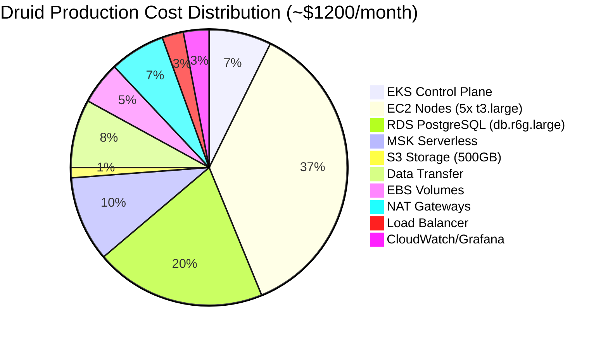
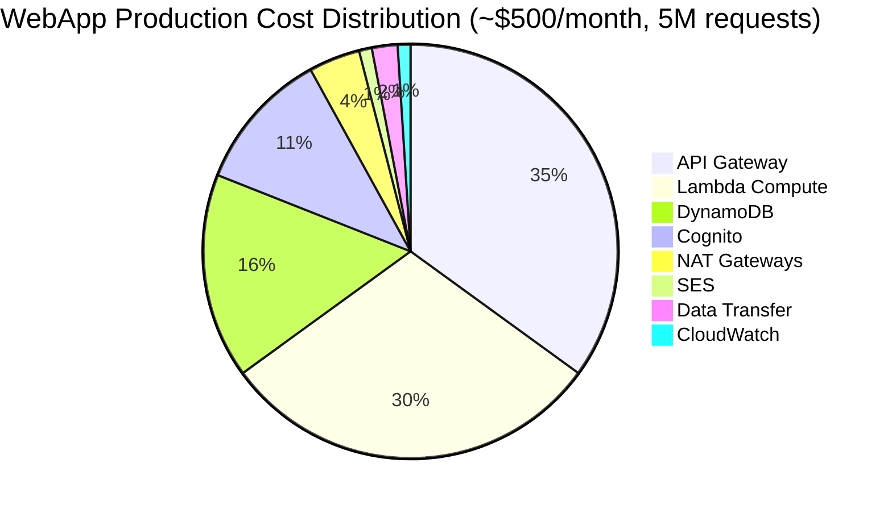

# Cost Optimization Guide

## Overview

This guide provides strategies to reduce AWS costs for both Druid and WebApp architectures while maintaining performance and reliability.

## Cost Breakdown by Architecture

### Druid Architecture Monthly Costs



### WebApp Architecture Monthly Costs



## Druid Architecture Cost Optimization

### 1. Compute Optimization

#### Use Spot Instances for Historical Nodes (50-70% savings)

```yaml
# Karpenter Provisioner Configuration
# aws-druid-infra/src/main/resources/prototype/v1/eks/tenancy.mustache

provisioners:
  - name: druid-historical
    requirements:
      - key: karpenter.sh/capacity-type
        operator: In
        values: ["spot"]  # Spot instances for non-critical workloads
      - key: karpenter.k8s.aws/instance-category
        operator: In
        values: ["r", "m"]  # Memory or general-purpose
    limits:
      resources:
        cpu: 100
    consolidation:
      enabled: true  # Pack pods efficiently
    weight: 10  # Prefer this provisioner

  - name: druid-critical
    requirements:
      - key: karpenter.sh/capacity-type
        operator: In
        values: ["on-demand"]  # On-demand for critical components
      - key: node.kubernetes.io/instance-type
        operator: In
        values: ["t3.medium", "t3.large"]
    labels:
      druid.io/critical: "true"
    weight: 100  # Fallback to on-demand
```

**Taints and Tolerations:**
```yaml
# Historical pods tolerate spot instances
historical:
  tolerations:
    - key: karpenter.sh/capacity-type
      operator: Equal
      value: spot
      effect: NoSchedule

# Coordinator/Overlord stay on on-demand
coordinator:
  nodeSelector:
    druid.io/critical: "true"
```

**Savings:** ~$200-300/month (50-70% on Historical nodes)

#### Karpenter Consolidation

```yaml
# Automatically consolidates underutilized nodes
provisioners:
  - name: general
    consolidation:
      enabled: true
    ttlSecondsAfterEmpty: 30  # Terminate empty nodes after 30s
    ttlSecondsUntilExpired: 604800  # Refresh nodes weekly (for security patches)
```

**Savings:** ~$50-100/month (20-30% better utilization)

#### Rightsize EC2 Instances

```bash
# Monitor actual usage
kubectl top nodes

# Example output:
# NAME                    CPU    MEMORY
# ip-10-0-1-100.ec2       45%    60%  ← Over-provisioned
# ip-10-0-1-101.ec2       85%    75%  ← Right-sized

# Adjust instance types in Karpenter provisioner
# Use t3.medium instead of t3.large for low-CPU pods
```

**Savings:** ~$100-150/month (right-sizing)

### 2. Storage Optimization

#### S3 Lifecycle Policies for Deep Storage

```yaml
# Apply to Druid deep storage bucket
S3 Lifecycle:
  - Rule: Transition old segments
    Prefix: segments/
    Transitions:
      - Days: 30
        StorageClass: STANDARD_IA  # Infrequent Access (40% cheaper)
      - Days: 90
        StorageClass: GLACIER_IR   # Glacier Instant Retrieval (68% cheaper)
      - Days: 180
        StorageClass: DEEP_ARCHIVE # Deep Archive (95% cheaper)
    NoncurrentVersionExpiration:
      Days: 7  # Delete old versions after 7 days
```

**Implementation:**
```bash
aws s3api put-bucket-lifecycle-configuration \
  --bucket your-druid-deep-storage \
  --lifecycle-configuration file://lifecycle.json
```

**Savings:** ~$50-200/month (depending on data volume)

#### S3 Intelligent-Tiering

```yaml
# Automatically moves objects to optimal storage class
S3 Intelligent-Tiering:
  - Archive tier after 90 days (90% cheaper)
  - Deep Archive tier after 180 days (95% cheaper)
  - No retrieval fees for frequent access tier
```

**Savings:** ~$30-100/month (automatic optimization)

#### EBS Volume Optimization

```yaml
# Use gp3 instead of gp2 (20% cheaper, better performance)
StorageClass:
  name: ebs-gp3
  parameters:
    type: gp3
    iops: "3000"      # Configurable (vs fixed in gp2)
    throughput: "125" # 125 MiB/s baseline
    encrypted: "true"
```

**Savings:** ~$10-30/month

### 3. Database Optimization

#### RDS Reserved Instances (40% savings)

```bash
# 1-year No Upfront Reserved Instance
aws rds purchase-reserved-db-instances-offering \
  --reserved-db-instances-offering-id <offering-id> \
  --db-instance-count 1

# Savings: ~$80/month on db.r6g.large
```

#### RDS Aurora Serverless v2 (alternative)

```yaml
# For variable workload, consider Aurora Serverless v2
Aurora Serverless v2:
  MinCapacity: 0.5 ACU  # Scale down to 0.5 ACU when idle
  MaxCapacity: 16 ACU   # Scale up to 16 ACU under load
  Autoscaling: Enabled

# Cost:
# Idle: ~$40/month (0.5 ACU)
# Peak: ~$640/month (16 ACU)
# Average (variable): ~$150-300/month
```

**Savings:** ~$50-150/month (for variable load)

#### Optimize RDS Storage

```bash
# Enable storage autoscaling
aws rds modify-db-instance \
  --db-instance-identifier druid-metadata \
  --max-allocated-storage 500 \
  --apply-immediately

# Use gp3 instead of io1
aws rds modify-db-instance \
  --db-instance-identifier druid-metadata \
  --storage-type gp3 \
  --iops 3000
```

**Savings:** ~$20-50/month

### 4. Network Optimization

#### Reduce NAT Gateway Costs

**Option 1: VPC Endpoints (eliminate NAT for AWS services)**
```yaml
# Add VPC endpoints to avoid NAT gateway charges
VPC Endpoints:
  - com.amazonaws.region.s3 (Gateway - Free)
  - com.amazonaws.region.dynamodb (Gateway - Free)
  - com.amazonaws.region.ecr.api (Interface - $7/month)
  - com.amazonaws.region.ecr.dkr (Interface - $7/month)
  - com.amazonaws.region.logs (Interface - $7/month)
```

**Savings:** ~$30-50/month (reduce NAT data transfer)

**Option 2: Single NAT Gateway (not recommended for production)**
```yaml
# For non-critical environments only
VPC:
  natGateways: 1  # Instead of 2
```

**Savings:** ~$32/month (but single point of failure)

#### Optimize Data Transfer

```bash
# Keep traffic within same AZ
# Use S3 Transfer Acceleration only when needed
# Enable CloudFront for global distribution (edge caching)
```

**Savings:** ~$20-40/month

### 5. Observability Optimization

#### Grafana Cloud Free Tier

```yaml
# Use Grafana Cloud free tier
Grafana Cloud Free:
  Metrics: 10K series (usually sufficient for prototype)
  Logs: 50 GB/month
  Traces: 50 GB/month
  Profiles: 50 GB/month
  Cost: $0
```

**Upgrade only when needed:**
```yaml
Grafana Cloud Pro:
  Metrics: 100K series
  Logs: 100 GB/month
  Cost: ~$50/month
```

**Savings:** ~$50/month (stay on free tier)

#### CloudWatch Log Retention

```bash
# Reduce log retention to 7 days (from 30 days)
aws logs put-retention-policy \
  --log-group-name /aws/eks/cluster-name/cluster \
  --retention-in-days 7

# Export old logs to S3 ($0.03/GB vs $0.50/GB in CloudWatch)
aws logs create-export-task \
  --log-group-name /aws/eks/cluster-name/cluster \
  --destination /druid-logs-archive \
  --from $(date -d '30 days ago' +%s)000 \
  --to $(date +%s)000
```

**Savings:** ~$10-30/month

### 6. MSK Cost Optimization

#### MSK Serverless vs Provisioned

**For variable ingestion (< 100 MB/s):**
```yaml
# Use MSK Serverless (pay per GB ingested/retrieved)
MSK Serverless:
  Cost: $0.75/GB ingested + $0.10/GB retrieved
  Idle cost: $0

# Break-even: ~130 GB/month (vs smallest provisioned cluster)
```

**For consistent ingestion (> 100 MB/s):**
```yaml
# Use provisioned MSK with reserved capacity
MSK Provisioned:
  Brokers: 3x kafka.t3.small
  Reserved 1-year: 40% discount
  Cost: ~$100/month (vs $165 on-demand)
```

**Savings:** ~$50-100/month

## WebApp Architecture Cost Optimization

### 1. Lambda Optimization

#### Right-size Memory Allocation

```bash
# Use AWS Lambda Power Tuning
# https://github.com/alexcasalboni/aws-lambda-power-tuning

# Before: 1024 MB, 200ms avg, $0.000000333/ms = $0.67/1M invocations
# After: 512 MB, 250ms avg, $0.000000166/ms = $0.42/1M invocations
# Savings: 37%
```

**Savings:** ~$50-150/month (depending on volume)

#### Lambda Provisioned Concurrency (use wisely)

```yaml
# Only provision for user-facing APIs, not background tasks
User API Lambda:
  Provisioned Concurrency: 5  # Cost: ~$100/month
  Reserved Concurrency: 100

Background Jobs:
  Provisioned Concurrency: 0  # Use cold starts
  Reserved Concurrency: 50
```

**Cost vs Benefit:**
- Provisioned: $100/month, 0% cold starts
- No provisioned: $0/month, 5-10% cold starts
- **Decision:** Only use for critical APIs

#### Reduce Lambda Execution Time

```javascript
// Bad: Serial operations (300ms)
const user = await getUser(id);
const settings = await getSettings(id);
const preferences = await getPreferences(id);

// Good: Parallel operations (100ms)
const [user, settings, preferences] = await Promise.all([
  getUser(id),
  getSettings(id),
  getPreferences(id)
]);
```

**Savings:** ~$20-50/month (66% faster = 66% cheaper)

### 2. API Gateway Optimization

#### Enable Caching

```yaml
API Gateway Caching:
  Cache Size: 0.5 GB ($0.020/hour = $14/month)
  TTL: 300 seconds
  Cache Key: Authorization header + query params

# Impact:
# Before: 1M requests × $3.50/M = $3.50
# After: 200K requests × $3.50/M + $14 = $14.70
# Break-even: ~4M requests/month
```

**When to enable:**
- High read ratio (> 80% GET requests)
- Cacheable responses (user profiles, settings)
- Traffic > 4M requests/month

**Savings:** ~$50-200/month (for high traffic)

#### Request Validation (reduce Lambda invocations)

```yaml
# Validate requests at API Gateway (cheaper than Lambda)
API Gateway Request Validator:
  Validate query parameters: true
  Validate request body: true
  Schema: OpenAPI 3.0

# Reject invalid requests before Lambda invocation
# Cost: $0 (no Lambda execution)
```

**Savings:** ~$10-30/month (fewer Lambda errors)

### 3. DynamoDB Optimization

#### On-Demand vs Provisioned

**On-Demand (default):**
```yaml
Cost:
  Read: $0.25 per million requests
  Write: $1.25 per million requests
Best for: Variable, unpredictable traffic
```

**Provisioned:**
```yaml
Cost:
  Read: $0.00013 per RCU-hour
  Write: $0.00065 per WCU-hour
Best for: Steady, predictable traffic

Example:
  50 RCU × $0.00013 × 730 hours = $4.75/month
  10 WCU × $0.00065 × 730 hours = $4.75/month
  Total: $9.50/month (vs $25-50 on-demand for same load)
```

**Break-even:** ~2M reads + 400K writes per month

**Savings:** ~$30-100/month (for predictable load)

#### Reserved Capacity (40% savings)

```bash
# 1-year commitment, 40% discount
aws dynamodb purchase-reserved-capacity-offerings \
  --reserved-capacity-offering-id <offering-id> \
  --reservation-name user-table-reserved
```

**Savings:** ~$40-80/month

#### Efficient Query Patterns

```javascript
// Bad: Scan (expensive, slow)
const result = await docClient.scan({
  TableName: 'users',
  FilterExpression: 'subscription_tier = :tier',
  ExpressionAttributeValues: { ':tier': 'premium' }
}).promise();
// Cost: Scans entire table, consumes RCUs for ALL items

// Good: Query with GSI (cheap, fast)
const result = await docClient.query({
  TableName: 'users',
  IndexName: 'subscription-index',
  KeyConditionExpression: 'subscription_tier = :tier',
  ExpressionAttributeValues: { ':tier': 'premium' }
}).promise();
// Cost: Only consumes RCUs for matching items
```

**Savings:** ~$20-60/month (10x fewer RCUs)

#### DynamoDB Auto-Scaling

```yaml
# For provisioned mode
Auto-Scaling:
  Target Utilization: 70%
  Min Capacity: 5 RCU/WCU
  Max Capacity: 100 RCU/WCU

# Scales down during off-peak hours
# Example: 8am-6pm: 50 RCU, 6pm-8am: 10 RCU
# Avg: 30 RCU vs fixed 50 RCU
```

**Savings:** ~$10-30/month

### 4. Cognito Optimization

#### Leverage Free Tier

```yaml
Cognito Pricing:
  Free: Up to 50,000 MAU
  $0.0055/MAU: 50K-100K
  $0.0046/MAU: 100K-1M
  $0.00325/MAU: 1M-10M

Strategy:
  - Optimize token refresh (reduce MAU count)
  - Archive inactive users (> 90 days)
```

**JWT Token Refresh Strategy:**
```javascript
// Extend token lifetime to reduce MAU
Cognito User Pool:
  ID Token Validity: 24 hours (vs 1 hour)
  Access Token Validity: 24 hours
  Refresh Token Validity: 30 days

// Fewer refreshes = lower MAU
```

**Savings:** ~$20-50/month (by staying in lower tier)

### 5. Network Optimization

#### VPC Endpoints vs NAT Gateway

```yaml
# Replace NAT Gateway with VPC Endpoints
VPC Endpoints (Interface):
  - DynamoDB (Gateway - Free)
  - S3 (Gateway - Free)
  - Lambda (not needed, AWS-managed)

Cost Comparison:
  NAT Gateway: $32.40/month + $0.045/GB data
  VPC Endpoints: $7.20/month each (interface)

# For DynamoDB + S3: $0 (gateways are free)
```

**Savings:** ~$30-60/month (if Lambda heavily uses DynamoDB/S3)

#### Optimize SES Costs

```yaml
# SES Pricing:
# First 62,000 emails/month (from EC2): Free
# From Lambda: $0.10 per 1,000 emails

Strategy:
  - Use SES template feature (no Lambda processing)
  - Batch emails (reduce Lambda invocations)
  - Verify domain (vs individual emails) for higher limits
```

**Savings:** ~$5-20/month

### 6. Data Transfer Optimization

#### Use CloudFront for API (optional)

```yaml
# For global users
CloudFront:
  Origin: API Gateway
  Caching: Enabled (GET requests only)
  Cost: $0.085/GB (vs $0.09/GB from API Gateway)

Benefit:
  - Faster response (edge caching)
  - Cheaper data transfer
  - Reduced API Gateway requests (cached responses)
```

**When to use:**
- Global user base (high latency from single region)
- High traffic (> 1TB/month data transfer)

**Savings:** ~$50-150/month (for global high traffic)

## Cost Monitoring & Alerts

### Set Up Cost Alarms

```bash
# CloudWatch Billing Alarm
aws cloudwatch put-metric-alarm \
  --alarm-name druid-monthly-cost-alert \
  --alarm-description "Alert when monthly cost exceeds $1500" \
  --metric-name EstimatedCharges \
  --namespace AWS/Billing \
  --statistic Maximum \
  --period 21600 \
  --evaluation-periods 1 \
  --threshold 1500 \
  --comparison-operator GreaterThanThreshold \
  --dimensions Name=Currency,Value=USD
```

### Use AWS Budgets

```bash
# Create budget with alerts
aws budgets create-budget \
  --account-id 123456789012 \
  --budget file://budget.json \
  --notifications-with-subscribers file://notifications.json
```

**budget.json:**
```json
{
  "BudgetName": "Druid Monthly Budget",
  "BudgetLimit": {
    "Amount": "1200",
    "Unit": "USD"
  },
  "TimeUnit": "MONTHLY",
  "BudgetType": "COST"
}
```

### Tag Resources for Cost Allocation

```yaml
# Tag all resources with cost center
Tags:
  CostCenter: druid-analytics
  Environment: production
  Owner: data-team

# View costs by tag in Cost Explorer
aws ce get-cost-and-usage \
  --time-period Start=2024-01-01,End=2024-01-31 \
  --granularity MONTHLY \
  --metrics BlendedCost \
  --group-by Type=TAG,Key=CostCenter
```

## Cost Optimization Summary

### Druid Architecture Savings

| Optimization | Monthly Savings | Effort | Impact |
|--------------|-----------------|--------|--------|
| Spot Instances (Historical) | $200-300 | Low | High |
| Karpenter Consolidation | $50-100 | Low | Medium |
| S3 Lifecycle Policies | $50-200 | Low | High |
| RDS Reserved Instances | $80 | Low | Medium |
| VPC Endpoints | $30-50 | Medium | Low |
| CloudWatch Log Retention | $10-30 | Low | Low |
| **Total Potential Savings** | **$420-760** | - | - |

**Cost reduction: 35-60%** (from ~$1200 to $440-780/month)

### WebApp Architecture Savings

| Optimization | Monthly Savings | Effort | Impact |
|--------------|-----------------|--------|--------|
| Lambda Memory Tuning | $50-150 | Medium | High |
| DynamoDB Provisioned Mode | $30-100 | Low | High |
| DynamoDB Reserved Capacity | $40-80 | Low | Medium |
| API Gateway Caching | $50-200 | Low | High |
| VPC Endpoints | $30-60 | Low | Medium |
| Cognito Optimization | $20-50 | Low | Low |
| **Total Potential Savings** | **$220-640** | - | - |

**Cost reduction: 40-70%** (from ~$500 to $150-280/month)

## Quick Wins (Implement First)

### Druid Architecture

1. **Enable Spot Instances for Historical Nodes** - 50% savings, low effort
2. **Apply S3 Lifecycle Policies** - 40% storage savings, low effort
3. **Purchase RDS Reserved Instance** - 40% savings, low effort
4. **Enable Karpenter Consolidation** - 20% savings, low effort

### WebApp Architecture

1. **Right-size Lambda Memory** - 30% savings, medium effort
2. **Switch DynamoDB to Provisioned** - 50% savings (if predictable), low effort
3. **Enable API Gateway Caching** - 80% fewer Lambda calls, low effort
4. **Add VPC Endpoints** - $30-60/month, low effort

## Next Steps

- [Architecture Decisions →](decisions.md)
- [Detailed Comparison →](comparison.md)
- [Scaling Guide →](scaling-guide.md)
- [Druid Overview →](/druid/overview.md)
- [WebApp Overview →](/webapp/overview.md)
