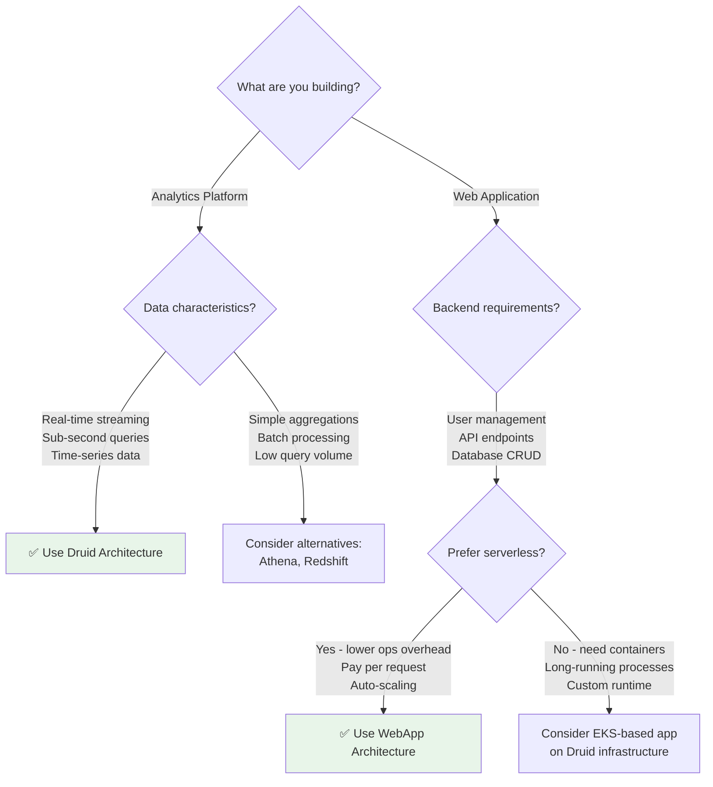
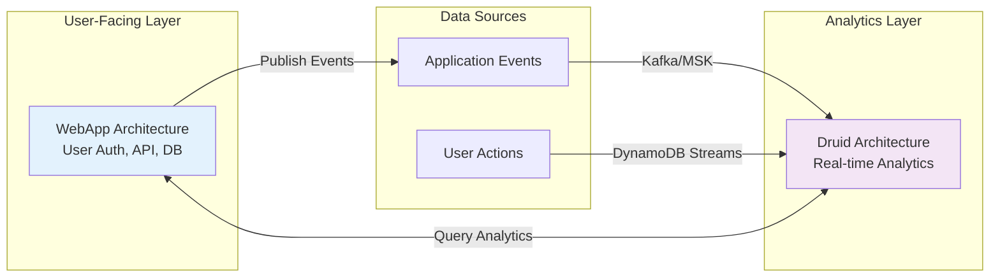
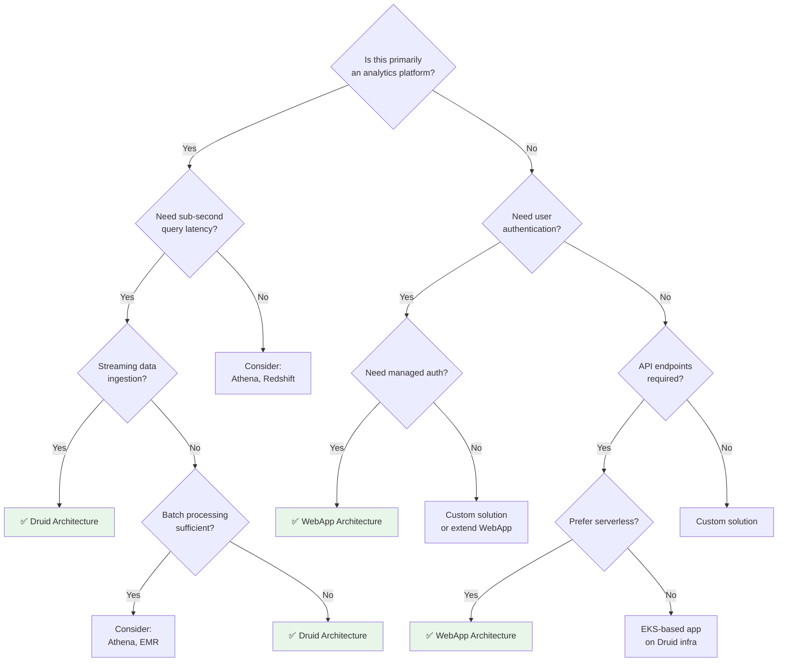

# Architecture Decision Guide

## Overview

Fastish provides two distinct infrastructure architectures optimized for different use cases:

1. **Druid Architecture** (`aws-druid-infra`) - Real-time analytics on EKS
2. **WebApp Architecture** (`aws-webapp-infra`) - Serverless web application

This guide helps you choose the right architecture for your needs.

## Quick Decision Matrix

## When to Use Druid Architecture

### ✅ Ideal Use Cases

**Real-time Analytics Dashboards**
- Live metrics visualization
- User behavior analytics
- Application performance monitoring (APM)
- Business intelligence dashboards with sub-second refresh

**Time-Series Data Analysis**
- IoT sensor data (millions of events/sec)
- Network traffic monitoring
- Log aggregation and analysis
- Clickstream analytics

**Streaming Data Processing**
- Kafka/MSK data ingestion
- Real-time data transformations
- Multi-stage query processing
- Complex aggregations on streaming data

**High Query Concurrency**
- 100s-1000s of concurrent queries
- Interactive data exploration
- Ad-hoc analytical queries
- OLAP workloads

### ❌ When NOT to Use Druid

**Simple Web Applications**
- Standard CRUD operations → Use WebApp Architecture
- Low query volume (< 10 QPS) → Use Athena/RDS
- No streaming ingestion → Use Redshift for batch analytics

**Transactional Workloads**
- ACID transactions required → Use RDS/Aurora
- Strong consistency needed → Use DynamoDB with transactions
- Relational joins across tables → Use PostgreSQL/MySQL

**Cost Sensitivity with Low Usage**
- Druid requires minimum EKS cluster (2-3 nodes always running)
- WebApp Architecture is pure serverless (pay per request)
- For < 1M requests/month, WebApp is more cost-effective

## When to Use WebApp Architecture

### ✅ Ideal Use Cases

**SaaS Web Applications**
- User authentication and management
- Multi-tenant applications
- Subscription-based services
- API-first applications

**Mobile App Backends**
- REST API endpoints
- User profiles and preferences
- Push notifications
- Session management

**Membership/Content Platforms**
- User registration and login
- Content access control
- Email notifications
- Tiered access (free/paid)

**MVP/Prototypes**
- Fast time to market
- Minimal operational overhead
- Built-in authentication
- Pay-per-use pricing

### ❌ When NOT to Use WebApp

**High-Volume Analytics**
- Millions of events per second → Use Druid
- Real-time aggregations → Use Druid
- Complex OLAP queries → Use Druid

**Long-Running Processes**
- Jobs > 15 minutes → Lambda timeout limit
- Batch processing → Use ECS/EKS or Step Functions
- WebSocket connections → Use API Gateway WebSocket or AppSync

**Large File Processing**
- Files > 6 MB request → Lambda payload limit
- Video encoding → Use MediaConvert or ECS
- Large data transformations → Use EMR or Glue

## Combining Both Architectures

Many production systems benefit from using **both** architectures:

**Example Architecture:**
1. **WebApp** handles user authentication, API requests, user data in DynamoDB
2. **WebApp Lambda** publishes events to MSK/Kinesis
3. **Druid** ingests events from MSK for real-time analytics
4. **WebApp frontend** queries Druid for user-facing analytics dashboards

## Feature Comparison

| Feature | Druid Architecture | WebApp Architecture |
|---------|-------------------|---------------------|
| **Primary Use Case** | Real-time analytics | Web application backend |
| **Compute** | EKS (Kubernetes) | Lambda (serverless) |
| **Database** | RDS + S3 (Druid segments) | DynamoDB |
| **Authentication** | Not included | Cognito User Pool ✅ |
| **Streaming Ingestion** | MSK Serverless ✅ | Not included |
| **Query Latency** | Sub-second (< 100ms) | 50-500ms (Lambda cold start) |
| **Concurrency** | 1000s of queries | 1000 concurrent Lambda (default) |
| **Data Retention** | Configurable (unlimited with S3) | DynamoDB (manual archival) |
| **Scaling** | Karpenter (horizontal pod autoscaling) | Automatic (Lambda) |
| **Cold Start** | No (always-on cluster) | Yes (Lambda cold start) |
| **Monthly Cost (idle)** | ~$200-400 (EKS cluster) | ~$0-5 (serverless) |
| **Monthly Cost (high traffic)** | $500-2000 (predictable) | $100-1000 (pay-per-request) |
| **Operational Complexity** | Medium (Kubernetes) | Low (managed services) |
| **Deployment Time** | 40-60 minutes | 20-30 minutes |
| **Observability** | Grafana Cloud + CloudWatch | CloudWatch + X-Ray |

## Cost Considerations

### Druid Architecture Monthly Costs

**Minimum (Prototype Environment):**
- EKS Control Plane: $73
- EC2 Nodes (2x t3.medium): ~$60
- RDS PostgreSQL (db.t3.micro): ~$15
- MSK Serverless (minimal): ~$50
- Data transfer: ~$20
- **Total: ~$200-250/month**

**Production (High Availability):**
- EKS Control Plane: $73
- EC2 Nodes (5-10x t3.large): ~$400-800
- RDS PostgreSQL (db.r6g.large): ~$200
- MSK Serverless (1M messages): ~$100
- S3 Deep Storage (1TB): ~$23
- Data transfer: ~$100
- **Total: ~$900-1300/month**

### WebApp Architecture Monthly Costs

**Low Traffic (< 100K requests/month):**
- API Gateway: ~$3.50
- Lambda: ~$1-5
- DynamoDB: ~$1 (on-demand)
- Cognito: Free (< 50K MAU)
- SES: ~$0.10
- **Total: ~$5-10/month**

**Medium Traffic (1M requests/month):**
- API Gateway: ~$35
- Lambda: ~$20-50
- DynamoDB: ~$10-50
- Cognito: ~$27.50 (55K MAU)
- SES: ~$1
- **Total: ~$95-165/month**

**High Traffic (10M requests/month):**
- API Gateway: ~$350
- Lambda: ~$200-500
- DynamoDB: ~$100-500
- Cognito: ~$550 (1M MAU)
- SES: ~$10
- **Total: ~$1200-1900/month**

## Performance Characteristics

### Druid Architecture

**Query Performance:**
- P50 latency: < 50ms
- P95 latency: < 200ms
- P99 latency: < 500ms
- Throughput: 1000+ QPS (properly sized cluster)

**Ingestion Performance:**
- Real-time: 100K+ events/sec (single MiddleManager)
- Batch: Limited by MSK throughput (MBps)
- End-to-end latency: < 1 second (streaming)

**Scaling Characteristics:**
- Scale up: Add Historical nodes (minutes with Karpenter)
- Scale down: Automatic segment redistribution
- Cold start: None (always-on cluster)

### WebApp Architecture

**API Performance:**
- Warm Lambda P50: 50-100ms
- Warm Lambda P95: 100-300ms
- Cold start: 500-2000ms (first request)
- Throughput: 1000 concurrent executions (adjustable)

**Database Performance (DynamoDB):**
- Point queries: < 10ms (P99)
- Writes: < 20ms (P99)
- Throughput: Unlimited (on-demand mode)
- Consistency: Eventual by default, strong available

**Scaling Characteristics:**
- Scale up: Automatic, no configuration
- Scale down: Automatic, zero idle cost
- Cold start: 1-2 seconds (provisioned concurrency available)

## Decision Workflow

### Step 1: Define Requirements

**Ask these questions:**

1. **What is the primary workload?**
   - Real-time analytics → Likely Druid
   - Web application CRUD → Likely WebApp

2. **What is the expected traffic?**
   - High sustained load → Druid (no cold starts)
   - Variable/bursty traffic → WebApp (auto-scaling)

3. **What is your query pattern?**
   - Complex aggregations, OLAP → Druid
   - Simple CRUD, key-value lookups → WebApp

4. **What is your budget?**
   - Tight budget + low traffic → WebApp
   - Predictable cost + high performance → Druid

5. **What is your team's expertise?**
   - Kubernetes experience → Druid (easier operations)
   - Serverless experience → WebApp (easier operations)

### Step 2: Prototype Decision Tree

### Step 3: Validate with Proof of Concept

**For Druid:**
1. Deploy prototype environment (~$200/month)
2. Load sample data to MSK
3. Test query performance with expected data volume
4. Verify latency meets requirements (< 1 second)

**For WebApp:**
1. Deploy to AWS account (~$5-10/month low traffic)
2. Implement sample API endpoint
3. Test authentication flow
4. Load test with expected traffic pattern

### Step 4: Production Considerations

**Druid Migration Checklist:**
- [ ] Grafana Cloud account configured
- [ ] MSK topics created
- [ ] Data retention policy defined
- [ ] Disaster recovery plan documented
- [ ] Monitoring dashboards set up
- [ ] Cost alerts configured

**WebApp Migration Checklist:**
- [ ] SES production access requested
- [ ] Domain verified in Route 53
- [ ] Cognito password policy reviewed
- [ ] DynamoDB backup enabled
- [ ] API rate limits configured
- [ ] CloudWatch alarms set up

## Next Steps

- [Detailed Comparison →](comparison.md)
- [Scaling Guide →](scaling-guide.md)
- [Cost Optimization →](cost-optimization.md)
- [Druid Overview →](/druid/overview.md)
- [WebApp Overview →](/webapp/overview.md)
