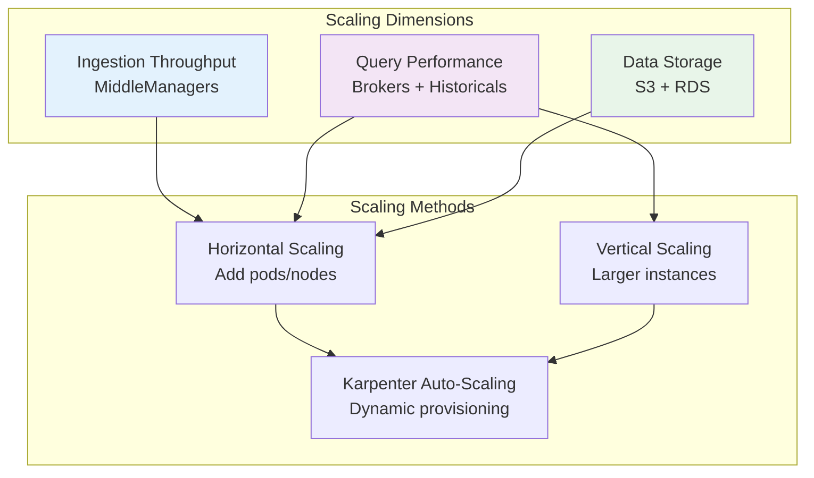
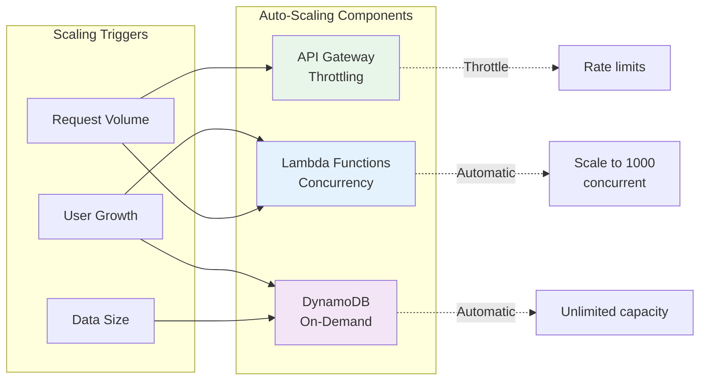

# Scaling Guide

## Overview

This guide covers scaling strategies for both Druid and WebApp architectures across different growth stages.

## Scaling Druid Architecture

### Understanding Druid Scaling



### Stage 1: Prototype (< 100K events/day)

**Initial Configuration:**
```yaml
EKS Nodes:
  - Type: t3.medium
  - Count: 2-3
  - Total vCPUs: 4-6
  - Total RAM: 8-12 GB

Druid Pods:
  Coordinator: 1 replica, 1 vCPU, 2 GB RAM
  Overlord: 1 replica, 1 vCPU, 2 GB RAM
  Broker: 1 replica, 2 vCPUs, 4 GB RAM
  Historical: 1 replica, 2 vCPUs, 4 GB RAM
  MiddleManager: 1 replica, 2 vCPUs, 4 GB RAM
  Router: 1 replica, 0.5 vCPU, 1 GB RAM

RDS PostgreSQL:
  Instance: db.t3.micro
  Storage: 20 GB
  IOPS: 3000 (gp3)

MSK Serverless:
  Throughput: Minimal (pay per GB)

S3:
  Deep Storage: < 10 GB
  MSQ Storage: < 1 GB
```

**Monthly Cost:** ~$200-250

**Performance:**
- Ingestion: Up to 1K events/sec
- Query latency: < 500ms (P95)
- Concurrent queries: 10-20

**When to Scale:** Ingestion > 500 events/sec or query latency > 1 second

### Stage 2: Growth (100K-1M events/day)

**Scaling Actions:**

**1. Add Historical Nodes (Query Performance)**
```bash
# Karpenter automatically provisions nodes for Historical pods
kubectl scale deployment druid-historical -n druid --replicas=3
```

**Updated Configuration:**
```yaml
EKS Nodes:
  - Type: t3.large (via Karpenter)
  - Count: 4-6
  - Total vCPUs: 16-24
  - Total RAM: 32-48 GB

Druid Pods:
  Historical: 3 replicas, 4 vCPUs, 8 GB RAM each
  Broker: 2 replicas, 2 vCPUs, 4 GB RAM each
  MiddleManager: 2 replicas, 4 vCPUs, 8 GB RAM each
  (Coordinator, Overlord, Router unchanged)

RDS PostgreSQL:
  Instance: db.t3.small
  Storage: 50 GB
```

**Monthly Cost:** ~$400-600

**Performance:**
- Ingestion: Up to 10K events/sec
- Query latency: < 200ms (P95)
- Concurrent queries: 50-100

**Karpenter Configuration:**
```yaml
# Karpenter automatically provisions nodes based on pod requirements
# Example Provisioner in aws-druid-infra/src/main/resources/prototype/v1/eks/tenancy.mustache

provisioners:
  - name: general-purpose
    requirements:
      - key: karpenter.sh/capacity-type
        operator: In
        values: ["on-demand", "spot"]  # Use spot for cost savings
      - key: node.kubernetes.io/instance-type
        operator: In
        values: ["t3.large", "t3.xlarge", "m6i.large", "m6i.xlarge"]
    limits:
      resources:
        cpu: 100
        memory: 200Gi
    consolidation:
      enabled: true  # Automatically consolidates underutilized nodes
```

**When to Scale:** Ingestion > 8K events/sec or query latency > 300ms

### Stage 3: Production (1M-10M events/day)

**Scaling Actions:**

**1. Separate Query and Ingestion Workloads**
```yaml
# Historical pods on memory-optimized instances
Historical Pods:
  - Node selector: karpenter.sh/instance-type=r6i.xlarge
  - Replicas: 5
  - Resources: 8 vCPUs, 16 GB RAM each

# MiddleManager pods on compute-optimized instances
MiddleManager Pods:
  - Node selector: karpenter.sh/instance-type=c6i.xlarge
  - Replicas: 3
  - Resources: 8 vCPUs, 8 GB RAM each
```

**2. Scale RDS for Metadata**
```yaml
RDS PostgreSQL:
  Instance: db.r6g.large  # Memory-optimized
  Storage: 100 GB
  IOPS: 12000 (gp3)
  Multi-AZ: true  # High availability
  Read Replica: 1 (for Coordinator/Overlord reads)
```

**3. Optimize S3 Deep Storage**
```yaml
S3 Deep Storage:
  Size: 100-500 GB
  Lifecycle Policy:
    - Transition to IA after 30 days
    - Transition to Glacier after 90 days
  Versioning: Enabled
```

**Updated Configuration:**
```yaml
EKS Nodes:
  - Historical: 5x r6i.xlarge (32 vCPU, 128 GB total)
  - MiddleManager: 3x c6i.xlarge (24 vCPU, 24 GB total)
  - Other pods: 2x t3.large (8 vCPU, 16 GB total)

Druid Pods:
  Coordinator: 2 replicas (HA), 2 vCPUs, 4 GB each
  Overlord: 2 replicas (HA), 2 vCPUs, 4 GB each
  Broker: 3 replicas, 4 vCPUs, 8 GB each
  Historical: 5 replicas, 8 vCPUs, 16 GB each
  MiddleManager: 3 replicas, 8 vCPUs, 8 GB each
  Router: 2 replicas, 1 vCPU, 2 GB each
```

**Monthly Cost:** ~$900-1300

**Performance:**
- Ingestion: Up to 100K events/sec
- Query latency: < 100ms (P95)
- Concurrent queries: 500+

**When to Scale:** Ingestion > 80K events/sec or query latency > 200ms

### Stage 4: Enterprise (10M+ events/day)

**Scaling Actions:**

**1. Multi-Tier Historical Architecture**
```yaml
# Hot tier: Recent data (last 7 days)
Historical-Hot:
  - Instance: r6i.2xlarge (SSD instance storage)
  - Replicas: 8
  - Resources: 8 vCPUs, 32 GB RAM each
  - EBS: io2 (high IOPS)

# Cold tier: Historical data (> 7 days)
Historical-Cold:
  - Instance: r6i.xlarge
  - Replicas: 5
  - Resources: 8 vCPUs, 16 GB RAM each
  - EBS: gp3 (standard)
```

**2. Dedicated Coordinator and Overlord**
```yaml
Coordinator:
  - Instance: Dedicated nodes
  - Replicas: 3 (HA with leader election)
  - Resources: 4 vCPUs, 8 GB RAM each

Overlord:
  - Instance: Dedicated nodes
  - Replicas: 3 (HA with leader election)
  - Resources: 4 vCPUs, 8 GB RAM each
```

**3. RDS Scaling**
```yaml
RDS PostgreSQL:
  Primary:
    Instance: db.r6g.2xlarge
    Storage: 500 GB
    IOPS: 16000
  Read Replicas: 2
  Backups: Automated (PITR enabled)
```

**4. Karpenter Advanced Configuration**
```yaml
# Separate provisioners for different workloads
provisioners:
  - name: historical-hot
    requirements:
      - key: karpenter.sh/capacity-type
        operator: In
        values: ["on-demand"]  # On-demand for hot tier
      - key: node.kubernetes.io/instance-type
        operator: In
        values: ["r6i.2xlarge", "r6i.4xlarge"]
    taints:
      - key: druid.io/tier
        value: hot
        effect: NoSchedule

  - name: historical-cold
    requirements:
      - key: karpenter.k8s.aws/instance-category
        operator: In
        values: ["r"]
      - key: karpenter.sh/capacity-type
        operator: In
        values: ["spot"]  # Spot for cold tier (cost savings)
    taints:
      - key: druid.io/tier
        value: cold
        effect: NoSchedule

  - name: middlemanager
    requirements:
      - key: karpenter.k8s.aws/instance-category
        operator: In
        values: ["c"]  # Compute-optimized
      - key: karpenter.sh/capacity-type
        operator: In
        values: ["spot", "on-demand"]
    taints:
      - key: druid.io/component
        value: middlemanager
        effect: NoSchedule
```

**Monthly Cost:** ~$2000-4000

**Performance:**
- Ingestion: 500K+ events/sec
- Query latency: < 50ms (P95)
- Concurrent queries: 2000+
- Data retention: 1 year hot, unlimited cold (S3)

### Druid Scaling Strategies

#### Horizontal Scaling (Add Pods/Nodes)

**When to scale horizontally:**
- Query latency increases with more data
- Need higher ingestion throughput
- Want to distribute segment load

**How to scale:**
```bash
# Historical nodes (query performance)
kubectl scale deployment druid-historical -n druid --replicas=5

# Brokers (query routing)
kubectl scale deployment druid-broker -n druid --replicas=3

# MiddleManagers (ingestion)
kubectl scale deployment druid-middlemanager -n druid --replicas=3
```

**Karpenter automatically provisions EC2 nodes** to accommodate new pods.

#### Vertical Scaling (Larger Instances)

**When to scale vertically:**
- Single Historical node running out of memory
- Complex queries requiring more CPU
- Large segments need more RAM

**How to scale:**
```yaml
# Update Helm values (aws-druid-infra/src/main/resources/prototype/v1/druid/values.mustache)
historical:
  resources:
    requests:
      cpu: 8000m      # Increased from 4000m
      memory: 16Gi    # Increased from 8Gi
    limits:
      cpu: 16000m
      memory: 32Gi
```

Karpenter will provision larger instance types (e.g., r6i.2xlarge).

#### Data Tiering

**Hot/Cold Architecture:**
```yaml
# Hot tier: Last 7 days (fast queries)
historical-hot:
  replicas: 8
  nodeSelector:
    druid.io/tier: hot
  resources:
    requests:
      cpu: 8
      memory: 32Gi
  storage:
    class: io2  # High IOPS SSD

# Cold tier: Older than 7 days (cost-optimized)
historical-cold:
  replicas: 5
  nodeSelector:
    druid.io/tier: cold
  resources:
    requests:
      cpu: 4
      memory: 16Gi
  storage:
    class: gp3  # Standard SSD
```

**Druid Load Rules** (configure in Druid console):
```json
{
  "rules": [
    {
      "type": "loadByPeriod",
      "period": "P7D",
      "tieredReplicants": {
        "hot": 2
      }
    },
    {
      "type": "loadByPeriod",
      "period": "P30D",
      "tieredReplicants": {
        "cold": 1
      }
    },
    {
      "type": "dropForever"
    }
  ]
}
```

## Scaling WebApp Architecture

### Understanding Serverless Scaling



### Stage 1: MVP (< 1K users, < 100K requests/month)

**Configuration:**
```yaml
Lambda Functions:
  User API:
    Memory: 512 MB
    Timeout: 30 seconds
    Concurrency: Reserved 0, Max 10
    Provisioned Concurrency: 0

  Auth Triggers:
    Memory: 256 MB
    Timeout: 10 seconds
    Concurrency: Reserved 0, Max 5

DynamoDB:
  User Table:
    Billing Mode: On-demand
    Projected reads: < 100/sec
    Projected writes: < 10/sec

API Gateway:
  Throttle: 10 req/sec per IP
  Burst: 20 requests
  Caching: Disabled
```

**Monthly Cost:** ~$5-20

**Performance:**
- API latency: 200-500ms (cold start)
- Warm latency: 50-100ms
- Concurrent users: < 100

**When to Scale:** Users > 1K or requests > 100K/month

### Stage 2: Growth (1K-10K users, 100K-1M requests/month)

**Scaling Actions:**

**1. Enable Provisioned Concurrency (Reduce Cold Starts)**
```yaml
Lambda User API:
  Provisioned Concurrency: 5  # Keep 5 warm instances
  Memory: 1024 MB             # Increase memory for faster execution
```

**Cost Impact:** +$100-150/month (but lower latency)

**2. API Gateway Caching**
```yaml
API Gateway:
  Caching: Enabled
  Cache Size: 0.5 GB
  TTL: 300 seconds (5 minutes)
  Cache key: Authorization header + path
```

**Cost Impact:** +$15/month (but 80% fewer Lambda invocations)

**3. DynamoDB Optimization**
```yaml
# For predictable load, switch to provisioned (cheaper)
DynamoDB:
  Billing Mode: Provisioned (if load predictable)
  Read Capacity: 50 RCU
  Write Capacity: 10 WCU
  Auto-scaling: Enabled (target 70% utilization)
```

**Monthly Cost:** ~$100-300

**Performance:**
- API latency: 50-100ms (warm)
- Cold start: < 1% of requests (with provisioned concurrency)
- Concurrent users: 500-1000

**When to Scale:** Users > 10K or requests > 1M/month

### Stage 3: Production (10K-100K users, 1M-10M requests/month)

**Scaling Actions:**

**1. Increase Lambda Concurrency Limits**
```bash
# Request quota increase via AWS Support
aws service-quotas request-service-quota-increase \
  --service-code lambda \
  --quota-code L-B99A9384 \
  --desired-value 5000  # Concurrent executions
```

**2. Optimize Lambda Memory for Cost/Performance**
```yaml
# Lambda Power Tuning (use aws-lambda-power-tuning)
User API:
  Memory: 1536 MB  # Optimal from power tuning
  Timeout: 15 seconds
  Provisioned Concurrency: 20

Auth Triggers:
  Memory: 512 MB
  Timeout: 10 seconds
```

**3. DynamoDB Global Secondary Indexes**
```yaml
DynamoDB User Table:
  GSI: email-index
    Partition Key: email
    Projection: ALL
    Auto-scaling: Enabled

  GSI: subscription-index
    Partition Key: subscription_tier
    Sort Key: created_at
    Projection: KEYS_ONLY
```

**4. API Gateway Advanced Configuration**
```yaml
API Gateway:
  Throttling:
    Rate: 1000 req/sec
    Burst: 2000 requests
  Caching:
    Size: 6.1 GB
    TTL: 600 seconds (10 minutes)
  WAF: Enabled (rate limiting, geo-blocking)
```

**Monthly Cost:** ~$500-1500

**Performance:**
- API latency: 50ms (P50), 150ms (P95)
- Throughput: 1000 req/sec
- Concurrent users: 5000+

**When to Scale:** Users > 100K or requests > 10M/month

### Stage 4: Enterprise (100K+ users, 10M+ requests/month)

**Scaling Actions:**

**1. Multi-Region Deployment**
```yaml
# Primary region: us-west-2
# Secondary region: us-east-1

Route 53:
  Routing Policy: Latency-based
  Health Checks: Enabled

DynamoDB:
  Global Tables: us-west-2, us-east-1
  Replication: Enabled

Lambda:
  Deployed in both regions
  API Gateway regional endpoints
```

**2. CloudFront Distribution**
```yaml
CloudFront:
  Origin: API Gateway (us-west-2, us-east-1)
  Caching: Enabled (API responses)
  TTL: 60 seconds
  Geographic Distribution: Global
```

**3. Advanced DynamoDB Scaling**
```yaml
DynamoDB:
  Billing Mode: On-demand (for unpredictable spikes)
  Global Tables: 2 regions
  Point-in-time Recovery: Enabled
  Contributor Insights: Enabled
  Backups: Daily automated backups
```

**4. Lambda@Edge** (for regional processing)
```yaml
# Cognito JWT validation at edge (reduce Lambda invocations)
Lambda@Edge Functions:
  - Viewer Request: JWT validation
  - Origin Request: Custom headers
  - Origin Response: Security headers
```

**Monthly Cost:** ~$2000-5000

**Performance:**
- API latency: 20-50ms (P95) with CloudFront
- Global availability: 99.99%
- Concurrent users: 50K+
- Multi-region failover: < 30 seconds

### WebApp Scaling Best Practices

#### Cost Optimization

**1. Right-size Lambda Memory**
```bash
# Use AWS Lambda Power Tuning
# https://github.com/alexcasalboni/aws-lambda-power-tuning

# Result example:
# 512 MB: $0.50/1M invocations, 300ms avg
# 1024 MB: $0.60/1M invocations, 150ms avg  ← Optimal
# 2048 MB: $0.90/1M invocations, 120ms avg
```

**2. API Gateway Caching Strategy**
```yaml
# Cache GET requests only
Cache Key Parameters:
  - Authorization header (user-specific)
  - Query parameters (filters)

Cache Invalidation:
  - Automatic: On PUT/POST/DELETE to same resource
  - Manual: CloudWatch Events
```

**3. DynamoDB Reserved Capacity** (for predictable load)
```bash
# 40% savings vs on-demand
aws dynamodb purchase-reserved-capacity-offerings \
  --reserved-capacity-offering-id xyz \
  --reservation-name user-table-reserved
```

#### Performance Optimization

**1. Lambda Layer Optimization**
```yaml
# Reduce Lambda package size
Layers:
  - auth-layer: 5 MB (shared Cognito SDK)
  - api-layer: 2 MB (shared API utilities)
  - shared-layer: 3 MB (common models)

Function Code: 1 MB (business logic only)
Total: 11 MB (vs 50 MB without layers)
```

**2. DynamoDB Query Patterns**
```javascript
// Bad: Scan operation (slow, expensive)
const result = await docClient.scan({
  TableName: 'users',
  FilterExpression: 'email = :email',
  ExpressionAttributeValues: { ':email': email }
}).promise();

// Good: Query with GSI
const result = await docClient.query({
  TableName: 'users',
  IndexName: 'email-index',
  KeyConditionExpression: 'email = :email',
  ExpressionAttributeValues: { ':email': email }
}).promise();
```

## Monitoring Scaling Metrics

### Druid Metrics to Monitor

```yaml
Key Metrics:
  Query Latency:
    - Target: P95 < 200ms
    - Alert: P95 > 500ms
    - Action: Scale Brokers/Historicals

  Ingestion Lag:
    - Target: < 10 seconds
    - Alert: > 60 seconds
    - Action: Scale MiddleManagers

  Segment Load Queue:
    - Target: < 100 segments
    - Alert: > 500 segments
    - Action: Scale Historicals or reduce retention

  Node CPU:
    - Target: < 70%
    - Alert: > 85%
    - Action: Karpenter auto-scales

  Node Memory:
    - Target: < 80%
    - Alert: > 90%
    - Action: Karpenter provisions larger nodes
```

### WebApp Metrics to Monitor

```yaml
Key Metrics:
  Lambda Concurrency:
    - Target: < 80% of reserved
    - Alert: > 90%
    - Action: Increase reserved concurrency

  Lambda Duration:
    - Target: P95 < 1000ms
    - Alert: P95 > 3000ms
    - Action: Optimize code or increase memory

  API Gateway 4xx:
    - Target: < 1%
    - Alert: > 5%
    - Action: Check authorization logic

  DynamoDB Throttles:
    - Target: 0
    - Alert: > 1% of requests
    - Action: Increase capacity or switch to on-demand

  Cold Start Rate:
    - Target: < 1%
    - Alert: > 10%
    - Action: Increase provisioned concurrency
```

## Next Steps

- [Architecture Decisions →](decisions.md)
- [Detailed Comparison →](comparison.md)
- [Cost Optimization →](cost-optimization.md)
- [Druid Overview →](/druid/overview.md)
- [WebApp Overview →](/webapp/overview.md)
