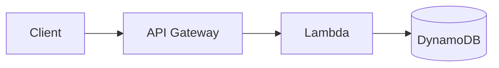

# Code Style Guide

## Overview

This guide defines coding standards and conventions for Fastish infrastructure code.

## Java Code Style

### General Principles

- **Clarity over cleverness:** Write code that's easy to understand
- **Consistency:** Follow existing patterns in the codebase
- **Documentation:** JavaDoc for public APIs

### Formatting

**Use Google Java Style:**
```bash
# Install google-java-format
brew install google-java-format

# Format code
google-java-format --replace src/**/*.java
```

**Key Rules:**
- Indentation: 2 spaces
- Line length: 120 characters
- Braces: K&R style
- Imports: No wildcards

### Naming Conventions

| Type | Convention | Example |
|------|-----------|---------|
| Class | PascalCase | `VpcConstruct` |
| Method | camelCase | `getVpc()` |
| Variable | camelCase | `clusterName` |
| Constant | UPPER_SNAKE_CASE | `MAX_RETRY_COUNT` |
| Package | lowercase | `fasti.sh.execute.aws.vpc` |

### CDK Constructs

**Pattern:**
```java
package fasti.sh.execute.aws.vpc;

import static fasti.sh.execute.serialization.Format.id;

import fasti.sh.model.aws.vpc.NetworkConf;
import fasti.sh.model.main.Common;
import lombok.Getter;
import lombok.extern.slf4j.Slf4j;
import software.amazon.awscdk.services.ec2.Vpc;
import software.constructs.Construct;

@Slf4j
@Getter
public class VpcConstruct extends Construct {
  private final Vpc vpc;

  public VpcConstruct(Construct scope, Common common, NetworkConf conf) {
    super(scope, id("vpc", conf.name()));

    log.debug("{} [common: {} conf: {}]", "VpcConstruct", common, conf);

    this.vpc = Vpc.Builder.create(this, conf.name())
      .vpcName(conf.name())
      .ipAddresses(IpAddresses.cidr(conf.cidr()))
      .maxAzs(3)
      .natGateways(conf.natGateways())
      .build();

    Tags.of(this).add(common.domain() + ":resource-type", "vpc");
  }
}
```

**Key Patterns:**
1. Extend `Construct`
2. Use `@Slf4j` for logging
3. Use `@Getter` for resources
4. Constructor: `(Construct scope, Common common, XxxConf conf)`
5. Call `super(scope, id(...))`
6. Log at debug level
7. Store CDK resources as final fields
8. Apply tags via `Tags.of(this)`

### Configuration Records

**Pattern:**
```java
package fasti.sh.model.aws.vpc;

import java.util.List;

public record NetworkConf(
  String name,
  String cidr,
  int natGateways,
  List<Subnet> subnets
) {}
```

**Key Points:**
- Use Java records for immutable configuration
- Validate in constructor if needed
- Document fields with JavaDoc

### Mustache Templates

**Pattern:**
```yaml
# conf.mustache
vpc:
  name: {{hosted:id}}-vpc
  cidr: 10.0.0.0/16
  natGateways: 2
  subnets:
    - name: public
      type: PUBLIC
      cidrMask: 24
    - name: private
      type: PRIVATE_WITH_EGRESS
      cidrMask: 24
```

**Conventions:**
- Use `{{variable}}` for substitution
- Indent with 2 spaces
- Use lowercase for keys
- Use camelCase for nested keys

### Error Handling

**Prefer validation over runtime errors:**
```java
// Good
public VpcConstruct(Construct scope, Common common, NetworkConf conf) {
  Objects.requireNonNull(conf.cidr(), "CIDR cannot be null");
  if (conf.natGateways() < 0) {
    throw new IllegalArgumentException("NAT gateways must be >= 0");
  }
  // ...
}

// Bad
public VpcConstruct(Construct scope, Common common, NetworkConf conf) {
  // Crashes at runtime with NullPointerException
  this.vpc = Vpc.Builder.create(this, conf.cidr())...
}
```

### Logging

**Use structured logging:**
```java
// Good
log.debug("Creating VPC [name: {} cidr: {}]", conf.name(), conf.cidr());
log.info("VPC created successfully [id: {}]", vpc.getVpcId());
log.error("Failed to create VPC [error: {}]", e.getMessage(), e);

// Bad
log.debug("Creating VPC: " + conf.name());  // String concatenation
log.info("VPC created");  // Missing context
System.out.println("Debug: " + conf);  // Use logger, not println
```

## TypeScript Code Style (Bootstrap)

### Formatting

**Use Prettier:**
```bash
npm install --save-dev prettier
npx prettier --write src/**/*.ts
```

**.prettierrc:**
```json
{
  "semi": true,
  "trailingComma": "es5",
  "singleQuote": true,
  "printWidth": 100,
  "tabWidth": 2
}
```

### CDK Stacks

**Pattern:**
```typescript
import * as cdk from 'aws-cdk-lib';
import { Construct } from 'constructs';

export class BootstrapStack extends cdk.Stack {
  constructor(scope: Construct, id: string, props?: cdk.StackProps) {
    super(scope, id, props);

    // Resources
    const bucket = new s3.Bucket(this, 'AssetBucket', {
      bucketName: `cdk-assets-${this.account}-${this.region}`,
      encryption: s3.BucketEncryption.S3_MANAGED,
      blockPublicAccess: s3.BlockPublicAccess.BLOCK_ALL,
      versioned: true,
    });

    // Outputs
    new cdk.CfnOutput(this, 'BucketName', {
      value: bucket.bucketName,
      exportName: 'BootstrapBucketName',
    });
  }
}
```

### Naming

| Type | Convention | Example |
|------|-----------|---------|
| Class | PascalCase | `BootstrapStack` |
| Method | camelCase | `createBucket()` |
| Variable | camelCase | `assetBucket` |
| Constant | UPPER_SNAKE_CASE | `DEFAULT_REGION` |
| Interface | PascalCase + I prefix | `IBootstrapProps` |

## Markdown Style (Documentation)

### Structure

```markdown
# Page Title

## Overview

Brief description (1-2 paragraphs)

## Section 1

Content...

### Subsection 1.1

More specific content...

## Next Steps

- [Related Page →](link.md)
```

### Formatting Rules

- **Headers:** Use ATX style (`#`, `##`, `###`)
- **Lists:** Use `-` for unordered, `1.` for ordered
- **Code:** Use triple backticks with language
- **Links:** Use reference style for repeated links
- **Line length:** Soft limit 100 characters

### Code Blocks

**Always specify language:**
````markdown
```bash
aws eks update-kubeconfig --name fff-eks
```

```java
public class VpcConstruct extends Construct {
  // ...
}
```

```yaml
vpc:
  cidr: 10.0.0.0/16
```
````

### Diagrams

**Use Mermaid for diagrams:**
````markdown

````

## YAML Style (Configuration)

### Mustache Templates

**Pattern:**
```yaml
# Good structure
hosted:
  common:
    id: {{hosted:id}}
    domain: {{hosted:domain}}

  vpc:
    name: {{hosted:id}}-vpc
    cidr: 10.0.0.0/16
    natGateways: 2

  eks:
    name: {{hosted:id}}-eks
    version: "1.33"
```

**Rules:**
- Indent: 2 spaces
- Use lowercase keys
- Quote version strings
- Group related config

### Helm Values

**Pattern:**
```yaml
# values.mustache
druid:
  coordinator:
    replicas: 1
    resources:
      requests:
        cpu: 1000m
        memory: 2Gi
      limits:
        cpu: 2000m
        memory: 4Gi

  historical:
    replicas: 2
    storage:
      size: 100Gi
      storageClass: ebs-gp3
```

## Git Commit Messages

### Format

```
<type>(<scope>): <subject>

<body>

<footer>
```

**Example:**
```
feat(vpc): add VPC endpoints for ECR

- Add ECR API endpoint
- Add ECR DKR endpoint
- Add S3 gateway endpoint for ECR layers
- Update documentation

Closes #123
```

### Types

- `feat`: New feature
- `fix`: Bug fix
- `docs`: Documentation
- `style`: Code style (formatting)
- `refactor`: Code refactoring
- `test`: Add/update tests
- `chore`: Maintenance
- `perf`: Performance improvement
- `ci`: CI/CD changes

### Scope

Scope indicates affected component:
- `vpc`, `eks`, `rds`, `msk`, `s3`
- `druid`, `webapp`, `bootstrap`
- `docs`, `ci`, `tests`

## Testing Style

### Unit Tests

**Pattern:**
```java
@Test
void testVpcConstructCreatesCorrectCidr() {
    // Given
    var conf = new NetworkConf("test-vpc", "10.0.0.0/16", 2, List.of());
    var app = new App();
    var stack = new Stack(app, "TestStack");

    // When
    var vpc = new VpcConstruct(stack, common, conf);

    // Then
    var template = Template.fromStack(stack);
    template.hasResourceProperties("AWS::EC2::VPC", Map.of(
        "CidrBlock", "10.0.0.0/16"
    ));
}
```

**Naming:**
- Test method: `test<What><Condition>`
- Use Given/When/Then structure
- One assertion per test (when possible)

## Performance Guidelines

### CDK Synthesis

**Avoid:**
```java
// Bad: Creates new constructs in loops
for (int i = 0; i < 100; i++) {
  new Bucket(this, "Bucket" + i);  // Creates 100 buckets!
}
```

**Prefer:**
```java
// Good: Use configuration
for (var bucketConf : conf.buckets()) {
  new Bucket(this, bucketConf.name());
}
```

### Mustache Templates

**Avoid:**
```yaml
# Bad: Deeply nested conditionals
{{#if condition1}}
  {{#if condition2}}
    {{#if condition3}}
      value
    {{/if}}
  {{/if}}
{{/if}}
```

**Prefer:**
```yaml
# Good: Flatten structure
{{#if allConditionsMet}}
  value
{{/if}}
```

## Security Guidelines

### Secrets

**Never commit:**
- AWS credentials
- API keys
- Passwords
- Private keys

**Use:**
```java
// Good: Reference Secrets Manager
var secret = Secret.fromSecretNameV2(this, "Secret", "druid/metadata");

// Bad: Hardcoded secret
var password = "my-secret-password";  // NEVER DO THIS
```

### IAM Policies

**Principle of least privilege:**
```java
// Good: Specific permissions
PolicyStatement.Builder.create()
  .actions(List.of("s3:GetObject", "s3:PutObject"))
  .resources(List.of(bucket.arnForObjects("segments/*")))
  .build();

// Bad: Overly permissive
PolicyStatement.Builder.create()
  .actions(List.of("s3:*"))
  .resources(List.of("*"))  // NEVER DO THIS
  .build();
```

## Documentation Standards

### JavaDoc

**Public APIs must have JavaDoc:**
```java
/**
 * Creates a VPC with configurable subnets and NAT gateways.
 *
 * <p>This construct provides enterprise-grade network infrastructure with:
 * <ul>
 *   <li>Multi-AZ deployment
 *   <li>Public and private subnets
 *   <li>NAT gateway high availability
 * </ul>
 *
 * @param scope CDK construct scope
 * @param common Common configuration (tags, domain)
 * @param conf Network configuration (CIDR, subnets)
 */
public VpcConstruct(Construct scope, Common common, NetworkConf conf) {
  // ...
}
```

### Inline Comments

**When to comment:**
```java
// Good: Explain WHY, not WHAT
// Use spot instances for cost savings (50-70% cheaper)
provisioner.setCapacityType(CapacityType.SPOT);

// Bad: Obvious comment
// Create VPC
var vpc = new Vpc(this, "VPC");
```

## IDE Configuration

### IntelliJ IDEA

**.editorconfig:**
```ini
root = true

[*]
charset = utf-8
end_of_line = lf
insert_final_newline = true
trim_trailing_whitespace = true

[*.java]
indent_style = space
indent_size = 2
max_line_length = 120

[*.{yml,yaml}]
indent_style = space
indent_size = 2

[*.ts]
indent_style = space
indent_size = 2
```

### VS Code

**settings.json:**
```json
{
  "editor.formatOnSave": true,
  "editor.rulers": [100],
  "java.format.settings.url": "https://raw.githubusercontent.com/google/styleguide/gh-pages/intellij-java-google-style.xml",
  "[typescript]": {
    "editor.defaultFormatter": "esbenp.prettier-vscode"
  }
}
```

## Linting

### Java (Checkstyle)

**pom.xml:**
```xml
<plugin>
  <groupId>org.apache.maven.plugins</groupId>
  <artifactId>maven-checkstyle-plugin</artifactId>
  <version>3.3.0</version>
  <configuration>
    <configLocation>google_checks.xml</configLocation>
  </configuration>
</plugin>
```

**Run:**
```bash
mvn checkstyle:check
```

### TypeScript (ESLint)

**.eslintrc.json:**
```json
{
  "extends": [
    "eslint:recommended",
    "plugin:@typescript-eslint/recommended"
  ],
  "parser": "@typescript-eslint/parser",
  "plugins": ["@typescript-eslint"],
  "rules": {
    "@typescript-eslint/no-explicit-any": "error",
    "@typescript-eslint/explicit-function-return-type": "warn"
  }
}
```

**Run:**
```bash
npm run lint
```

## Next Steps

- [Development Workflow →](development-workflow.md)
- [Pull Request Guidelines →](pr-guidelines.md)
- [Contributing Overview →](README.md)
