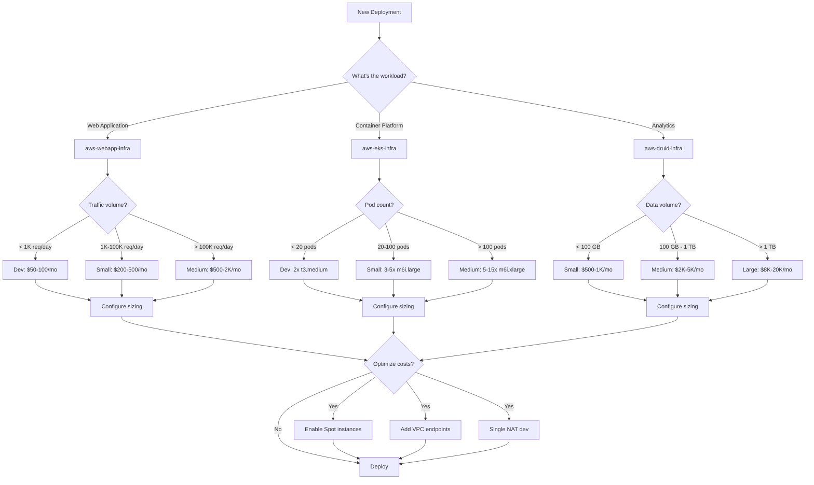
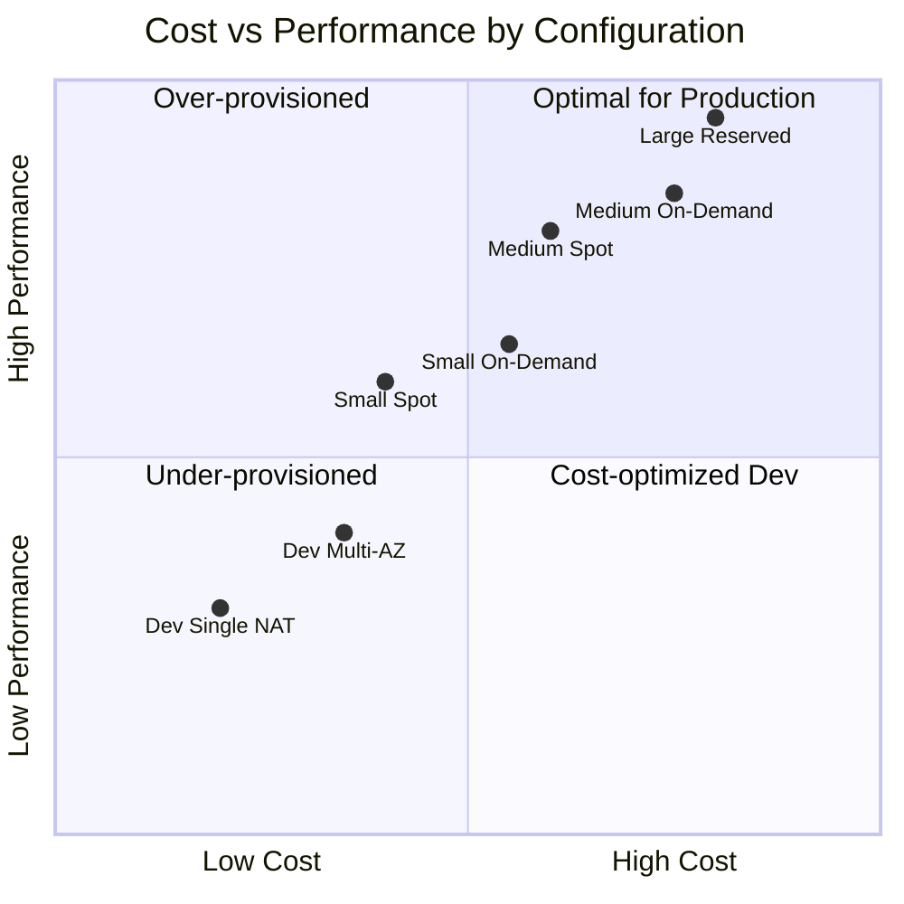

# Capacity Planning Guide

Sizing recommendations, cost estimates, and scaling guidance for Fastish infrastructure deployments.

---

## Quick Reference: Sizing Decision Tree



### Cost-Performance Trade-offs



---

## Table of Contents

1. [Sizing Framework](#sizing-framework)
2. [aws-webapp-infra Capacity](#aws-webapp-infra-capacity)
3. [aws-eks-infra Capacity](#aws-eks-infra-capacity)
4. [aws-druid-infra Capacity](#aws-druid-infra-capacity)
5. [Cost Estimation](#cost-estimation)
6. [Scaling Triggers](#scaling-triggers)
7. [Right-Sizing Process](#right-sizing-process)

---

## Sizing Framework

### Workload Tiers

| Tier | Description | Users/Requests | Data Volume | Use Case |
|------|-------------|----------------|-------------|----------|
| **Development** | Single developer testing | <100/day | <1 GB | Local development |
| **Prototype** | Team evaluation | <1,000/day | <10 GB | POC, demos |
| **Small** | Early production | <10,000/day | <100 GB | Startups, small apps |
| **Medium** | Growth stage | <100,000/day | <1 TB | Mid-market SaaS |
| **Large** | Scale production | <1,000,000/day | <10 TB | Enterprise apps |
| **Enterprise** | High-scale | >1,000,000/day | >10 TB | Large enterprise |

### Key Metrics for Sizing

| Metric | Description | How to Measure |
|--------|-------------|----------------|
| **Requests per Second (RPS)** | API call volume | Application logs, API Gateway metrics |
| **Concurrent Users** | Simultaneous active sessions | Cognito active sessions |
| **Data Ingestion Rate** | Events/records per second | Source system metrics |
| **Query Volume** | Analytical queries per hour | Application metrics |
| **Storage Growth** | Monthly data accumulation | Historical trends |

---

## aws-webapp-infra Capacity

### Serverless Scaling Characteristics

aws-webapp-infra uses serverless components that auto-scale:

| Component | Scaling | Limits | Cost Model |
|-----------|---------|--------|------------|
| **API Gateway** | Automatic | 10,000 RPS default | Per request |
| **Lambda** | Automatic | 1,000 concurrent default | Per invocation + duration |
| **DynamoDB** | On-demand or provisioned | Unlimited with on-demand | Per request or capacity |
| **Cognito** | Automatic | 50 RPS auth default | Per MAU |
| **SES** | Automatic | 200 emails/day sandbox | Per email |

### Recommended Configurations

#### Development/Prototype

```json
{
  "deployment:vpc": {
    "maxAzs": 2,
    "natGateways": 1
  },
  "deployment:db": {
    "billingMode": "PAY_PER_REQUEST"
  },
  "deployment:lambda": {
    "memorySize": 512,
    "timeout": 30
  }
}
```

**Estimated Monthly Cost**: $50-100

#### Small Production

```json
{
  "deployment:vpc": {
    "maxAzs": 2,
    "natGateways": 2
  },
  "deployment:db": {
    "billingMode": "PAY_PER_REQUEST",
    "pointInTimeRecovery": true
  },
  "deployment:lambda": {
    "memorySize": 1024,
    "timeout": 30,
    "reservedConcurrency": 100
  },
  "deployment:api": {
    "throttling": {
      "rateLimit": 1000,
      "burstLimit": 500
    }
  }
}
```

**Estimated Monthly Cost**: $200-500

#### Medium Production

```json
{
  "deployment:vpc": {
    "maxAzs": 3,
    "natGateways": 3
  },
  "deployment:db": {
    "billingMode": "PROVISIONED",
    "readCapacity": 100,
    "writeCapacity": 50,
    "autoScaling": {
      "minCapacity": 50,
      "maxCapacity": 500,
      "targetUtilization": 70
    },
    "pointInTimeRecovery": true,
    "globalSecondaryIndexes": true
  },
  "deployment:lambda": {
    "memorySize": 2048,
    "timeout": 60,
    "reservedConcurrency": 500
  },
  "deployment:api": {
    "throttling": {
      "rateLimit": 10000,
      "burstLimit": 5000
    },
    "caching": {
      "enabled": true,
      "ttl": 300
    }
  }
}
```

**Estimated Monthly Cost**: $500-2,000

### DynamoDB Capacity Planning

| Access Pattern | On-Demand | Provisioned |
|----------------|-----------|-------------|
| **Unpredictable traffic** | Recommended | Not recommended |
| **Steady traffic** | Expensive | Cost-effective |
| **Spiky traffic** | Recommended | With auto-scaling |
| **Development** | Recommended | Overkill |

**Capacity Calculation**:
```
Read Capacity Units (RCU):
  - 1 RCU = 1 strongly consistent read/sec (up to 4 KB)
  - 1 RCU = 2 eventually consistent reads/sec

Write Capacity Units (WCU):
  - 1 WCU = 1 write/sec (up to 1 KB)

Example: 1000 reads/sec × 2 KB items = 500 RCU (eventually consistent)
```

**Reference**: [DynamoDB Capacity Planning](https://docs.aws.amazon.com/amazondynamodb/latest/developerguide/ProvisionedThroughput.html)

---

## aws-eks-infra Capacity

### Node Sizing Guidelines

| Workload Type | Instance Family | Example | Use Case |
|---------------|-----------------|---------|----------|
| **General purpose** | m6i, m7i | m6i.xlarge | Web apps, APIs |
| **Compute optimized** | c6i, c7i | c6i.2xlarge | CPU-intensive |
| **Memory optimized** | r6i, r7i | r6i.2xlarge | Caching, analytics |
| **GPU** | g4dn, g5 | g4dn.xlarge | ML inference |
| **Burstable** | t3, t3a | t3.large | Dev/test |

### Cluster Sizing by Tier

#### Development

```json
{
  "deployment:eks": {
    "version": "1.28",
    "nodeGroups": [
      {
        "name": "default",
        "instanceTypes": ["t3.medium"],
        "minSize": 1,
        "maxSize": 3,
        "desiredSize": 2
      }
    ]
  },
  "deployment:vpc": {
    "natGateways": 1
  }
}
```

**Nodes**: 2 × t3.medium (2 vCPU, 4 GB)
**Estimated Monthly Cost**: $150-300

#### Small Production

```json
{
  "deployment:eks": {
    "version": "1.28",
    "nodeGroups": [
      {
        "name": "system",
        "instanceTypes": ["m6i.large"],
        "minSize": 2,
        "maxSize": 4,
        "desiredSize": 2,
        "labels": {
          "workload": "system"
        }
      }
    ],
    "karpenter": {
      "enabled": true,
      "provisioners": [
        {
          "name": "default",
          "instanceTypes": ["m6i.large", "m6i.xlarge", "m6a.large"],
          "capacityTypes": ["spot", "on-demand"],
          "limits": {
            "cpu": 100,
            "memory": "200Gi"
          }
        }
      ]
    }
  }
}
```

**Nodes**: 2-10 mixed instances
**Estimated Monthly Cost**: $300-800

#### Medium Production

```json
{
  "deployment:eks": {
    "version": "1.28",
    "nodeGroups": [
      {
        "name": "system",
        "instanceTypes": ["m6i.xlarge"],
        "minSize": 3,
        "maxSize": 5,
        "desiredSize": 3,
        "labels": {
          "workload": "system"
        },
        "taints": [
          {
            "key": "CriticalAddonsOnly",
            "effect": "NoSchedule"
          }
        ]
      }
    ],
    "karpenter": {
      "enabled": true,
      "provisioners": [
        {
          "name": "general",
          "instanceTypes": ["m6i.xlarge", "m6i.2xlarge", "m6a.xlarge", "m6a.2xlarge"],
          "capacityTypes": ["spot", "on-demand"],
          "limits": {
            "cpu": 500,
            "memory": "1000Gi"
          }
        },
        {
          "name": "compute",
          "instanceTypes": ["c6i.xlarge", "c6i.2xlarge"],
          "capacityTypes": ["spot"],
          "limits": {
            "cpu": 200
          }
        }
      ]
    }
  }
}
```

**Nodes**: 5-30 mixed instances
**Estimated Monthly Cost**: $800-3,000

### Pod Resource Recommendations

| Application Type | CPU Request | Memory Request | CPU Limit | Memory Limit |
|------------------|-------------|----------------|-----------|--------------|
| **API service** | 100m | 256Mi | 500m | 512Mi |
| **Web frontend** | 50m | 128Mi | 200m | 256Mi |
| **Worker** | 250m | 512Mi | 1000m | 1Gi |
| **Database proxy** | 100m | 256Mi | 500m | 512Mi |
| **Cache** | 100m | 1Gi | 500m | 2Gi |

### Karpenter Optimization

```yaml
# Example NodePool for cost optimization
apiVersion: karpenter.sh/v1beta1
kind: NodePool
metadata:
  name: default
spec:
  template:
    spec:
      requirements:
        - key: karpenter.sh/capacity-type
          operator: In
          values: ["spot", "on-demand"]
        - key: kubernetes.io/arch
          operator: In
          values: ["amd64"]
        - key: node.kubernetes.io/instance-type
          operator: In
          values:
            - m6i.large
            - m6i.xlarge
            - m6a.large
            - m6a.xlarge
            - c6i.large
            - c6i.xlarge
      nodeClassRef:
        name: default
  limits:
    cpu: 1000
    memory: 2000Gi
  disruption:
    consolidationPolicy: WhenUnderutilized
    consolidateAfter: 30s
```

**Reference**: [Karpenter Best Practices](https://aws.github.io/aws-eks-best-practices/karpenter/)

---

## aws-druid-infra Capacity

### Druid Component Sizing

| Component | CPU | Memory | Storage | Replicas | Purpose |
|-----------|-----|--------|---------|----------|---------|
| **Coordinator** | 1-2 | 2-4 GB | 10 GB | 2 | Segment management |
| **Overlord** | 1-2 | 2-4 GB | 10 GB | 2 | Task management |
| **Broker** | 2-8 | 8-32 GB | 10 GB | 2-10 | Query routing |
| **Router** | 0.5-1 | 1-2 GB | 10 GB | 2 | API gateway |
| **Historical** | 4-16 | 16-64 GB | 500 GB-2 TB | 3-50 | Data storage |
| **MiddleManager** | 2-8 | 8-32 GB | 100-500 GB | 2-20 | Ingestion |

### Sizing by Data Volume

#### Small (< 100 GB)

```json
{
  "deployment:druid": {
    "coordinator": { "replicas": 1, "cpu": "1", "memory": "2Gi" },
    "overlord": { "replicas": 1, "cpu": "1", "memory": "2Gi" },
    "broker": { "replicas": 2, "cpu": "2", "memory": "8Gi" },
    "router": { "replicas": 1, "cpu": "0.5", "memory": "1Gi" },
    "historical": { "replicas": 2, "cpu": "4", "memory": "16Gi", "storage": "200Gi" },
    "middleManager": { "replicas": 2, "cpu": "2", "memory": "8Gi", "storage": "100Gi" }
  },
  "deployment:rds": {
    "instanceClass": "db.t3.medium",
    "allocatedStorage": 50,
    "multiAz": false
  },
  "deployment:msk": {
    "instanceType": "kafka.t3.small",
    "brokerCount": 2,
    "storagePerBroker": 100
  }
}
```

**Estimated Monthly Cost**: $500-1,000

#### Medium (100 GB - 1 TB)

```json
{
  "deployment:druid": {
    "coordinator": { "replicas": 2, "cpu": "2", "memory": "4Gi" },
    "overlord": { "replicas": 2, "cpu": "2", "memory": "4Gi" },
    "broker": { "replicas": 3, "cpu": "4", "memory": "16Gi" },
    "router": { "replicas": 2, "cpu": "1", "memory": "2Gi" },
    "historical": { "replicas": 5, "cpu": "8", "memory": "32Gi", "storage": "500Gi" },
    "middleManager": { "replicas": 4, "cpu": "4", "memory": "16Gi", "storage": "200Gi" }
  },
  "deployment:rds": {
    "instanceClass": "db.r6i.large",
    "allocatedStorage": 100,
    "multiAz": true
  },
  "deployment:msk": {
    "instanceType": "kafka.m5.large",
    "brokerCount": 3,
    "storagePerBroker": 500
  }
}
```

**Estimated Monthly Cost**: $2,000-5,000

#### Large (1 TB - 10 TB)

```json
{
  "deployment:druid": {
    "coordinator": { "replicas": 2, "cpu": "4", "memory": "8Gi" },
    "overlord": { "replicas": 2, "cpu": "4", "memory": "8Gi" },
    "broker": { "replicas": 5, "cpu": "8", "memory": "32Gi" },
    "router": { "replicas": 3, "cpu": "2", "memory": "4Gi" },
    "historical": { "replicas": 20, "cpu": "16", "memory": "64Gi", "storage": "1Ti" },
    "middleManager": { "replicas": 10, "cpu": "8", "memory": "32Gi", "storage": "500Gi" }
  },
  "deployment:rds": {
    "instanceClass": "db.r6i.xlarge",
    "allocatedStorage": 500,
    "multiAz": true,
    "readReplicas": 1
  },
  "deployment:msk": {
    "instanceType": "kafka.m5.2xlarge",
    "brokerCount": 6,
    "storagePerBroker": 2000
  }
}
```

**Estimated Monthly Cost**: $8,000-20,000

### Druid Query Performance Targets

| Query Type | Target Latency | Historical Nodes | Broker Cache |
|------------|----------------|------------------|--------------|
| **Simple aggregation** | < 100ms | 3+ | Enabled |
| **Complex aggregation** | < 500ms | 5+ | Enabled |
| **High cardinality** | < 2s | 10+ | Large |
| **Scan queries** | < 5s | 5+ | Optional |

### Historical Node Storage Calculation

```
Total Segments = Raw Data Size × Compression Ratio × Replication Factor
               = 1 TB × 0.3 × 2 = 600 GB

Storage per Historical = Total Segments / Historical Count
                       = 600 GB / 5 = 120 GB

Recommended Storage = Storage per Historical × 1.5 (headroom)
                    = 120 GB × 1.5 = 180 GB
```

**Reference**: [Druid Cluster Tuning](https://druid.apache.org/docs/latest/operations/basic-cluster-tuning.html)

---

## Cost Estimation

### Monthly Cost Calculator

| Component | Small | Medium | Large |
|-----------|-------|--------|-------|
| **aws-webapp-infra** | $100-300 | $300-800 | $800-2,000 |
| **aws-eks-infra** | $200-500 | $500-1,500 | $1,500-5,000 |
| **aws-druid-infra** | $500-1,000 | $2,000-5,000 | $8,000-20,000 |

### Cost Breakdown by Service

| Service | Cost Driver | Optimization |
|---------|-------------|--------------|
| **EC2/EKS** | Instance hours | Spot instances, right-sizing |
| **NAT Gateway** | Hourly + data transfer | VPC endpoints, single NAT |
| **RDS** | Instance hours + storage | Reserved instances |
| **MSK** | Broker hours + storage | Right-size brokers |
| **S3** | Storage + requests | Lifecycle policies |
| **Data Transfer** | Inter-AZ, internet | Same-AZ placement |

### Cost Optimization Checklist

- [ ] Use Spot instances for fault-tolerant workloads (60-70% savings)
- [ ] Deploy VPC endpoints for S3 and DynamoDB (reduce NAT costs)
- [ ] Use single NAT Gateway for non-production (50% savings)
- [ ] Enable S3 Intelligent Tiering for Druid deep storage
- [ ] Use Karpenter consolidation to reduce idle capacity
- [ ] Consider Reserved Instances for steady-state workloads (30-40% savings)
- [ ] Tag resources for cost allocation and tracking
- [ ] Set up AWS Budgets alerts

---

## Scaling Triggers

### When to Scale Up

| Metric | Threshold | Action |
|--------|-----------|--------|
| **CPU utilization** | > 70% sustained | Add capacity |
| **Memory utilization** | > 80% sustained | Add capacity or increase size |
| **API latency p99** | > 1s | Scale API tier |
| **Queue depth** | Growing over time | Scale workers |
| **Disk utilization** | > 70% | Expand storage |
| **Druid query latency** | > 2s p95 | Add Historical nodes |

### When to Scale Down

| Metric | Threshold | Action |
|--------|-----------|--------|
| **CPU utilization** | < 20% sustained | Reduce capacity |
| **Memory utilization** | < 30% sustained | Reduce size |
| **Unused reserved capacity** | > 50% | Release reservations |
| **Idle nodes** | > 30 minutes | Karpenter consolidation |

### Automated Scaling Configuration

#### EKS Horizontal Pod Autoscaler

```yaml
apiVersion: autoscaling/v2
kind: HorizontalPodAutoscaler
metadata:
  name: api-hpa
spec:
  scaleTargetRef:
    apiVersion: apps/v1
    kind: Deployment
    name: api
  minReplicas: 2
  maxReplicas: 20
  metrics:
  - type: Resource
    resource:
      name: cpu
      target:
        type: Utilization
        averageUtilization: 70
  - type: Resource
    resource:
      name: memory
      target:
        type: Utilization
        averageUtilization: 80
  behavior:
    scaleDown:
      stabilizationWindowSeconds: 300
    scaleUp:
      stabilizationWindowSeconds: 60
```

#### DynamoDB Auto Scaling

```json
{
  "deployment:db:autoScaling": {
    "enabled": true,
    "minReadCapacity": 5,
    "maxReadCapacity": 1000,
    "minWriteCapacity": 5,
    "maxWriteCapacity": 500,
    "targetUtilization": 70,
    "scaleInCooldown": 300,
    "scaleOutCooldown": 60
  }
}
```

---

## Right-Sizing Process

### 1. Baseline Metrics (Week 1-2)

```bash
# Collect CPU/memory metrics
aws cloudwatch get-metric-statistics \
  --namespace AWS/EC2 \
  --metric-name CPUUtilization \
  --dimensions Name=AutoScalingGroupName,Value=<asg-name> \
  --start-time $(date -u -d '14 days ago' +%Y-%m-%dT%H:%M:%SZ) \
  --end-time $(date -u +%Y-%m-%dT%H:%M:%SZ) \
  --period 3600 \
  --statistics Average Maximum

# For EKS, use kubectl top or metrics-server
kubectl top nodes
kubectl top pods -A
```

### 2. Identify Opportunities

| Finding | Recommendation |
|---------|----------------|
| CPU < 20% average | Downsize instance or reduce replicas |
| Memory < 40% average | Downsize instance |
| CPU spikes > 90% | Right-size up or enable HPA |
| Uneven pod distribution | Adjust pod topology constraints |

### 3. Implement Changes

```bash
# For managed node groups
aws eks update-nodegroup-config \
  --cluster-name <cluster> \
  --nodegroup-name <nodegroup> \
  --scaling-config minSize=2,maxSize=10,desiredSize=4

# For Karpenter
kubectl edit nodepool default
# Adjust limits and instance types
```

### 4. Validate and Iterate

- Monitor for 1-2 weeks after changes
- Compare cost before/after
- Adjust thresholds based on observed patterns
- Document decisions for future reference

---

## Quick Reference: Sizing Cheat Sheet

| Workload | webapp | eks Nodes | druid Historical |
|----------|--------|-----------|------------------|
| **Dev** | Default | 2 × t3.medium | 2 × 4CPU/16GB |
| **Small** | +PITR | 3-5 × m6i.large | 3 × 8CPU/32GB |
| **Medium** | +Provisioned | 5-15 × m6i.xlarge | 10 × 16CPU/64GB |
| **Large** | +Caching | 20-50 × mixed | 30 × 16CPU/64GB |

---

## Related Documentation

| Document | When to Use |
|----------|-------------|
| [Troubleshooting Guide](TROUBLESHOOTING.md) | Resource limit errors |
| [Network Requirements](NETWORK-REQUIREMENTS.md) | NAT Gateway and VPC costs |
| [Validation Guide](VALIDATION.md) | Verify sizing after deployment |
| [Upgrade Guide](UPGRADE.md) | Scaling during version upgrades |
| [Glossary](../GLOSSARY.md) | Capacity terminology |

### AWS Documentation References

| Topic | AWS Documentation |
|-------|-------------------|
| EC2 Instance Types | [Amazon EC2 Instance Types](https://aws.amazon.com/ec2/instance-types/) |
| EC2 Pricing | [Amazon EC2 Pricing](https://aws.amazon.com/ec2/pricing/) |
| EKS Pricing | [Amazon EKS Pricing](https://aws.amazon.com/eks/pricing/) |
| DynamoDB Capacity | [Read/Write Capacity Mode](https://docs.aws.amazon.com/amazondynamodb/latest/developerguide/HowItWorks.ReadWriteCapacityMode.html) |
| Lambda Pricing | [AWS Lambda Pricing](https://aws.amazon.com/lambda/pricing/) |
| Karpenter Best Practices | [Karpenter Best Practices](https://aws.github.io/aws-eks-best-practices/karpenter/) |
| Spot Instances | [Amazon EC2 Spot Instances](https://aws.amazon.com/ec2/spot/) |
| AWS Pricing Calculator | [AWS Pricing Calculator](https://calculator.aws/) |
| Cost Explorer | [AWS Cost Explorer](https://docs.aws.amazon.com/cost-management/latest/userguide/ce-what-is.html) |

---

**Last Updated**: 2024-01
