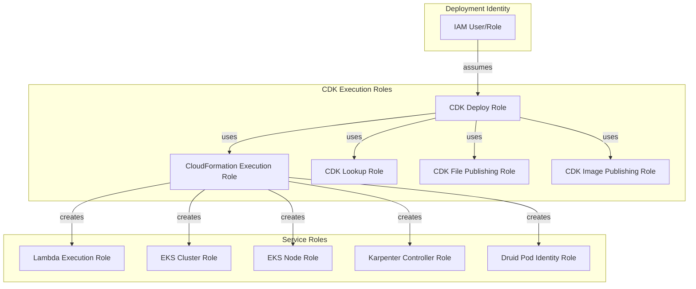
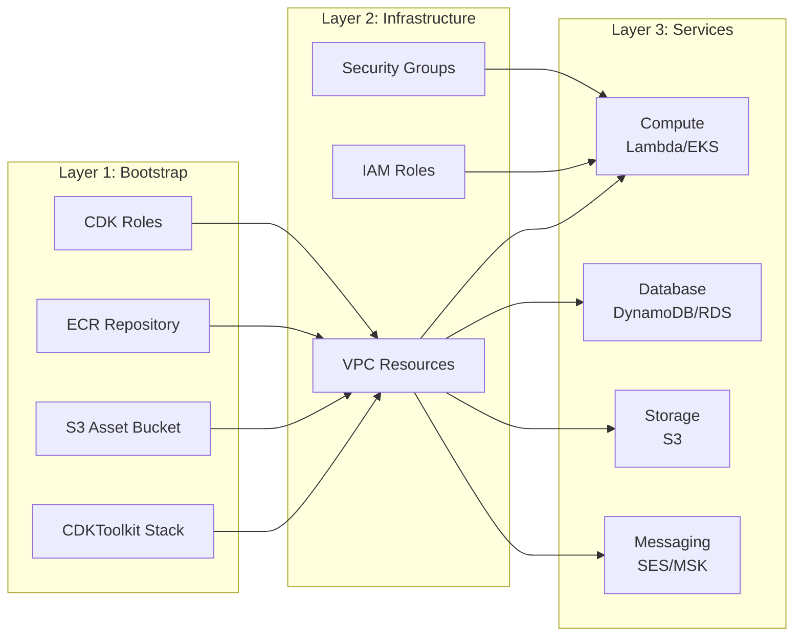

# IAM Permissions Reference

Minimum IAM permissions required to deploy Fastish infrastructure projects.

---

## Quick Reference: Permission Architecture



### Permission Layers



**Permission Requirements by Layer**:

| Layer | Required For | Minimum Permission |
|-------|--------------|-------------------|
| Bootstrap | CDK first-time setup | CDK Bootstrap Policy |
| Infrastructure | VPC, IAM, Security | VPC + IAM policies |
| Services | Compute, Database, etc. | Service-specific policies |

---

## Table of Contents

1. [Overview](#overview)
2. [CDK Bootstrap Permissions](#cdk-bootstrap-permissions)
3. [aws-webapp-infra Permissions](#aws-webapp-infra-permissions)
4. [aws-eks-infra Permissions](#aws-eks-infra-permissions)
5. [aws-druid-infra Permissions](#aws-druid-infra-permissions)
6. [Least Privilege Recommendations](#least-privilege-recommendations)

---

## Overview

Fastish deployments require IAM permissions for:

1. **CDK Bootstrap**: One-time setup of CDK resources (S3, ECR, IAM roles)
2. **CloudFormation**: Stack creation, updates, and resource provisioning
3. **Service-Specific**: Permissions for each AWS service being deployed

### Permission Approaches

| Approach | Use Case | Security | Maintenance |
|----------|----------|----------|-------------|
| **AdministratorAccess** | Development, testing | Low | Easy |
| **PowerUserAccess** | Non-production | Medium | Medium |
| **Least Privilege** | Production | High | Complex |

For production deployments, use the least privilege policies documented below.

---

## CDK Bootstrap Permissions

Required for initial `cdk bootstrap` command. Only needed once per account/region.

### Minimum Bootstrap Policy

```json
{
  "Version": "2012-10-17",
  "Statement": [
    {
      "Sid": "CloudFormationPermissions",
      "Effect": "Allow",
      "Action": [
        "cloudformation:CreateStack",
        "cloudformation:DescribeStacks",
        "cloudformation:DescribeStackEvents",
        "cloudformation:GetTemplate",
        "cloudformation:CreateChangeSet",
        "cloudformation:DescribeChangeSet",
        "cloudformation:ExecuteChangeSet",
        "cloudformation:DeleteChangeSet"
      ],
      "Resource": "arn:aws:cloudformation:*:*:stack/CDKToolkit/*"
    },
    {
      "Sid": "S3BucketCreation",
      "Effect": "Allow",
      "Action": [
        "s3:CreateBucket",
        "s3:PutBucketPolicy",
        "s3:PutBucketVersioning",
        "s3:PutBucketPublicAccessBlock",
        "s3:PutEncryptionConfiguration",
        "s3:PutLifecycleConfiguration"
      ],
      "Resource": "arn:aws:s3:::cdk-*"
    },
    {
      "Sid": "ECRRepositoryCreation",
      "Effect": "Allow",
      "Action": [
        "ecr:CreateRepository",
        "ecr:SetRepositoryPolicy",
        "ecr:PutLifecyclePolicy"
      ],
      "Resource": "arn:aws:ecr:*:*:repository/cdk-*"
    },
    {
      "Sid": "IAMRoleCreation",
      "Effect": "Allow",
      "Action": [
        "iam:CreateRole",
        "iam:PutRolePolicy",
        "iam:AttachRolePolicy",
        "iam:GetRole",
        "iam:PassRole"
      ],
      "Resource": [
        "arn:aws:iam::*:role/cdk-*"
      ]
    },
    {
      "Sid": "SSMParameter",
      "Effect": "Allow",
      "Action": [
        "ssm:PutParameter",
        "ssm:GetParameter"
      ],
      "Resource": "arn:aws:ssm:*:*:parameter/cdk-bootstrap/*"
    }
  ]
}
```

**Reference**: [CDK Bootstrapping](https://docs.aws.amazon.com/cdk/v2/guide/bootstrapping.html)

---

## aws-webapp-infra Permissions

Permissions for deploying serverless web application infrastructure.

### Required Service Permissions

| Service | Actions | Purpose |
|---------|---------|---------|
| **CloudFormation** | Full stack management | Deploy nested stacks |
| **VPC** | Create, modify, delete | Network infrastructure |
| **Cognito** | Full user pool management | Authentication |
| **DynamoDB** | Create, modify tables | Database |
| **SES** | Identity management | Email services |
| **API Gateway** | Full API management | REST API |
| **Lambda** | Full function management | Compute |
| **IAM** | Role and policy management | Service permissions |
| **Route 53** | Record management | DNS for SES |
| **CloudWatch** | Logs, metrics | Monitoring |

### Webapp Deployment Policy

```json
{
  "Version": "2012-10-17",
  "Statement": [
    {
      "Sid": "CloudFormationFullAccess",
      "Effect": "Allow",
      "Action": [
        "cloudformation:*"
      ],
      "Resource": "*"
    },
    {
      "Sid": "VPCManagement",
      "Effect": "Allow",
      "Action": [
        "ec2:CreateVpc",
        "ec2:DeleteVpc",
        "ec2:DescribeVpcs",
        "ec2:ModifyVpcAttribute",
        "ec2:CreateSubnet",
        "ec2:DeleteSubnet",
        "ec2:DescribeSubnets",
        "ec2:CreateInternetGateway",
        "ec2:DeleteInternetGateway",
        "ec2:AttachInternetGateway",
        "ec2:DetachInternetGateway",
        "ec2:DescribeInternetGateways",
        "ec2:CreateNatGateway",
        "ec2:DeleteNatGateway",
        "ec2:DescribeNatGateways",
        "ec2:AllocateAddress",
        "ec2:ReleaseAddress",
        "ec2:DescribeAddresses",
        "ec2:CreateRouteTable",
        "ec2:DeleteRouteTable",
        "ec2:DescribeRouteTables",
        "ec2:CreateRoute",
        "ec2:DeleteRoute",
        "ec2:AssociateRouteTable",
        "ec2:DisassociateRouteTable",
        "ec2:CreateSecurityGroup",
        "ec2:DeleteSecurityGroup",
        "ec2:DescribeSecurityGroups",
        "ec2:AuthorizeSecurityGroupIngress",
        "ec2:AuthorizeSecurityGroupEgress",
        "ec2:RevokeSecurityGroupIngress",
        "ec2:RevokeSecurityGroupEgress",
        "ec2:CreateTags",
        "ec2:DeleteTags",
        "ec2:DescribeTags",
        "ec2:DescribeAvailabilityZones",
        "ec2:DescribeAccountAttributes"
      ],
      "Resource": "*"
    },
    {
      "Sid": "CognitoManagement",
      "Effect": "Allow",
      "Action": [
        "cognito-idp:CreateUserPool",
        "cognito-idp:DeleteUserPool",
        "cognito-idp:DescribeUserPool",
        "cognito-idp:UpdateUserPool",
        "cognito-idp:CreateUserPoolClient",
        "cognito-idp:DeleteUserPoolClient",
        "cognito-idp:DescribeUserPoolClient",
        "cognito-idp:UpdateUserPoolClient",
        "cognito-idp:CreateUserPoolDomain",
        "cognito-idp:DeleteUserPoolDomain",
        "cognito-idp:DescribeUserPoolDomain",
        "cognito-idp:SetUserPoolMfaConfig",
        "cognito-idp:AdminCreateUser",
        "cognito-idp:AdminDeleteUser",
        "cognito-idp:ListUserPools",
        "cognito-idp:ListUserPoolClients"
      ],
      "Resource": "*"
    },
    {
      "Sid": "DynamoDBManagement",
      "Effect": "Allow",
      "Action": [
        "dynamodb:CreateTable",
        "dynamodb:DeleteTable",
        "dynamodb:DescribeTable",
        "dynamodb:UpdateTable",
        "dynamodb:CreateBackup",
        "dynamodb:DescribeBackup",
        "dynamodb:ListBackups",
        "dynamodb:TagResource",
        "dynamodb:UntagResource",
        "dynamodb:ListTagsOfResource",
        "dynamodb:DescribeContinuousBackups",
        "dynamodb:UpdateContinuousBackups"
      ],
      "Resource": "*"
    },
    {
      "Sid": "SESManagement",
      "Effect": "Allow",
      "Action": [
        "ses:CreateEmailIdentity",
        "ses:DeleteEmailIdentity",
        "ses:GetEmailIdentity",
        "ses:PutEmailIdentityDkimAttributes",
        "ses:PutEmailIdentityMailFromAttributes",
        "ses:VerifyEmailIdentity",
        "ses:VerifyDomainIdentity",
        "ses:VerifyDomainDkim",
        "ses:GetIdentityVerificationAttributes",
        "ses:GetIdentityDkimAttributes"
      ],
      "Resource": "*"
    },
    {
      "Sid": "APIGatewayManagement",
      "Effect": "Allow",
      "Action": [
        "apigateway:*"
      ],
      "Resource": "*"
    },
    {
      "Sid": "LambdaManagement",
      "Effect": "Allow",
      "Action": [
        "lambda:CreateFunction",
        "lambda:DeleteFunction",
        "lambda:GetFunction",
        "lambda:GetFunctionConfiguration",
        "lambda:UpdateFunctionCode",
        "lambda:UpdateFunctionConfiguration",
        "lambda:AddPermission",
        "lambda:RemovePermission",
        "lambda:InvokeFunction",
        "lambda:ListFunctions",
        "lambda:CreateEventSourceMapping",
        "lambda:DeleteEventSourceMapping",
        "lambda:GetEventSourceMapping",
        "lambda:ListEventSourceMappings",
        "lambda:TagResource",
        "lambda:UntagResource",
        "lambda:ListTags",
        "lambda:PublishVersion",
        "lambda:CreateAlias",
        "lambda:DeleteAlias",
        "lambda:GetAlias"
      ],
      "Resource": "*"
    },
    {
      "Sid": "IAMRoleManagement",
      "Effect": "Allow",
      "Action": [
        "iam:CreateRole",
        "iam:DeleteRole",
        "iam:GetRole",
        "iam:UpdateRole",
        "iam:PassRole",
        "iam:CreatePolicy",
        "iam:DeletePolicy",
        "iam:GetPolicy",
        "iam:GetPolicyVersion",
        "iam:AttachRolePolicy",
        "iam:DetachRolePolicy",
        "iam:PutRolePolicy",
        "iam:DeleteRolePolicy",
        "iam:GetRolePolicy",
        "iam:ListRolePolicies",
        "iam:ListAttachedRolePolicies",
        "iam:TagRole",
        "iam:UntagRole",
        "iam:CreateServiceLinkedRole"
      ],
      "Resource": "*"
    },
    {
      "Sid": "Route53Management",
      "Effect": "Allow",
      "Action": [
        "route53:ChangeResourceRecordSets",
        "route53:GetHostedZone",
        "route53:ListHostedZones",
        "route53:ListResourceRecordSets",
        "route53:GetChange"
      ],
      "Resource": "*"
    },
    {
      "Sid": "CloudWatchLogs",
      "Effect": "Allow",
      "Action": [
        "logs:CreateLogGroup",
        "logs:DeleteLogGroup",
        "logs:DescribeLogGroups",
        "logs:PutRetentionPolicy",
        "logs:DeleteRetentionPolicy",
        "logs:TagLogGroup",
        "logs:UntagLogGroup"
      ],
      "Resource": "*"
    },
    {
      "Sid": "S3AssetAccess",
      "Effect": "Allow",
      "Action": [
        "s3:GetObject",
        "s3:PutObject",
        "s3:DeleteObject",
        "s3:ListBucket",
        "s3:GetBucketLocation"
      ],
      "Resource": [
        "arn:aws:s3:::cdk-*",
        "arn:aws:s3:::cdk-*/*"
      ]
    }
  ]
}
```

---

## aws-eks-infra Permissions

Permissions for deploying EKS Kubernetes clusters.

### Additional Service Permissions

Beyond webapp permissions, EKS requires:

| Service | Actions | Purpose |
|---------|---------|---------|
| **EKS** | Full cluster management | Kubernetes control plane |
| **EC2** | Extended (ASG, Launch Templates) | Worker nodes |
| **Auto Scaling** | Full management | Node groups |
| **SQS** | Queue management | Karpenter interruption |
| **SSM** | Parameter access | Bottlerocket configuration |

### EKS Deployment Policy (Additional)

```json
{
  "Version": "2012-10-17",
  "Statement": [
    {
      "Sid": "EKSFullAccess",
      "Effect": "Allow",
      "Action": [
        "eks:*"
      ],
      "Resource": "*"
    },
    {
      "Sid": "EC2ExtendedAccess",
      "Effect": "Allow",
      "Action": [
        "ec2:CreateLaunchTemplate",
        "ec2:DeleteLaunchTemplate",
        "ec2:DescribeLaunchTemplates",
        "ec2:DescribeLaunchTemplateVersions",
        "ec2:CreateLaunchTemplateVersion",
        "ec2:ModifyLaunchTemplate",
        "ec2:RunInstances",
        "ec2:TerminateInstances",
        "ec2:DescribeInstances",
        "ec2:DescribeInstanceTypes",
        "ec2:DescribeImages",
        "ec2:DescribeKeyPairs",
        "ec2:CreateFleet",
        "ec2:DeleteFleets",
        "ec2:DescribeFleets",
        "ec2:DescribeSpotPriceHistory"
      ],
      "Resource": "*"
    },
    {
      "Sid": "AutoScalingAccess",
      "Effect": "Allow",
      "Action": [
        "autoscaling:CreateAutoScalingGroup",
        "autoscaling:DeleteAutoScalingGroup",
        "autoscaling:DescribeAutoScalingGroups",
        "autoscaling:UpdateAutoScalingGroup",
        "autoscaling:CreateLaunchConfiguration",
        "autoscaling:DeleteLaunchConfiguration",
        "autoscaling:DescribeLaunchConfigurations",
        "autoscaling:CreateOrUpdateTags",
        "autoscaling:DeleteTags",
        "autoscaling:DescribeTags",
        "autoscaling:SetDesiredCapacity",
        "autoscaling:TerminateInstanceInAutoScalingGroup"
      ],
      "Resource": "*"
    },
    {
      "Sid": "SQSManagement",
      "Effect": "Allow",
      "Action": [
        "sqs:CreateQueue",
        "sqs:DeleteQueue",
        "sqs:GetQueueAttributes",
        "sqs:SetQueueAttributes",
        "sqs:TagQueue",
        "sqs:UntagQueue",
        "sqs:ListQueueTags",
        "sqs:GetQueueUrl",
        "sqs:ListQueues"
      ],
      "Resource": "*"
    },
    {
      "Sid": "SSMParameterAccess",
      "Effect": "Allow",
      "Action": [
        "ssm:GetParameter",
        "ssm:GetParameters",
        "ssm:GetParametersByPath"
      ],
      "Resource": "arn:aws:ssm:*:*:parameter/aws/*"
    },
    {
      "Sid": "ServiceLinkedRoles",
      "Effect": "Allow",
      "Action": [
        "iam:CreateServiceLinkedRole"
      ],
      "Resource": "*",
      "Condition": {
        "StringEquals": {
          "iam:AWSServiceName": [
            "eks.amazonaws.com",
            "eks-nodegroup.amazonaws.com",
            "autoscaling.amazonaws.com",
            "elasticloadbalancing.amazonaws.com"
          ]
        }
      }
    }
  ]
}
```

---

## aws-druid-infra Permissions

Permissions for deploying Apache Druid on EKS.

### Additional Service Permissions

Beyond EKS permissions, Druid requires:

| Service | Actions | Purpose |
|---------|---------|---------|
| **RDS** | Full instance management | Metadata storage |
| **S3** | Full bucket management | Deep storage |
| **MSK** | Full cluster management | Kafka streaming |
| **Secrets Manager** | Secret management | Database credentials |

### Druid Deployment Policy (Additional)

```json
{
  "Version": "2012-10-17",
  "Statement": [
    {
      "Sid": "RDSManagement",
      "Effect": "Allow",
      "Action": [
        "rds:CreateDBInstance",
        "rds:DeleteDBInstance",
        "rds:DescribeDBInstances",
        "rds:ModifyDBInstance",
        "rds:CreateDBSubnetGroup",
        "rds:DeleteDBSubnetGroup",
        "rds:DescribeDBSubnetGroups",
        "rds:CreateDBParameterGroup",
        "rds:DeleteDBParameterGroup",
        "rds:DescribeDBParameterGroups",
        "rds:ModifyDBParameterGroup",
        "rds:CreateDBSnapshot",
        "rds:DeleteDBSnapshot",
        "rds:DescribeDBSnapshots",
        "rds:RestoreDBInstanceFromDBSnapshot",
        "rds:AddTagsToResource",
        "rds:RemoveTagsFromResource",
        "rds:ListTagsForResource"
      ],
      "Resource": "*"
    },
    {
      "Sid": "S3BucketManagement",
      "Effect": "Allow",
      "Action": [
        "s3:CreateBucket",
        "s3:DeleteBucket",
        "s3:GetBucketLocation",
        "s3:GetBucketPolicy",
        "s3:PutBucketPolicy",
        "s3:DeleteBucketPolicy",
        "s3:GetBucketVersioning",
        "s3:PutBucketVersioning",
        "s3:GetBucketEncryption",
        "s3:PutBucketEncryption",
        "s3:GetLifecycleConfiguration",
        "s3:PutLifecycleConfiguration",
        "s3:GetBucketPublicAccessBlock",
        "s3:PutBucketPublicAccessBlock",
        "s3:GetBucketTagging",
        "s3:PutBucketTagging",
        "s3:ListBucket"
      ],
      "Resource": "*"
    },
    {
      "Sid": "MSKManagement",
      "Effect": "Allow",
      "Action": [
        "kafka:CreateCluster",
        "kafka:DeleteCluster",
        "kafka:DescribeCluster",
        "kafka:DescribeClusterV2",
        "kafka:UpdateClusterConfiguration",
        "kafka:UpdateBrokerCount",
        "kafka:UpdateBrokerStorage",
        "kafka:GetBootstrapBrokers",
        "kafka:ListClusters",
        "kafka:ListClustersV2",
        "kafka:CreateConfiguration",
        "kafka:DeleteConfiguration",
        "kafka:DescribeConfiguration",
        "kafka:ListConfigurations",
        "kafka:TagResource",
        "kafka:UntagResource",
        "kafka:ListTagsForResource"
      ],
      "Resource": "*"
    },
    {
      "Sid": "SecretsManagerAccess",
      "Effect": "Allow",
      "Action": [
        "secretsmanager:CreateSecret",
        "secretsmanager:DeleteSecret",
        "secretsmanager:DescribeSecret",
        "secretsmanager:GetSecretValue",
        "secretsmanager:PutSecretValue",
        "secretsmanager:UpdateSecret",
        "secretsmanager:TagResource",
        "secretsmanager:UntagResource"
      ],
      "Resource": "*"
    },
    {
      "Sid": "KMSAccess",
      "Effect": "Allow",
      "Action": [
        "kms:CreateKey",
        "kms:DescribeKey",
        "kms:EnableKey",
        "kms:DisableKey",
        "kms:CreateAlias",
        "kms:DeleteAlias",
        "kms:ListAliases",
        "kms:CreateGrant",
        "kms:ListGrants",
        "kms:RevokeGrant",
        "kms:Encrypt",
        "kms:Decrypt",
        "kms:GenerateDataKey",
        "kms:TagResource",
        "kms:UntagResource"
      ],
      "Resource": "*"
    }
  ]
}
```

---

## Least Privilege Recommendations

### Use Resource-Level Restrictions

Instead of `"Resource": "*"`, restrict to specific ARN patterns:

```json
{
  "Effect": "Allow",
  "Action": ["dynamodb:*"],
  "Resource": [
    "arn:aws:dynamodb:us-west-2:123456789012:table/fastish-*"
  ]
}
```

### Use Condition Keys

Restrict actions based on tags or other conditions:

```json
{
  "Effect": "Allow",
  "Action": ["ec2:RunInstances"],
  "Resource": "*",
  "Condition": {
    "StringEquals": {
      "aws:RequestTag/Project": "Fastish"
    }
  }
}
```

### Use IAM Permission Boundaries

Create a permission boundary to cap maximum permissions:

```json
{
  "Version": "2012-10-17",
  "Statement": [
    {
      "Effect": "Allow",
      "Action": "*",
      "Resource": "*"
    },
    {
      "Effect": "Deny",
      "Action": [
        "iam:CreateUser",
        "iam:DeleteUser",
        "organizations:*",
        "account:*"
      ],
      "Resource": "*"
    }
  ]
}
```

### Review with IAM Access Analyzer

After deployment, use IAM Access Analyzer to identify unused permissions:

```bash
aws accessanalyzer list-findings \
  --analyzer-arn <analyzer-arn> \
  --filter 'status={"eq": ["ACTIVE"]}'
```

**Reference**: [IAM Best Practices](https://docs.aws.amazon.com/IAM/latest/UserGuide/best-practices.html)

---

## Quick Reference: Permission Sets

| Deployment | Quick Start | Production |
|------------|-------------|------------|
| **CDK Bootstrap** | `AdministratorAccess` | Bootstrap Policy |
| **aws-webapp-infra** | `PowerUserAccess` | Webapp Policy |
| **aws-eks-infra** | `PowerUserAccess` | Webapp + EKS Policies |
| **aws-druid-infra** | `PowerUserAccess` | Webapp + EKS + Druid Policies |

---

## Related Documentation

| Document | When to Use |
|----------|-------------|
| [Troubleshooting Guide](TROUBLESHOOTING.md) | Permission denied errors |
| [Network Requirements](NETWORK-REQUIREMENTS.md) | Security group and VPC policies |
| [Validation Guide](VALIDATION.md) | Verify permissions work correctly |
| [Glossary](../GLOSSARY.md) | IAM terminology definitions |

### AWS Documentation References

| Topic | AWS Documentation |
|-------|-------------------|
| IAM Best Practices | [Security Best Practices in IAM](https://docs.aws.amazon.com/IAM/latest/UserGuide/best-practices.html) |
| IAM Policy Reference | [IAM JSON Policy Reference](https://docs.aws.amazon.com/IAM/latest/UserGuide/reference_policies.html) |
| CDK Security | [Security Best Practices for AWS CDK](https://docs.aws.amazon.com/cdk/v2/guide/security.html) |
| EKS IAM | [IAM Roles for Service Accounts](https://docs.aws.amazon.com/eks/latest/userguide/iam-roles-for-service-accounts.html) |
| Pod Identity | [EKS Pod Identity](https://docs.aws.amazon.com/eks/latest/userguide/pod-identities.html) |
| Service-Linked Roles | [Using Service-Linked Roles](https://docs.aws.amazon.com/IAM/latest/UserGuide/using-service-linked-roles.html) |
| Permission Boundaries | [Permissions Boundaries](https://docs.aws.amazon.com/IAM/latest/UserGuide/access_policies_boundaries.html) |

---

**Last Updated**: 2024-01
