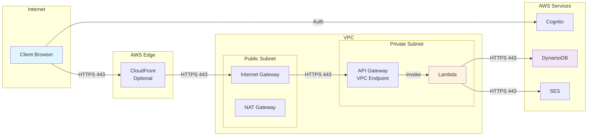
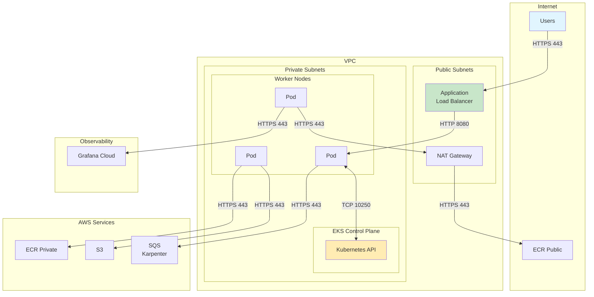
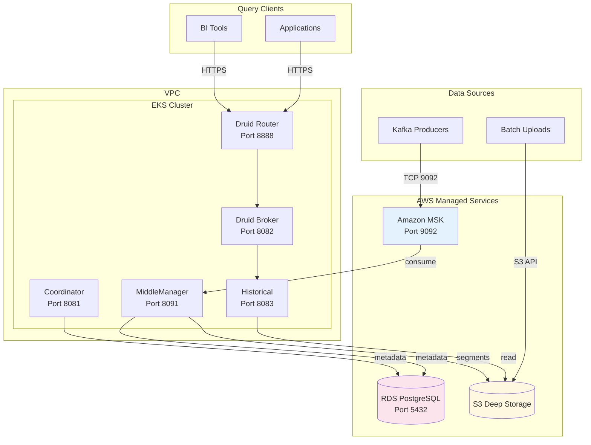

# Network Requirements

Network architecture, CIDR planning, port requirements, and connectivity prerequisites for Fastish infrastructure deployments.

---

## Quick Reference: Traffic Flow Patterns

### aws-webapp-infra Traffic Flow



### aws-eks-infra Traffic Flow



### aws-druid-infra Traffic Flow



---

## Table of Contents

1. [VPC Architecture](#vpc-architecture)
2. [CIDR Planning](#cidr-planning)
3. [Port Requirements](#port-requirements)
4. [Security Group Rules](#security-group-rules)
5. [NAT Gateway Considerations](#nat-gateway-considerations)
6. [DNS Requirements](#dns-requirements)
7. [Cross-Stack Connectivity](#cross-stack-connectivity)
8. [Firewall and Proxy Considerations](#firewall-and-proxy-considerations)

---

## VPC Architecture

### Standard VPC Layout

All Fastish projects deploy a VPC with the following structure:

```
┌─────────────────────────────────────────────────────────────────────┐
│                        VPC (10.0.0.0/16)                           │
├─────────────────────────────────────────────────────────────────────┤
│                                                                     │
│  ┌─────────────────────────────┐  ┌─────────────────────────────┐  │
│  │     Availability Zone A     │  │     Availability Zone B     │  │
│  ├─────────────────────────────┤  ├─────────────────────────────┤  │
│  │                             │  │                             │  │
│  │  ┌───────────────────────┐  │  │  ┌───────────────────────┐  │  │
│  │  │   Public Subnet       │  │  │  │   Public Subnet       │  │  │
│  │  │   10.0.0.0/24         │  │  │  │   10.0.1.0/24         │  │  │
│  │  │   - NAT Gateway       │  │  │  │   - NAT Gateway       │  │  │
│  │  │   - Load Balancers    │  │  │  │   - Load Balancers    │  │  │
│  │  └───────────────────────┘  │  │  └───────────────────────┘  │  │
│  │                             │  │                             │  │
│  │  ┌───────────────────────┐  │  │  ┌───────────────────────┐  │  │
│  │  │   Private Subnet      │  │  │  │   Private Subnet      │  │  │
│  │  │   10.0.2.0/24         │  │  │  │   10.0.3.0/24         │  │  │
│  │  │   - EKS Nodes         │  │  │  │   - EKS Nodes         │  │  │
│  │  │   - Lambda Functions  │  │  │  │   - Lambda Functions  │  │  │
│  │  │   - RDS Instances     │  │  │  │   - RDS Instances     │  │  │
│  │  └───────────────────────┘  │  │  └───────────────────────┘  │  │
│  │                             │  │                             │  │
│  └─────────────────────────────┘  └─────────────────────────────┘  │
│                                                                     │
│  ┌─────────────────────────────────────────────────────────────┐   │
│  │                     Internet Gateway                         │   │
│  └─────────────────────────────────────────────────────────────┘   │
│                                                                     │
└─────────────────────────────────────────────────────────────────────┘
```

### Subnet Types

| Subnet Type | CIDR Size | Purpose | Internet Access |
|-------------|-----------|---------|-----------------|
| **Public** | /24 (251 IPs) | NAT Gateways, ALBs, NLBs | Direct via IGW |
| **Private** | /24 (251 IPs) | Compute resources, databases | Outbound via NAT |
| **Isolated** | /24 (251 IPs) | Databases (optional) | None |

**Reference**: [VPC Subnets](https://docs.aws.amazon.com/vpc/latest/userguide/configure-subnets.html)

---

## CIDR Planning

### Default CIDR Allocation

| Project | VPC CIDR | Public A | Public B | Private A | Private B |
|---------|----------|----------|----------|-----------|-----------|
| aws-webapp-infra | 10.0.0.0/16 | 10.0.0.0/24 | 10.0.1.0/24 | 10.0.2.0/24 | 10.0.3.0/24 |
| aws-eks-infra | 10.1.0.0/16 | 10.1.0.0/24 | 10.1.1.0/24 | 10.1.2.0/24 | 10.1.3.0/24 |
| aws-druid-infra | 10.2.0.0/16 | 10.2.0.0/24 | 10.2.1.0/24 | 10.2.2.0/24 | 10.2.3.0/24 |

### CIDR Customization

Override default CIDRs in `cdk.context.json`:

```json
{
  "deployment:vpc:cidr": "10.100.0.0/16",
  "deployment:vpc:publicSubnetCidrs": ["10.100.0.0/24", "10.100.1.0/24"],
  "deployment:vpc:privateSubnetCidrs": ["10.100.2.0/24", "10.100.3.0/24"]
}
```

### Multi-Stack CIDR Planning

When deploying multiple stacks that may need peering:

```
Corporate Network:  172.16.0.0/12
AWS Region 1:       10.0.0.0/12
  - Production:     10.0.0.0/14 (10.0.0.0 - 10.3.255.255)
  - Staging:        10.4.0.0/14 (10.4.0.0 - 10.7.255.255)
  - Development:    10.8.0.0/14 (10.8.0.0 - 10.11.255.255)
```

### EKS-Specific CIDR Requirements

EKS clusters require additional IP addresses for pods:

| Configuration | Pods per Node | IPs per Node | Recommendation |
|---------------|---------------|--------------|----------------|
| **Default VPC CNI** | ~29 | ~30 | /24 subnet per AZ |
| **Prefix Delegation** | ~110 | ~120 | /22 subnet per AZ |
| **Custom Networking** | Variable | Variable | Secondary CIDR |

**Reference**: [EKS VPC and Subnet Requirements](https://docs.aws.amazon.com/eks/latest/userguide/network_reqs.html)

To enable prefix delegation for higher pod density:

```json
{
  "deployment:eks:vpc:cni:enablePrefixDelegation": true
}
```

---

## Port Requirements

### aws-webapp-infra Ports

| Source | Destination | Port | Protocol | Purpose |
|--------|-------------|------|----------|---------|
| Internet | ALB | 443 | HTTPS | API Gateway |
| ALB | Lambda | 443 | HTTPS | Lambda invocation |
| Lambda | DynamoDB | 443 | HTTPS | DynamoDB VPC endpoint |
| Lambda | Internet | 443 | HTTPS | External APIs via NAT |
| Cognito | SES | 443 | HTTPS | Email delivery |

### aws-eks-infra Ports

| Source | Destination | Port | Protocol | Purpose |
|--------|-------------|------|----------|---------|
| Internet | ALB | 443 | HTTPS | Ingress traffic |
| Internet | ALB | 80 | HTTP | Redirect to HTTPS |
| Worker Nodes | Control Plane | 443 | HTTPS | Kubernetes API |
| Control Plane | Worker Nodes | 10250 | HTTPS | Kubelet API |
| Control Plane | Worker Nodes | 53 | TCP/UDP | CoreDNS |
| Worker Nodes | Worker Nodes | All | All | Pod-to-pod (VPC CNI) |
| Worker Nodes | Internet | 443 | HTTPS | ECR, S3, AWS APIs |
| Karpenter | SQS | 443 | HTTPS | Interruption events |

**Reference**: [EKS Security Group Requirements](https://docs.aws.amazon.com/eks/latest/userguide/sec-group-reqs.html)

### aws-druid-infra Ports

Includes all EKS ports plus:

| Source | Destination | Port | Protocol | Purpose |
|--------|-------------|------|----------|---------|
| Druid Nodes | RDS PostgreSQL | 5432 | TCP | Metadata storage |
| Druid Nodes | S3 | 443 | HTTPS | Deep storage |
| Druid Nodes | MSK | 9092 | TCP | Kafka plaintext |
| Druid Nodes | MSK | 9094 | TCP | Kafka TLS |
| Druid Broker | Druid Historical | 8083 | HTTP | Query routing |
| Druid Router | Druid Broker | 8082 | HTTP | Query proxy |
| Druid MiddleManager | Druid Overlord | 8090 | HTTP | Task coordination |
| Client | Druid Router | 8888 | HTTP | Web console/API |

---

## Security Group Rules

### EKS Cluster Security Group

```
Inbound Rules:
┌───────────────┬──────────┬────────────┬─────────────────────────────┐
│ Type          │ Protocol │ Port Range │ Source                      │
├───────────────┼──────────┼────────────┼─────────────────────────────┤
│ HTTPS         │ TCP      │ 443        │ Worker Node SG              │
│ Custom TCP    │ TCP      │ 10250      │ Worker Node SG              │
│ DNS (TCP)     │ TCP      │ 53         │ Worker Node SG              │
│ DNS (UDP)     │ UDP      │ 53         │ Worker Node SG              │
└───────────────┴──────────┴────────────┴─────────────────────────────┘

Outbound Rules:
┌───────────────┬──────────┬────────────┬─────────────────────────────┐
│ Type          │ Protocol │ Port Range │ Destination                 │
├───────────────┼──────────┼────────────┼─────────────────────────────┤
│ All traffic   │ All      │ All        │ 0.0.0.0/0                   │
└───────────────┴──────────┴────────────┴─────────────────────────────┘
```

### Worker Node Security Group

```
Inbound Rules:
┌───────────────┬──────────┬────────────┬─────────────────────────────┐
│ Type          │ Protocol │ Port Range │ Source                      │
├───────────────┼──────────┼────────────┼─────────────────────────────┤
│ All traffic   │ All      │ All        │ Self (Worker Node SG)       │
│ HTTPS         │ TCP      │ 443        │ Cluster SG                  │
│ Custom TCP    │ TCP      │ 10250      │ Cluster SG                  │
│ Custom TCP    │ TCP      │ 53         │ Cluster SG                  │
│ Custom UDP    │ UDP      │ 53         │ Cluster SG                  │
└───────────────┴──────────┴────────────┴─────────────────────────────┘

Outbound Rules:
┌───────────────┬──────────┬────────────┬─────────────────────────────┐
│ Type          │ Protocol │ Port Range │ Destination                 │
├───────────────┼──────────┼────────────┼─────────────────────────────┤
│ All traffic   │ All      │ All        │ 0.0.0.0/0                   │
└───────────────┴──────────┴────────────┴─────────────────────────────┘
```

### RDS Security Group (Druid)

```
Inbound Rules:
┌───────────────┬──────────┬────────────┬─────────────────────────────┐
│ Type          │ Protocol │ Port Range │ Source                      │
├───────────────┼──────────┼────────────┼─────────────────────────────┤
│ PostgreSQL    │ TCP      │ 5432       │ Worker Node SG              │
└───────────────┴──────────┴────────────┴─────────────────────────────┘

Outbound Rules:
┌───────────────┬──────────┬────────────┬─────────────────────────────┐
│ Type          │ Protocol │ Port Range │ Destination                 │
├───────────────┼──────────┼────────────┼─────────────────────────────┤
│ All traffic   │ All      │ All        │ 0.0.0.0/0                   │
└───────────────┴──────────┴────────────┴─────────────────────────────┘
```

---

## NAT Gateway Considerations

### Default Configuration

| Setting | Value | Notes |
|---------|-------|-------|
| **Count** | 1 per AZ | High availability |
| **Type** | NAT Gateway | Managed service |
| **Elastic IP** | 1 per NAT | Required |

### Cost Optimization Options

```json
{
  "deployment:vpc:natGateways": 1
}
```

| Configuration | Monthly Cost (approx) | Availability | Use Case |
|---------------|----------------------|--------------|----------|
| **2 NAT Gateways** | ~$65 + data | High | Production |
| **1 NAT Gateway** | ~$32 + data | Medium | Non-production |
| **NAT Instance** | ~$15 + data | Low | Development |

### Data Transfer Costs

NAT Gateway charges for data processed:

| Data Direction | Cost |
|----------------|------|
| Inbound | Free |
| Outbound to Internet | $0.045/GB |
| Outbound to same AZ | Free |
| Outbound to different AZ | $0.01/GB |

**Optimization**: Use VPC endpoints to avoid NAT Gateway for AWS services.

### VPC Endpoints (Recommended)

Deploy interface endpoints for frequently used services:

| Service | Endpoint Type | Benefit |
|---------|---------------|---------|
| **S3** | Gateway | Free, no NAT charges |
| **DynamoDB** | Gateway | Free, no NAT charges |
| **ECR** | Interface | Faster image pulls |
| **CloudWatch Logs** | Interface | Reduce NAT traffic |
| **STS** | Interface | IAM role assumption |

```json
{
  "deployment:vpc:endpoints": ["s3", "dynamodb", "ecr.api", "ecr.dkr", "logs", "sts"]
}
```

---

## DNS Requirements

### Route 53 Integration

| Requirement | Service | Purpose |
|-------------|---------|---------|
| **Domain Registration** | Route 53 | Custom domain names |
| **Hosted Zone** | Route 53 | DNS record management |
| **Private Hosted Zone** | Route 53 | Internal DNS for VPC |

### SES DNS Records

For aws-webapp-infra with SES:

| Record Type | Name | Purpose |
|-------------|------|---------|
| **TXT** | `_amazonses.domain.com` | Domain verification |
| **CNAME** | `selector1._domainkey.domain.com` | DKIM signing |
| **CNAME** | `selector2._domainkey.domain.com` | DKIM signing |
| **CNAME** | `selector3._domainkey.domain.com` | DKIM signing |
| **TXT** | `_dmarc.domain.com` | DMARC policy |
| **MX** | `domain.com` | Inbound mail (optional) |

### EKS DNS

EKS clusters use CoreDNS for internal resolution:

| Domain | Resolution |
|--------|------------|
| `*.cluster.local` | Kubernetes services |
| `*.svc.cluster.local` | Service discovery |
| `*.pod.cluster.local` | Pod DNS |
| External domains | Forward to VPC DNS |

---

## Cross-Stack Connectivity

### VPC Peering

For connecting multiple Fastish deployments:

```
┌─────────────────┐     ┌─────────────────┐
│  webapp VPC     │     │   eks VPC       │
│  10.0.0.0/16    │────▶│  10.1.0.0/16    │
└─────────────────┘     └─────────────────┘
         │                      │
         └──────────┬───────────┘
                    ▼
         ┌─────────────────┐
         │   druid VPC     │
         │  10.2.0.0/16    │
         └─────────────────┘
```

### Requirements for Peering

1. **Non-overlapping CIDRs**: VPCs cannot have overlapping IP ranges
2. **Route Tables**: Add routes to peered VPC CIDRs
3. **Security Groups**: Reference peered VPC security groups
4. **DNS Resolution**: Enable DNS resolution across peering

### Transit Gateway (Enterprise)

For many interconnected VPCs:

```json
{
  "deployment:network:transitGateway": {
    "enabled": true,
    "id": "tgw-0123456789abcdef0"
  }
}
```

---

## Firewall and Proxy Considerations

### Corporate Firewall Allowlist

If deploying from a corporate network with egress filtering:

| Destination | Port | Purpose |
|-------------|------|---------|
| `*.amazonaws.com` | 443 | AWS APIs |
| `*.cloudfront.net` | 443 | CDK assets |
| `*.github.com` | 443 | Repository cloning |
| `*.githubusercontent.com` | 443 | GitHub raw content |
| `repo.maven.apache.org` | 443 | Maven dependencies |
| `registry.npmjs.org` | 443 | CDK CLI dependencies |
| `grafana.com` | 443 | Grafana Cloud (if used) |

### HTTP Proxy Configuration

For environments requiring proxy:

```bash
# Set proxy environment variables
export HTTP_PROXY=http://proxy.example.com:8080
export HTTPS_PROXY=http://proxy.example.com:8080
export NO_PROXY=localhost,127.0.0.1,169.254.169.254,.amazonaws.com

# Configure AWS CLI
aws configure set default.proxy http://proxy.example.com:8080

# Configure Maven
# Add to ~/.m2/settings.xml
<proxies>
  <proxy>
    <id>corporate-proxy</id>
    <active>true</active>
    <protocol>https</protocol>
    <host>proxy.example.com</host>
    <port>8080</port>
  </proxy>
</proxies>
```

### AWS PrivateLink

For private connectivity to AWS services without internet:

| Service | Endpoint Service Name |
|---------|----------------------|
| CloudFormation | `com.amazonaws.<region>.cloudformation` |
| EKS | `com.amazonaws.<region>.eks` |
| ECR API | `com.amazonaws.<region>.ecr.api` |
| ECR Docker | `com.amazonaws.<region>.ecr.dkr` |
| S3 | `com.amazonaws.<region>.s3` |

---

## Network Validation Checklist

Before deployment, verify:

- [ ] VPC CIDR does not conflict with existing networks
- [ ] Subnet CIDRs are correctly sized for workload
- [ ] NAT Gateway limits are not exceeded (5 per AZ default)
- [ ] Elastic IP limits are not exceeded (5 per region default)
- [ ] Route 53 hosted zone exists for SES domain
- [ ] Security group rules allow required traffic
- [ ] VPC endpoints configured for cost optimization
- [ ] DNS resolution configured correctly
- [ ] Proxy/firewall rules allow AWS API access

```bash
# Verify VPC CIDR availability
aws ec2 describe-vpcs --query 'Vpcs[*].CidrBlock'

# Check NAT Gateway limits
aws service-quotas get-service-quota \
  --service-code vpc \
  --quota-code L-FE5A380F

# Verify Route 53 hosted zone
aws route53 list-hosted-zones --query 'HostedZones[*].[Name,Id]'
```

---

## Related Documentation

| Document | When to Use |
|----------|-------------|
| [Troubleshooting Guide](TROUBLESHOOTING.md) | Connectivity issues |
| [IAM Permissions](IAM-PERMISSIONS.md) | Security group management permissions |
| [Capacity Planning](CAPACITY-PLANNING.md) | NAT Gateway cost optimization |
| [Validation Guide](VALIDATION.md) | Network connectivity validation |
| [Glossary](../GLOSSARY.md) | Networking terminology |

### AWS Documentation References

| Topic | AWS Documentation |
|-------|-------------------|
| VPC User Guide | [Amazon VPC User Guide](https://docs.aws.amazon.com/vpc/latest/userguide/what-is-amazon-vpc.html) |
| VPC Quotas | [VPC Quotas](https://docs.aws.amazon.com/vpc/latest/userguide/amazon-vpc-limits.html) |
| NAT Gateway | [NAT Gateways](https://docs.aws.amazon.com/vpc/latest/userguide/vpc-nat-gateway.html) |
| VPC Endpoints | [VPC Endpoints](https://docs.aws.amazon.com/vpc/latest/privatelink/vpc-endpoints.html) |
| Security Groups | [Security Groups](https://docs.aws.amazon.com/vpc/latest/userguide/vpc-security-groups.html) |
| EKS Networking | [EKS Networking](https://docs.aws.amazon.com/eks/latest/userguide/eks-networking.html) |
| VPC CNI | [Amazon VPC CNI](https://docs.aws.amazon.com/eks/latest/userguide/managing-vpc-cni.html) |
| Transit Gateway | [AWS Transit Gateway](https://docs.aws.amazon.com/vpc/latest/tgw/what-is-transit-gateway.html) |

---

**Last Updated**: 2024-01
