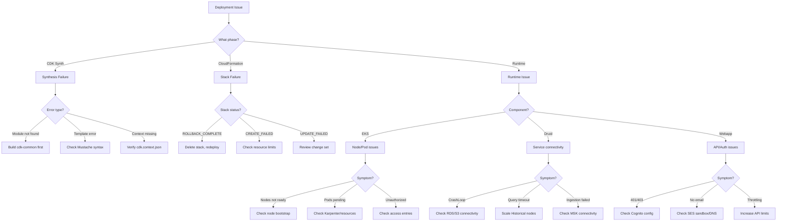
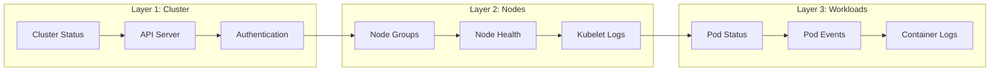
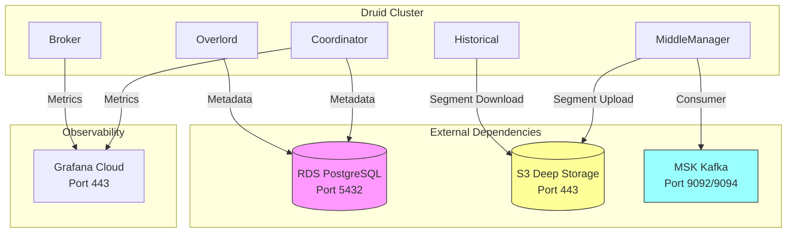

# Troubleshooting Guide

Common issues encountered during Fastish infrastructure deployments and their resolutions.

---

## Quick Reference: Troubleshooting Flow



---

## Table of Contents

1. [CDK Bootstrap Issues](#cdk-bootstrap-issues)
2. [CDK Synthesis Failures](#cdk-synthesis-failures)
3. [CloudFormation Deployment Failures](#cloudformation-deployment-failures)
4. [EKS Cluster Issues](#eks-cluster-issues)
5. [Druid Deployment Issues](#druid-deployment-issues)
6. [Networking Issues](#networking-issues)
7. [Authentication Issues](#authentication-issues)
8. [Observability Issues](#observability-issues)
9. [Cost and Quota Issues](#cost-and-quota-issues)

---

## CDK Bootstrap Issues

### Error: "This stack uses assets, so the toolkit stack must be deployed"

**Symptoms**:
```
Error: This stack uses assets, so the toolkit stack must be deployed to the environment
```

**Cause**: CDK bootstrap has not been run for the target account/region.

**Resolution**:
```bash
# Bootstrap the account/region
cdk bootstrap aws://<account-id>/<region>

# Verify bootstrap completed
aws cloudformation describe-stacks \
  --stack-name CDKToolkit \
  --region <region> \
  --query 'Stacks[0].StackStatus'
```

**Reference**: [CDK Bootstrapping](https://docs.aws.amazon.com/cdk/v2/guide/bootstrapping.html)

---

### Error: "Policy contains a statement with one or more invalid principals"

**Symptoms**:
```
Policy contains a statement with one or more invalid principals
```

**Cause**: Bootstrap was performed with a different AWS account or the bootstrap stack is corrupted.

**Resolution**:
```bash
# Delete existing bootstrap stack
aws cloudformation delete-stack --stack-name CDKToolkit --region <region>

# Wait for deletion
aws cloudformation wait stack-delete-complete --stack-name CDKToolkit --region <region>

# Re-bootstrap
cdk bootstrap aws://<account-id>/<region>
```

---

## CDK Synthesis Failures

### Error: "Cannot find module" or "Class not found"

**Symptoms**:
```
Error: Cannot find module 'cdk-common'
java.lang.ClassNotFoundException: io.tinstafl.cdk.common.*
```

**Cause**: cdk-common library not installed in local Maven repository.

**Resolution**:
```bash
# Build and install cdk-common first
cd cdk-common
mvn clean install

# Verify installation
ls ~/.m2/repository/io/tinstafl/cdk-common/
```

---

### Error: "Template resolution failed"

**Symptoms**:
```
Error: Failed to resolve template: prototype/v1/conf.mustache
```

**Cause**: Missing or incorrect `:environment` or `:version` in cdk.context.json.

**Resolution**:
```bash
# Verify cdk.context.json has correct values
cat cdk.context.json | jq '.[":environment"], .[":version"]'

# Expected output:
# "prototype"
# "v1"

# Verify template files exist
ls src/main/resources/prototype/v1/
```

---

### Error: "Mustache variable not found"

**Symptoms**:
```
Error: No variable named 'account' found in context
```

**Cause**: Required context variable missing from cdk.context.json.

**Resolution**:
```bash
# Check required variables exist
cat cdk.context.json | jq '.[":account"], .[":region"]'

# Ensure cdk.context.json includes all required fields:
{
  ":account": "123456789012",
  ":region": "us-west-2",
  ":environment": "prototype",
  ":version": "v1"
}
```

---

## CloudFormation Deployment Failures

### Error: "Resource limit exceeded"

**Symptoms**:
```
Resource limit exceeded: Maximum number of resources per stack is 500
```

**Cause**: Stack exceeds CloudFormation resource limit.

**Resolution**: This should not occur with properly designed nested stacks. If it does:

```bash
# Check resource count
aws cloudformation describe-stack-resources \
  --stack-name <stack-name> \
  --query 'length(StackResources)'

# Review stack structure for optimization opportunities
cdk synth --quiet && find cdk.out -name "*.template.json" -exec wc -l {} \;
```

**Reference**: [CloudFormation Quotas](https://docs.aws.amazon.com/AWSCloudFormation/latest/UserGuide/cloudformation-limits.html)

---

### Error: "Stack is in ROLLBACK_COMPLETE state and cannot be updated"

**Symptoms**:
```
Stack [stack-name] is in ROLLBACK_COMPLETE state and can not be updated
```

**Cause**: Previous deployment failed and stack rolled back completely.

**Resolution**:
```bash
# Delete the failed stack
aws cloudformation delete-stack --stack-name <stack-name> --region <region>

# Wait for deletion
aws cloudformation wait stack-delete-complete --stack-name <stack-name> --region <region>

# Retry deployment
cdk deploy
```

---

### Error: "Export with name already exists"

**Symptoms**:
```
Export <export-name> cannot be created as it is already exported by stack <other-stack>
```

**Cause**: CloudFormation export name collision between stacks.

**Resolution**:
```bash
# Find which stack owns the export
aws cloudformation list-exports \
  --query "Exports[?Name=='<export-name>'].ExportingStackId"

# Either delete the other stack or modify export names in cdk.context.json
```

---

### Error: "Resource already exists"

**Symptoms**:
```
<resource-type> <resource-name> already exists
```

**Cause**: Resource with same name exists outside CloudFormation management.

**Resolution**:
```bash
# Option 1: Import existing resource (if supported)
# See: https://docs.aws.amazon.com/AWSCloudFormation/latest/UserGuide/resource-import.html

# Option 2: Delete existing resource manually
# Example for S3 bucket:
aws s3 rb s3://<bucket-name> --force

# Option 3: Change resource name in configuration
# Edit cdk.context.json to use different naming
```

---

## EKS Cluster Issues

### EKS Debugging Workflow



**Debugging Commands by Layer**:

| Layer | Command | Purpose |
|-------|---------|---------|
| Cluster | `aws eks describe-cluster --name <name>` | Cluster status, endpoint, version |
| Cluster | `aws eks list-access-entries --cluster-name <name>` | IAM access configuration |
| Nodes | `kubectl get nodes -o wide` | Node status, IPs, versions |
| Nodes | `kubectl describe node <node>` | Detailed node conditions |
| Workloads | `kubectl get pods -A -o wide` | All pods across namespaces |
| Workloads | `kubectl describe pod <pod> -n <ns>` | Pod events, conditions |
| Workloads | `kubectl logs <pod> -n <ns> --previous` | Container logs (including crashes) |

### Error: "Unable to connect to the server"

**Symptoms**:
```
Unable to connect to the server: dial tcp: lookup <cluster-endpoint>: no such host
```

**Cause**: kubeconfig not configured or cluster endpoint not accessible.

**Resolution**:
```bash
# Update kubeconfig
aws eks update-kubeconfig --name <cluster-name> --region <region>

# Verify cluster endpoint
aws eks describe-cluster \
  --name <cluster-name> \
  --query 'cluster.endpoint'

# Check network connectivity (if using private endpoint)
# Ensure you're on a network with access to the VPC
```

**Reference**: [Connecting to EKS](https://docs.aws.amazon.com/eks/latest/userguide/create-kubeconfig.html)

---

### Error: "Unauthorized" when accessing cluster

**Symptoms**:
```
error: You must be logged in to the server (Unauthorized)
```

**Cause**: IAM role/user not mapped to Kubernetes RBAC.

**Resolution**:
```bash
# Check current identity
aws sts get-caller-identity

# Verify access entry exists
aws eks list-access-entries --cluster-name <cluster-name>

# If missing, add access entry (requires cluster admin)
aws eks create-access-entry \
  --cluster-name <cluster-name> \
  --principal-arn <your-role-arn>

aws eks associate-access-policy \
  --cluster-name <cluster-name> \
  --principal-arn <your-role-arn> \
  --policy-arn arn:aws:eks::aws:cluster-access-policy/AmazonEKSClusterAdminPolicy \
  --access-scope type=cluster
```

**Reference**: [EKS Access Management](https://docs.aws.amazon.com/eks/latest/userguide/access-entries.html)

---

### Error: Pods stuck in "Pending" state

**Symptoms**:
```
kubectl get pods
NAME                    READY   STATUS    RESTARTS   AGE
my-pod-xxx              0/1     Pending   0          10m
```

**Cause**: Insufficient cluster capacity or resource constraints.

**Resolution**:
```bash
# Check pod events
kubectl describe pod <pod-name> | grep -A 10 Events

# Common causes and fixes:

# 1. Insufficient nodes - Check Karpenter provisioning
kubectl get nodepools
kubectl get nodeclaims

# 2. Resource constraints - Check node resources
kubectl describe nodes | grep -A 5 "Allocated resources"

# 3. Taints/tolerations - Check node taints
kubectl get nodes -o custom-columns=NAME:.metadata.name,TAINTS:.spec.taints

# 4. PVC not bound - Check persistent volume claims
kubectl get pvc
```

---

### Error: Node not joining cluster

**Symptoms**: Nodes visible in EC2 but not in `kubectl get nodes`.

**Cause**: Node bootstrap failure or networking issues.

**Resolution**:
```bash
# Check node group status
aws eks describe-nodegroup \
  --cluster-name <cluster-name> \
  --nodegroup-name <nodegroup-name> \
  --query 'nodegroup.health'

# For Bottlerocket nodes, check bootstrap logs via SSM
aws ssm start-session --target <instance-id>
# In session:
apiclient get settings.kubernetes

# Check security groups allow node-to-control-plane communication
# Required ports: 443, 10250
```

---

## Druid Deployment Issues

### Druid Connectivity Dependencies



**Connectivity Verification Commands**:

```bash
# Test RDS connectivity from Druid pod
kubectl exec -it druid-coordinator-0 -n druid -- \
  nc -zv <rds-endpoint> 5432

# Test S3 access (via IAM role)
kubectl exec -it druid-historical-0 -n druid -- \
  aws s3 ls s3://<bucket-name>/ --max-items 1

# Test MSK connectivity
kubectl exec -it druid-middlemanager-0 -n druid -- \
  nc -zv <msk-broker> 9092

# Test Grafana Cloud connectivity
kubectl exec -it druid-coordinator-0 -n druid -- \
  curl -s -o /dev/null -w "%{http_code}" https://<prometheus-host>/api/v1/status/buildinfo
```

### Error: Druid pods CrashLoopBackOff

**Symptoms**:
```
kubectl get pods -n druid
NAME                    READY   STATUS             RESTARTS   AGE
druid-coordinator-0     0/1     CrashLoopBackOff   5          10m
```

**Cause**: Configuration error or dependency unavailable.

**Resolution**:
```bash
# Check pod logs
kubectl logs druid-coordinator-0 -n druid --previous

# Common causes:

# 1. RDS connectivity - Check security groups
kubectl exec -it druid-coordinator-0 -n druid -- \
  nc -zv <rds-endpoint> 5432

# 2. S3 permissions - Check Pod Identity
kubectl describe pod druid-coordinator-0 -n druid | grep -i serviceaccount
aws iam get-role --role-name <pod-role> --query 'Role.AssumeRolePolicyDocument'

# 3. Configuration error - Check configmap
kubectl get configmap druid-config -n druid -o yaml
```

---

### Error: "Cannot connect to metadata storage"

**Symptoms**:
```
Cannot connect to metadata storage: Connection refused
```

**Cause**: RDS instance not accessible or credentials incorrect.

**Resolution**:
```bash
# Verify RDS instance is available
aws rds describe-db-instances \
  --db-instance-identifier <druid-rds-instance> \
  --query 'DBInstances[0].DBInstanceStatus'

# Check security group allows Druid pods
aws ec2 describe-security-groups \
  --group-ids <rds-security-group-id> \
  --query 'SecurityGroups[0].IpPermissions'

# Verify credentials in Kubernetes secret
kubectl get secret druid-metadata-secret -n druid -o jsonpath='{.data.password}' | base64 -d
```

---

## Networking Issues

### Error: "VPC limit exceeded"

**Symptoms**:
```
The maximum number of VPCs has been reached
```

**Cause**: AWS account VPC limit (default 5 per region).

**Resolution**:
```bash
# Check current VPC count
aws ec2 describe-vpcs --query 'length(Vpcs)'

# Request limit increase via Service Quotas
aws service-quotas request-service-quota-increase \
  --service-code vpc \
  --quota-code L-F678F1CE \
  --desired-value 10
```

**Reference**: [VPC Quotas](https://docs.aws.amazon.com/vpc/latest/userguide/amazon-vpc-limits.html)

---

### Error: "NAT Gateway limit exceeded"

**Symptoms**:
```
NatGatewayLimitExceeded: The maximum number of NAT gateways has been reached
```

**Cause**: AWS account NAT Gateway limit (default 5 per AZ).

**Resolution**:
```bash
# Check current NAT Gateway count
aws ec2 describe-nat-gateways \
  --filter Name=state,Values=available \
  --query 'length(NatGateways)'

# Request limit increase
aws service-quotas request-service-quota-increase \
  --service-code vpc \
  --quota-code L-FE5A380F \
  --desired-value 10
```

---

### Error: "Elastic IP limit exceeded"

**Symptoms**:
```
AddressLimitExceeded: The maximum number of addresses has been reached
```

**Cause**: AWS account Elastic IP limit (default 5 per region).

**Resolution**:
```bash
# Check current EIP count
aws ec2 describe-addresses --query 'length(Addresses)'

# Request limit increase
aws service-quotas request-service-quota-increase \
  --service-code ec2 \
  --quota-code L-0263D0A3 \
  --desired-value 10
```

---

## Authentication Issues

### Error: Cognito email verification not received

**Symptoms**: Users not receiving email verification messages.

**Cause**: SES still in sandbox mode or email identity not verified.

**Resolution**:
```bash
# Check SES sending status
aws ses get-account-sending-enabled

# Check email identity verification
aws ses get-identity-verification-attributes \
  --identities <your-email> <your-domain>

# If in sandbox, request production access
# https://docs.aws.amazon.com/ses/latest/dg/request-production-access.html

# Check SES sending quota
aws ses get-send-quota
```

**Reference**: [SES Sandbox](https://docs.aws.amazon.com/ses/latest/dg/request-production-access.html)

---

### Error: "Invalid identity token"

**Symptoms**:
```
Invalid identity token
```

**Cause**: Cognito token expired or malformed.

**Resolution**:
```bash
# Verify Cognito user pool settings
aws cognito-idp describe-user-pool \
  --user-pool-id <user-pool-id> \
  --query 'UserPool.Policies.PasswordPolicy'

# Check token expiration settings
aws cognito-idp describe-user-pool-client \
  --user-pool-id <user-pool-id> \
  --client-id <client-id> \
  --query 'UserPoolClient.TokenValidityUnits'

# Test authentication flow
aws cognito-idp initiate-auth \
  --auth-flow USER_PASSWORD_AUTH \
  --client-id <client-id> \
  --auth-parameters USERNAME=<user>,PASSWORD=<pass>
```

---

## Observability Issues

### Error: Metrics not appearing in Grafana Cloud

**Symptoms**: Prometheus metrics not visible in Grafana dashboards.

**Cause**: OpenTelemetry Collector misconfigured or credentials invalid.

**Resolution**:
```bash
# Check OTEL Collector pods
kubectl get pods -n monitoring -l app=opentelemetry-collector

# Check collector logs
kubectl logs -n monitoring -l app=opentelemetry-collector --tail=100

# Verify Grafana Cloud credentials in secret
kubectl get secret grafana-cloud-credentials -n monitoring -o yaml

# Test connectivity to Grafana Cloud
kubectl exec -it <otel-pod> -n monitoring -- \
  wget -q -O- --header="Authorization: Bearer <api-key>" \
  https://<prometheus-host>/api/v1/status/buildinfo
```

---

### Error: "Remote write request failed"

**Symptoms**:
```
remote write request failed: 401 Unauthorized
```

**Cause**: Invalid Grafana Cloud API key or incorrect endpoint.

**Resolution**:
```bash
# Verify API key permissions in Grafana Cloud console
# Required scopes: metrics:write, logs:write, traces:write

# Check endpoint URLs in configuration
kubectl get configmap otel-collector-config -n monitoring -o yaml | grep -A5 endpoint

# Regenerate API key in Grafana Cloud if expired
```

---

## Cost and Quota Issues

### Error: "Service quota exceeded"

**Symptoms**:
```
ServiceQuotaExceededException: You have exceeded your service quota
```

**Cause**: AWS service limit reached for a specific resource type.

**Resolution**:
```bash
# Check current quotas
aws service-quotas list-service-quotas \
  --service-code <service-code> \
  --query 'Quotas[*].[QuotaName,Value,UsageMetric]'

# Common service codes: ec2, eks, rds, lambda, dynamodb

# Request increase
aws service-quotas request-service-quota-increase \
  --service-code <service-code> \
  --quota-code <quota-code> \
  --desired-value <new-value>
```

**Reference**: [Service Quotas](https://docs.aws.amazon.com/servicequotas/latest/userguide/intro.html)

---

### Error: Unexpected high costs

**Symptoms**: AWS bill higher than expected after deployment.

**Cause**: Resources not right-sized or unused resources not terminated.

**Resolution**:
```bash
# Check NAT Gateway data transfer (common cost driver)
aws cloudwatch get-metric-statistics \
  --namespace AWS/NATGateway \
  --metric-name BytesOutToDestination \
  --start-time $(date -u -d '7 days ago' +%Y-%m-%dT%H:%M:%SZ) \
  --end-time $(date -u +%Y-%m-%dT%H:%M:%SZ) \
  --period 86400 \
  --statistics Sum

# Check for unattached EBS volumes
aws ec2 describe-volumes \
  --filters Name=status,Values=available \
  --query 'Volumes[*].[VolumeId,Size,CreateTime]'

# Check for idle load balancers
aws elbv2 describe-load-balancers \
  --query 'LoadBalancers[*].[LoadBalancerName,State.Code]'

# Use Cost Explorer for detailed breakdown
aws ce get-cost-and-usage \
  --time-period Start=$(date -u -d '30 days ago' +%Y-%m-%d),End=$(date -u +%Y-%m-%d) \
  --granularity DAILY \
  --metrics UnblendedCost \
  --group-by Type=DIMENSION,Key=SERVICE
```

---

## Getting Additional Help

If the issue persists after following these troubleshooting steps:

1. **Check CloudFormation Events**:
   ```bash
   aws cloudformation describe-stack-events \
     --stack-name <stack-name> \
     --query 'StackEvents[?ResourceStatus==`CREATE_FAILED` || ResourceStatus==`UPDATE_FAILED`]'
   ```

2. **Enable CDK Debug Output**:
   ```bash
   CDK_DEBUG=true cdk deploy --verbose
   ```

3. **Review CloudWatch Logs**:
   ```bash
   aws logs filter-log-events \
     --log-group-name /aws/lambda/<function-name> \
     --start-time $(date -u -d '1 hour ago' +%s)000
   ```

4. **Open GitHub Issue**: [github.com/fast-ish/fast-ish.github.io/issues](https://github.com/fast-ish/fast-ish.github.io/issues)
   - Include: CDK version, AWS region, error message, relevant cdk.context.json (redact account IDs)

---

## Related Documentation

| Document | When to Use |
|----------|-------------|
| [Validation Guide](VALIDATION.md) | Verify deployment health after troubleshooting |
| [Upgrade Guide](UPGRADE.md) | Issues related to version upgrades |
| [Network Requirements](NETWORK-REQUIREMENTS.md) | Connectivity and firewall issues |
| [IAM Permissions](IAM-PERMISSIONS.md) | Permission denied errors |
| [Capacity Planning](CAPACITY-PLANNING.md) | Resource limit and scaling issues |

### AWS Documentation References

| Topic | AWS Documentation |
|-------|-------------------|
| CloudFormation Troubleshooting | [Troubleshooting CloudFormation](https://docs.aws.amazon.com/AWSCloudFormation/latest/UserGuide/troubleshooting.html) |
| EKS Troubleshooting | [Amazon EKS Troubleshooting](https://docs.aws.amazon.com/eks/latest/userguide/troubleshooting.html) |
| VPC Connectivity | [VPC Connectivity Troubleshooting](https://docs.aws.amazon.com/vpc/latest/userguide/flow-logs-troubleshooting.html) |
| IAM Troubleshooting | [IAM Troubleshooting](https://docs.aws.amazon.com/IAM/latest/UserGuide/troubleshoot.html) |
| Service Quotas | [Service Quotas User Guide](https://docs.aws.amazon.com/servicequotas/latest/userguide/intro.html) |

---

**Last Updated**: 2024-01
