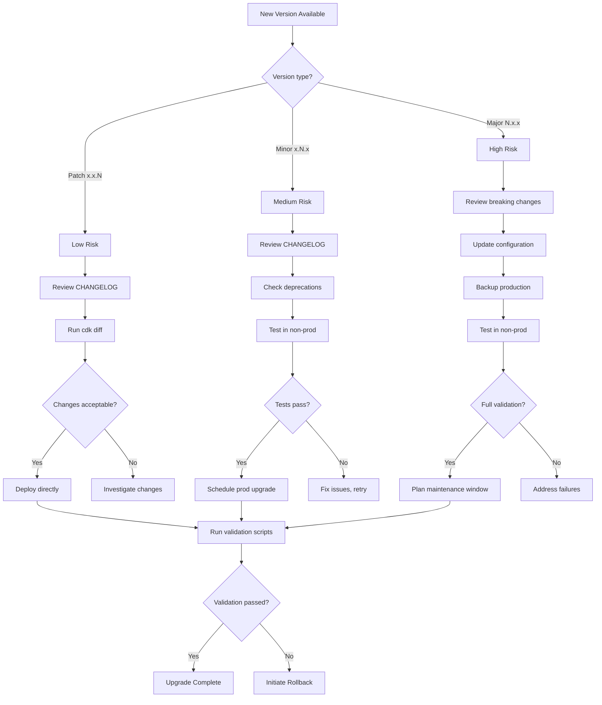
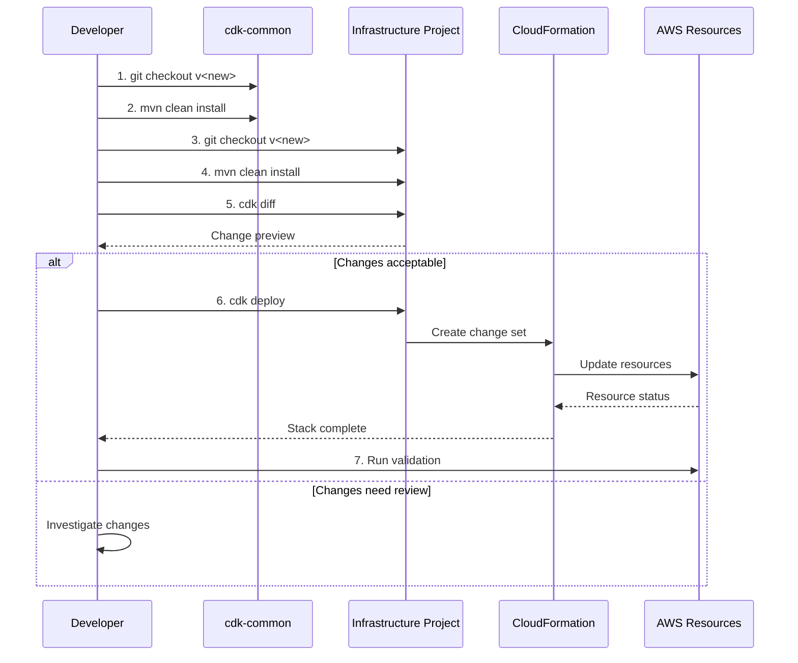
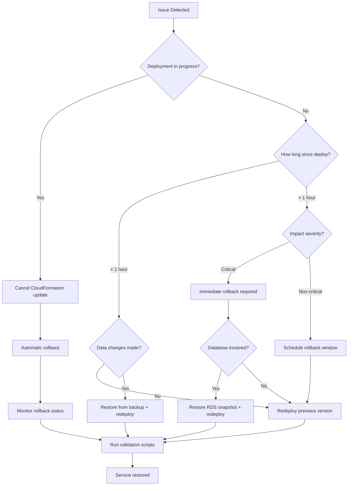

# Upgrade Guide

Procedures for upgrading Fastish infrastructure deployments to newer versions.

---

## Quick Reference: Upgrade Decision Flow



---

## Upgrade Sequence



---

## Table of Contents

1. [Upgrade Philosophy](#upgrade-philosophy)
2. [Pre-Upgrade Checklist](#pre-upgrade-checklist)
3. [Upgrade Procedures](#upgrade-procedures)
4. [Rollback Procedures](#rollback-procedures)
5. [Version-Specific Notes](#version-specific-notes)
6. [Post-Upgrade Validation](#post-upgrade-validation)

---

## Upgrade Philosophy

Fastish infrastructure follows these upgrade principles:

| Principle | Description |
|-----------|-------------|
| **Infrastructure as Code** | All changes flow through CDK/CloudFormation, ensuring auditability |
| **Immutable Updates** | Resources are replaced rather than patched when possible |
| **Backward Compatibility** | Minor versions maintain API and configuration compatibility |
| **Staged Rollout** | Test upgrades in non-production environments first |

### Semantic Versioning

| Version Type | Changes | Risk Level | Downtime |
|--------------|---------|------------|----------|
| **Patch** (x.x.1) | Bug fixes, security patches | Low | Typically none |
| **Minor** (x.1.x) | New features, deprecations | Medium | May require brief maintenance |
| **Major** (1.x.x) | Breaking changes, removals | High | Plan maintenance window |

---

## Pre-Upgrade Checklist

Complete these steps before any upgrade:

### 1. Review Release Notes

```bash
# Check CHANGELOG for target version
cat CHANGELOG.md | grep -A 50 "## \[<target-version>\]"

# Review breaking changes section
cat CHANGELOG.md | grep -A 20 "### Breaking Changes"
```

### 2. Backup Current State

```bash
# Export current CloudFormation template
aws cloudformation get-template \
  --stack-name <stack-name> \
  --query 'TemplateBody' > backup-template-$(date +%Y%m%d).json

# Export stack parameters
aws cloudformation describe-stacks \
  --stack-name <stack-name> \
  --query 'Stacks[0].Parameters' > backup-params-$(date +%Y%m%d).json

# Backup cdk.context.json
cp cdk.context.json cdk.context.json.backup-$(date +%Y%m%d)
```

### 3. Verify Current Deployment Health

```bash
# Check CloudFormation stack status
aws cloudformation describe-stacks \
  --stack-name <stack-name> \
  --query 'Stacks[0].StackStatus'
# Expected: CREATE_COMPLETE or UPDATE_COMPLETE

# For EKS deployments, verify cluster health
kubectl get nodes
kubectl get pods -A | grep -v Running | grep -v Completed
```

### 4. Check AWS Service Quotas

```bash
# Ensure quotas accommodate any new resources
aws service-quotas list-service-quotas \
  --service-code <service-code> \
  --query 'Quotas[*].[QuotaName,Value]' \
  --output table
```

### 5. Schedule Maintenance Window

For production deployments:
- Notify stakeholders
- Schedule during low-traffic period
- Ensure rollback plan is documented
- Have team members available for support

---

## Upgrade Procedures

### Upgrading cdk-common

The shared library must be upgraded first as other projects depend on it.

```bash
# 1. Pull latest version
cd cdk-common
git fetch origin
git checkout v<target-version>

# 2. Review changes
git log --oneline HEAD~10..HEAD

# 3. Build and install
mvn clean install

# 4. Verify installation
ls -la ~/.m2/repository/io/tinstafl/cdk-common/

# 5. Run tests if available
mvn test
```

### Upgrading aws-webapp-infra

```bash
# 1. Pull latest version
cd aws-webapp-infra
git fetch origin
git checkout v<target-version>

# 2. Update cdk-common dependency in pom.xml if version changed
# <version>1.x.x-SNAPSHOT</version>

# 3. Build project
mvn clean install

# 4. Review changes (no deployment yet)
cd infra
cdk diff

# 5. Review diff output carefully
# Look for: replaced resources, removed resources, security changes

# 6. Deploy to non-production first
# Modify cdk.context.json for test environment
cdk deploy

# 7. Validate (see Post-Upgrade Validation)

# 8. Deploy to production
# Restore production cdk.context.json
cdk deploy
```

### Upgrading aws-eks-infra

EKS upgrades require additional consideration for running workloads.

```bash
# 1. Pull latest version
cd aws-eks-infra
git fetch origin
git checkout v<target-version>

# 2. Build project
mvn clean install

# 3. Review changes
cdk diff

# 4. Check for Kubernetes version changes
grep -r "version" src/main/resources/prototype/v1/eks/

# 5. If Kubernetes version upgrade:
#    - Review EKS upgrade documentation
#    - Upgrade managed add-ons first
#    - Upgrade node groups with rolling update

# 6. Cordon existing nodes (for major upgrades)
kubectl cordon <node-name>

# 7. Deploy infrastructure changes
cdk deploy

# 8. Verify node group updates
kubectl get nodes -o wide

# 9. Drain old nodes (if applicable)
kubectl drain <old-node> --ignore-daemonsets --delete-emptydir-data

# 10. Validate workloads
kubectl get pods -A | grep -v Running
```

**Reference**: [EKS Upgrade Best Practices](https://docs.aws.amazon.com/eks/latest/userguide/update-cluster.html)

### Upgrading aws-druid-infra

Druid upgrades require careful handling of data and state.

```bash
# 1. Pull latest version
cd aws-druid-infra
git fetch origin
git checkout v<target-version>

# 2. Build project
mvn clean install

# 3. Review changes
cdk diff

# 4. Check for Druid version changes
grep -r "druid" src/main/resources/prototype/v1/

# 5. If Druid version upgrade:
#    - Review Druid upgrade documentation
#    - Backup metadata database
#    - Consider segment compatibility

# 6. Backup RDS metadata (recommended)
aws rds create-db-snapshot \
  --db-instance-identifier <druid-rds-instance> \
  --db-snapshot-identifier druid-pre-upgrade-$(date +%Y%m%d)

# 7. Scale down MiddleManagers (stop ingestion)
kubectl scale statefulset druid-middlemanager -n druid --replicas=0

# 8. Wait for running tasks to complete
# Check Druid console or API for task status

# 9. Deploy infrastructure changes
cdk deploy

# 10. Scale MiddleManagers back up
kubectl scale statefulset druid-middlemanager -n druid --replicas=<desired>

# 11. Verify Druid cluster health
kubectl port-forward svc/druid-router 8888:8888 -n druid
# Check http://localhost:8888 for cluster status
```

**Reference**: [Druid Upgrade Documentation](https://druid.apache.org/docs/latest/operations/upgrade-guide.html)

---

## Rollback Procedures

### Rollback Decision Tree



**Rollback Time Estimates**:

| Scenario | Estimated Time | Data Loss Risk |
|----------|----------------|----------------|
| CloudFormation auto-rollback | 5-30 min | None |
| CDK redeploy previous version | 10-45 min | None |
| RDS snapshot restore | 15-60 min | Minutes to hours |
| DynamoDB PITR restore | 15-45 min | Minutes |
| Full stack rebuild | 30-90 min | Depends on backup |

### Immediate Rollback (During Deployment)

CloudFormation automatically rolls back failed deployments. To force rollback of an in-progress deployment:

```bash
# Cancel current update
aws cloudformation cancel-update-stack --stack-name <stack-name>

# Monitor rollback
aws cloudformation describe-stack-events \
  --stack-name <stack-name> \
  --query 'StackEvents[0:10].[LogicalResourceId,ResourceStatus,ResourceStatusReason]' \
  --output table
```

### Post-Deployment Rollback

If issues are discovered after successful deployment:

```bash
# Option 1: Redeploy previous version via CDK

# Checkout previous version
git checkout v<previous-version>

# Rebuild
mvn clean install

# Redeploy
cd infra
cdk deploy

# Option 2: CloudFormation rollback to previous template

# Get previous template version from S3 (if available)
aws s3 cp s3://<cdk-bucket>/previous-template.json .

# Update stack with previous template
aws cloudformation update-stack \
  --stack-name <stack-name> \
  --template-body file://previous-template.json \
  --parameters file://backup-params-<date>.json \
  --capabilities CAPABILITY_IAM CAPABILITY_NAMED_IAM
```

### EKS Workload Rollback

For Kubernetes workload issues:

```bash
# Rollback Helm release
helm rollback <release-name> <revision> -n <namespace>

# Check revision history
helm history <release-name> -n <namespace>

# Rollback Kubernetes deployment
kubectl rollout undo deployment/<deployment-name> -n <namespace>

# Check rollout history
kubectl rollout history deployment/<deployment-name> -n <namespace>
```

### Database Rollback

For RDS-backed services (Druid metadata):

```bash
# Restore from snapshot
aws rds restore-db-instance-from-db-snapshot \
  --db-instance-identifier <new-instance-name> \
  --db-snapshot-identifier druid-pre-upgrade-<date>

# Update configuration to point to restored instance
# Modify cdk.context.json or Kubernetes secrets
```

### DynamoDB Point-in-Time Recovery

If PITR is enabled:

```bash
# Restore table to point in time
aws dynamodb restore-table-to-point-in-time \
  --source-table-name <table-name> \
  --target-table-name <table-name>-restored \
  --restore-date-time <iso-timestamp>
```

---

## Version-Specific Notes

### Upgrading to 1.0.0

This is the initial release. No upgrade path required from pre-release versions.

**Fresh Installation Required**: Pre-release deployments should be destroyed and redeployed:

```bash
# Destroy existing stack
cdk destroy

# Pull 1.0.0 release
git checkout v1.0.0

# Follow standard deployment procedure
mvn clean install
cdk deploy
```

### Future Version Notes

Version-specific upgrade notes will be added here as new versions are released.

---

## Post-Upgrade Validation

### aws-webapp-infra Validation

```bash
# 1. Check CloudFormation stack status
aws cloudformation describe-stacks \
  --stack-name <stack-name> \
  --query 'Stacks[0].StackStatus'

# 2. Verify API Gateway endpoint
ENDPOINT=$(aws cloudformation describe-stacks \
  --stack-name <stack-name> \
  --query 'Stacks[0].Outputs[?OutputKey==`ApiEndpoint`].OutputValue' \
  --output text)
curl -I $ENDPOINT

# 3. Test Cognito authentication
aws cognito-idp describe-user-pool \
  --user-pool-id <user-pool-id> \
  --query 'UserPool.Status'

# 4. Verify DynamoDB tables
aws dynamodb list-tables --query 'TableNames'

# 5. Check SES identity status
aws ses get-identity-verification-attributes \
  --identities <domain> <email>
```

### aws-eks-infra Validation

```bash
# 1. Check all nodes ready
kubectl get nodes
# All should show STATUS=Ready

# 2. Check system pods
kubectl get pods -n kube-system
# All should be Running

# 3. Check EKS add-ons
aws eks list-addons --cluster-name <cluster-name>
aws eks describe-addon --cluster-name <cluster-name> --addon-name <addon-name>

# 4. Verify Karpenter
kubectl get nodepools
kubectl get ec2nodeclasses

# 5. Test pod scheduling
kubectl run test-pod --image=nginx --restart=Never
kubectl wait --for=condition=Ready pod/test-pod --timeout=60s
kubectl delete pod test-pod

# 6. Check observability pipeline
kubectl logs -n monitoring -l app=opentelemetry-collector --tail=20
```

### aws-druid-infra Validation

```bash
# 1. Check all Druid pods
kubectl get pods -n druid
# All should be Running with READY matching expected

# 2. Check Druid cluster health via API
kubectl port-forward svc/druid-router 8888:8888 -n druid &
curl http://localhost:8888/status/health
# Expected: true

# 3. Verify metadata database connectivity
kubectl exec -it druid-coordinator-0 -n druid -- \
  nc -zv <rds-endpoint> 5432

# 4. Verify S3 deep storage access
kubectl exec -it druid-historical-0 -n druid -- \
  aws s3 ls s3://<deep-storage-bucket>/

# 5. Test query execution
curl -X POST http://localhost:8888/druid/v2/sql \
  -H 'Content-Type: application/json' \
  -d '{"query": "SELECT COUNT(*) FROM INFORMATION_SCHEMA.COLUMNS"}'

# 6. Check MSK connectivity (if applicable)
kubectl exec -it druid-middlemanager-0 -n druid -- \
  nc -zv <msk-bootstrap-servers> 9092
```

---

## Upgrade Support

For upgrade assistance:

1. **Review Documentation**: Check [Troubleshooting Guide](TROUBLESHOOTING.md) for common issues
2. **GitHub Issues**: [github.com/fast-ish/fast-ish.github.io/issues](https://github.com/fast-ish/fast-ish.github.io/issues)
3. **Include Details**: CDK version, current version, target version, error messages

---

## Related Documentation

| Document | When to Use |
|----------|-------------|
| [Troubleshooting Guide](TROUBLESHOOTING.md) | Resolve issues during or after upgrade |
| [Validation Guide](VALIDATION.md) | Post-upgrade validation procedures |
| [Changelog](../CHANGELOG.md) | Review changes between versions |
| [IAM Permissions](IAM-PERMISSIONS.md) | Verify permissions for new features |
| [Capacity Planning](CAPACITY-PLANNING.md) | Sizing changes in new versions |

### AWS Documentation References

| Topic | AWS Documentation |
|-------|-------------------|
| CloudFormation Updates | [Updating Stacks](https://docs.aws.amazon.com/AWSCloudFormation/latest/UserGuide/using-cfn-updating-stacks.html) |
| EKS Cluster Upgrades | [Updating an Amazon EKS cluster](https://docs.aws.amazon.com/eks/latest/userguide/update-cluster.html) |
| RDS Backups | [Backing Up and Restoring RDS](https://docs.aws.amazon.com/AmazonRDS/latest/UserGuide/CHAP_CommonTasks.BackupRestore.html) |
| DynamoDB PITR | [Point-in-Time Recovery](https://docs.aws.amazon.com/amazondynamodb/latest/developerguide/PointInTimeRecovery.html) |
| CDK Versioning | [CDK Versioning Policy](https://docs.aws.amazon.com/cdk/v2/guide/versioning.html) |

---

**Last Updated**: 2024-01
