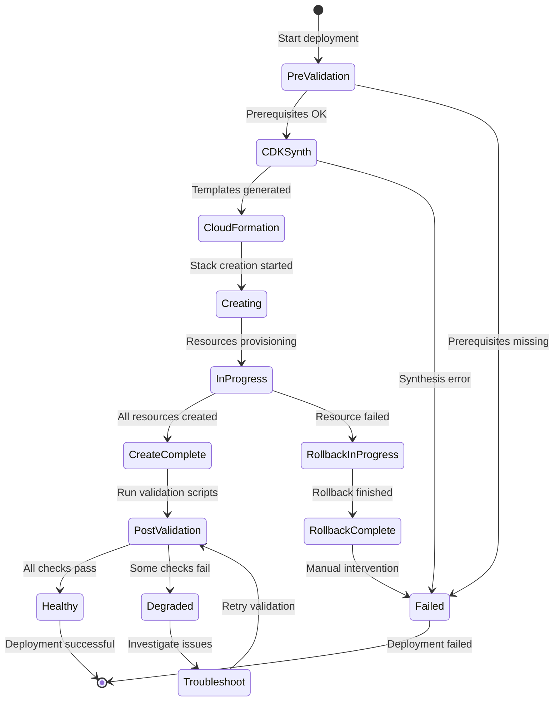

# Deployment Validation Guide

Procedures for validating successful Fastish infrastructure deployments.

---

## Quick Reference: Deployment State Machine



### Validation Checkpoints

```mermaid
flowchart LR
    subgraph "Pre-Deploy"
        P1[AWS Credentials]
        P2[CDK Bootstrap]
        P3[Context Config]
        P4[Dependencies]
    end

    subgraph "Deploy"
        D1[CDK Synth]
        D2[CFN Validate]
        D3[Stack Create]
        D4[Resource Check]
    end

    subgraph "Post-Deploy"
        V1[Stack Status]
        V2[Service Health]
        V3[Connectivity]
        V4[Functional]
    end

    P1 --> P2 --> P3 --> P4
    P4 --> D1 --> D2 --> D3 --> D4
    D4 --> V1 --> V2 --> V3 --> V4

    style P1 fill:#e3f2fd
    style D1 fill:#fff3e0
    style V1 fill:#e8f5e9
```



**Checkpoint Commands**:

| Phase | Check | Command |
|-------|-------|---------|
| Pre | AWS credentials | `aws sts get-caller-identity` |
| Pre | CDK bootstrap | `aws cloudformation describe-stacks --stack-name CDKToolkit` |
| Pre | Dependencies | `mvn dependency:tree` |
| Deploy | Synthesis | `cdk synth --quiet` |
| Deploy | Stack status | `aws cloudformation describe-stacks --stack-name <name>` |
| Post | Service health | Project-specific validation script |
| Post | Connectivity | Network connectivity tests |

---

## Table of Contents

1. [Pre-Deployment Validation](#pre-deployment-validation)
2. [aws-webapp-infra Validation](#aws-webapp-infra-validation)
3. [aws-eks-infra Validation](#aws-eks-infra-validation)
4. [aws-druid-infra Validation](#aws-druid-infra-validation)
5. [Automated Validation Script](#automated-validation-script)
6. [Health Check Endpoints](#health-check-endpoints)

---

## Pre-Deployment Validation

Run these checks before deploying any stack.

### Environment Validation

```bash
#!/bin/bash
# pre-deploy-validation.sh

echo "=== Pre-Deployment Validation ==="

# 1. Check AWS credentials
echo -n "AWS Credentials: "
if aws sts get-caller-identity &>/dev/null; then
    echo "OK"
    aws sts get-caller-identity --query 'Arn' --output text
else
    echo "FAILED - Configure AWS credentials"
    exit 1
fi

# 2. Check AWS region
echo -n "AWS Region: "
REGION=$(aws configure get region)
if [ -n "$REGION" ]; then
    echo "OK ($REGION)"
else
    echo "FAILED - Set AWS region"
    exit 1
fi

# 3. Check CDK version
echo -n "CDK CLI: "
CDK_VERSION=$(cdk --version 2>/dev/null | cut -d' ' -f1)
if [ -n "$CDK_VERSION" ]; then
    echo "OK ($CDK_VERSION)"
else
    echo "FAILED - Install CDK CLI"
    exit 1
fi

# 4. Check Java version
echo -n "Java: "
JAVA_VERSION=$(java --version 2>&1 | head -1)
if echo "$JAVA_VERSION" | grep -q "21\|22\|23"; then
    echo "OK ($JAVA_VERSION)"
else
    echo "WARNING - Java 21+ recommended"
fi

# 5. Check Maven
echo -n "Maven: "
MVN_VERSION=$(mvn --version 2>/dev/null | head -1)
if [ -n "$MVN_VERSION" ]; then
    echo "OK"
else
    echo "FAILED - Install Maven"
    exit 1
fi

# 6. Check CDK bootstrap
echo -n "CDK Bootstrap: "
ACCOUNT=$(aws sts get-caller-identity --query 'Account' --output text)
BOOTSTRAP_STACK=$(aws cloudformation describe-stacks \
    --stack-name CDKToolkit \
    --query 'Stacks[0].StackStatus' \
    --output text 2>/dev/null)
if [ "$BOOTSTRAP_STACK" = "CREATE_COMPLETE" ] || [ "$BOOTSTRAP_STACK" = "UPDATE_COMPLETE" ]; then
    echo "OK"
else
    echo "FAILED - Run: cdk bootstrap aws://$ACCOUNT/$REGION"
    exit 1
fi

# 7. Check cdk.context.json exists
echo -n "CDK Context: "
if [ -f "cdk.context.json" ]; then
    echo "OK"
else
    echo "FAILED - Create cdk.context.json from template"
    exit 1
fi

echo "=== Pre-Deployment Validation Complete ==="
```

### CDK Synthesis Validation

```bash
# Validate CDK synthesizes without errors
cdk synth --quiet

# Check synthesized template count
echo "Synthesized templates:"
find cdk.out -name "*.template.json" | wc -l

# Validate CloudFormation templates
for template in cdk.out/*.template.json; do
    echo "Validating: $template"
    aws cloudformation validate-template \
        --template-body file://$template \
        --query 'Description' 2>/dev/null || echo "Template validation failed"
done
```

---

## aws-webapp-infra Validation

### CloudFormation Stack Validation

```bash
#!/bin/bash
# validate-webapp.sh

STACK_NAME="${1:-WebappStack}"
REGION="${2:-us-west-2}"

echo "=== Validating aws-webapp-infra: $STACK_NAME ==="

# 1. Check stack status
echo -n "Stack Status: "
STACK_STATUS=$(aws cloudformation describe-stacks \
    --stack-name $STACK_NAME \
    --region $REGION \
    --query 'Stacks[0].StackStatus' \
    --output text 2>/dev/null)

if [ "$STACK_STATUS" = "CREATE_COMPLETE" ] || [ "$STACK_STATUS" = "UPDATE_COMPLETE" ]; then
    echo "OK ($STACK_STATUS)"
else
    echo "FAILED ($STACK_STATUS)"
    exit 1
fi

# 2. Get stack outputs
echo "Retrieving stack outputs..."
API_ENDPOINT=$(aws cloudformation describe-stacks \
    --stack-name $STACK_NAME \
    --region $REGION \
    --query 'Stacks[0].Outputs[?OutputKey==`ApiEndpoint`].OutputValue' \
    --output text)

USER_POOL_ID=$(aws cloudformation describe-stacks \
    --stack-name $STACK_NAME \
    --region $REGION \
    --query 'Stacks[0].Outputs[?OutputKey==`UserPoolId`].OutputValue' \
    --output text)

# 3. Validate VPC
echo -n "VPC: "
VPC_ID=$(aws cloudformation describe-stack-resources \
    --stack-name $STACK_NAME \
    --region $REGION \
    --query "StackResources[?ResourceType=='AWS::EC2::VPC'].PhysicalResourceId" \
    --output text 2>/dev/null)

if [ -n "$VPC_ID" ]; then
    VPC_STATE=$(aws ec2 describe-vpcs \
        --vpc-ids $VPC_ID \
        --region $REGION \
        --query 'Vpcs[0].State' \
        --output text)
    echo "OK ($VPC_ID - $VPC_STATE)"
else
    echo "FAILED - VPC not found"
fi

# 4. Validate Cognito User Pool
echo -n "Cognito User Pool: "
if [ -n "$USER_POOL_ID" ]; then
    POOL_STATUS=$(aws cognito-idp describe-user-pool \
        --user-pool-id $USER_POOL_ID \
        --region $REGION \
        --query 'UserPool.Status' \
        --output text 2>/dev/null)
    echo "OK ($USER_POOL_ID - $POOL_STATUS)"
else
    echo "FAILED - User Pool not found"
fi

# 5. Validate API Gateway
echo -n "API Gateway: "
if [ -n "$API_ENDPOINT" ]; then
    HTTP_STATUS=$(curl -s -o /dev/null -w "%{http_code}" "$API_ENDPOINT" 2>/dev/null)
    if [ "$HTTP_STATUS" = "200" ] || [ "$HTTP_STATUS" = "401" ] || [ "$HTTP_STATUS" = "403" ]; then
        echo "OK ($API_ENDPOINT - HTTP $HTTP_STATUS)"
    else
        echo "WARNING - Unexpected response (HTTP $HTTP_STATUS)"
    fi
else
    echo "FAILED - API endpoint not found"
fi

# 6. Validate DynamoDB Tables
echo -n "DynamoDB Tables: "
TABLE_COUNT=$(aws dynamodb list-tables \
    --region $REGION \
    --query 'TableNames' \
    --output text | wc -w)
echo "OK ($TABLE_COUNT tables)"

# 7. Validate SES Identity
echo -n "SES Identity: "
DOMAIN=$(aws cloudformation describe-stacks \
    --stack-name $STACK_NAME \
    --region $REGION \
    --query 'Stacks[0].Parameters[?ParameterKey==`Domain`].ParameterValue' \
    --output text 2>/dev/null)

if [ -n "$DOMAIN" ]; then
    SES_STATUS=$(aws ses get-identity-verification-attributes \
        --identities $DOMAIN \
        --region $REGION \
        --query "VerificationAttributes.$DOMAIN.VerificationStatus" \
        --output text 2>/dev/null)
    echo "OK ($DOMAIN - $SES_STATUS)"
else
    echo "SKIPPED - No domain configured"
fi

echo "=== aws-webapp-infra Validation Complete ==="
```

### Functional Tests

```bash
# Test Cognito sign-up flow (requires test user)
aws cognito-idp sign-up \
    --client-id <client-id> \
    --username test@example.com \
    --password 'TestPassword123!' \
    --user-attributes Name=email,Value=test@example.com

# Test API Gateway with authentication
TOKEN=$(aws cognito-idp initiate-auth \
    --auth-flow USER_PASSWORD_AUTH \
    --client-id <client-id> \
    --auth-parameters USERNAME=test@example.com,PASSWORD='TestPassword123!' \
    --query 'AuthenticationResult.IdToken' \
    --output text)

curl -H "Authorization: Bearer $TOKEN" $API_ENDPOINT/health
```

---

## aws-eks-infra Validation

### Cluster Validation

```bash
#!/bin/bash
# validate-eks.sh

CLUSTER_NAME="${1:-EksCluster}"
REGION="${2:-us-west-2}"

echo "=== Validating aws-eks-infra: $CLUSTER_NAME ==="

# 1. Update kubeconfig
echo "Updating kubeconfig..."
aws eks update-kubeconfig --name $CLUSTER_NAME --region $REGION

# 2. Check cluster status
echo -n "Cluster Status: "
CLUSTER_STATUS=$(aws eks describe-cluster \
    --name $CLUSTER_NAME \
    --region $REGION \
    --query 'cluster.status' \
    --output text)

if [ "$CLUSTER_STATUS" = "ACTIVE" ]; then
    echo "OK ($CLUSTER_STATUS)"
else
    echo "FAILED ($CLUSTER_STATUS)"
    exit 1
fi

# 3. Check Kubernetes version
echo -n "Kubernetes Version: "
K8S_VERSION=$(aws eks describe-cluster \
    --name $CLUSTER_NAME \
    --region $REGION \
    --query 'cluster.version' \
    --output text)
echo "$K8S_VERSION"

# 4. Check node status
echo -n "Nodes: "
NODE_COUNT=$(kubectl get nodes --no-headers 2>/dev/null | wc -l)
READY_COUNT=$(kubectl get nodes --no-headers 2>/dev/null | grep " Ready" | wc -l)
echo "$READY_COUNT/$NODE_COUNT Ready"

if [ "$READY_COUNT" -ne "$NODE_COUNT" ]; then
    echo "WARNING: Not all nodes are Ready"
    kubectl get nodes
fi

# 5. Check system pods
echo "System Pods:"
kubectl get pods -n kube-system --no-headers | while read line; do
    POD_NAME=$(echo $line | awk '{print $1}')
    POD_STATUS=$(echo $line | awk '{print $3}')
    if [ "$POD_STATUS" = "Running" ]; then
        echo "  OK: $POD_NAME"
    else
        echo "  FAILED: $POD_NAME ($POD_STATUS)"
    fi
done

# 6. Check EKS add-ons
echo "EKS Add-ons:"
aws eks list-addons --cluster-name $CLUSTER_NAME --region $REGION --query 'addons[]' --output text | tr '\t' '\n' | while read addon; do
    ADDON_STATUS=$(aws eks describe-addon \
        --cluster-name $CLUSTER_NAME \
        --addon-name $addon \
        --region $REGION \
        --query 'addon.status' \
        --output text)
    echo "  $addon: $ADDON_STATUS"
done

# 7. Check Karpenter
echo -n "Karpenter: "
KARPENTER_PODS=$(kubectl get pods -n karpenter --no-headers 2>/dev/null | grep Running | wc -l)
if [ "$KARPENTER_PODS" -gt 0 ]; then
    echo "OK ($KARPENTER_PODS pods running)"
    kubectl get nodepools 2>/dev/null || echo "  No NodePools configured"
else
    echo "WARNING - Karpenter pods not running"
fi

# 8. Check cert-manager
echo -n "cert-manager: "
CERTMGR_PODS=$(kubectl get pods -n cert-manager --no-headers 2>/dev/null | grep Running | wc -l)
if [ "$CERTMGR_PODS" -gt 0 ]; then
    echo "OK ($CERTMGR_PODS pods running)"
else
    echo "WARNING - cert-manager pods not running"
fi

# 9. Check AWS Load Balancer Controller
echo -n "AWS Load Balancer Controller: "
LBC_PODS=$(kubectl get pods -n kube-system -l app.kubernetes.io/name=aws-load-balancer-controller --no-headers 2>/dev/null | grep Running | wc -l)
if [ "$LBC_PODS" -gt 0 ]; then
    echo "OK ($LBC_PODS pods running)"
else
    echo "WARNING - Load Balancer Controller pods not running"
fi

# 10. Test pod scheduling
echo -n "Pod Scheduling: "
kubectl run validation-test --image=nginx --restart=Never --dry-run=client -o yaml | kubectl apply -f - 2>/dev/null
sleep 10
POD_STATUS=$(kubectl get pod validation-test -o jsonpath='{.status.phase}' 2>/dev/null)
if [ "$POD_STATUS" = "Running" ]; then
    echo "OK"
else
    echo "FAILED ($POD_STATUS)"
fi
kubectl delete pod validation-test --ignore-not-found 2>/dev/null

echo "=== aws-eks-infra Validation Complete ==="
```

### Observability Validation

```bash
# Check OpenTelemetry Collector
echo "OpenTelemetry Collector:"
kubectl get pods -n monitoring -l app=opentelemetry-collector

# Check recent logs for errors
kubectl logs -n monitoring -l app=opentelemetry-collector --tail=50 | grep -i error

# Verify metrics endpoint
kubectl port-forward -n monitoring svc/otel-collector 8888:8888 &
sleep 5
curl -s http://localhost:8888/metrics | head -20
kill %1
```

---

## aws-druid-infra Validation

### Full Stack Validation

```bash
#!/bin/bash
# validate-druid.sh

CLUSTER_NAME="${1:-DruidEksCluster}"
REGION="${2:-us-west-2}"
DRUID_NAMESPACE="${3:-druid}"

echo "=== Validating aws-druid-infra ==="

# Run EKS validation first
./validate-eks.sh $CLUSTER_NAME $REGION

# Druid-specific validation
echo ""
echo "=== Druid Cluster Validation ==="

# 1. Check Druid pods
echo "Druid Pods:"
kubectl get pods -n $DRUID_NAMESPACE -o wide

# 2. Validate each Druid component
for component in coordinator overlord broker router historical middlemanager; do
    echo -n "$component: "
    POD_COUNT=$(kubectl get pods -n $DRUID_NAMESPACE -l component=$component --no-headers 2>/dev/null | grep Running | wc -l)
    if [ "$POD_COUNT" -gt 0 ]; then
        echo "OK ($POD_COUNT running)"
    else
        echo "FAILED (0 running)"
    fi
done

# 3. Check RDS connectivity
echo -n "RDS Metadata Store: "
COORDINATOR_POD=$(kubectl get pods -n $DRUID_NAMESPACE -l component=coordinator -o jsonpath='{.items[0].metadata.name}' 2>/dev/null)
if [ -n "$COORDINATOR_POD" ]; then
    RDS_ENDPOINT=$(kubectl exec -n $DRUID_NAMESPACE $COORDINATOR_POD -- env | grep druid.metadata.storage.connector.connectURI | cut -d'/' -f3 | cut -d':' -f1)
    if kubectl exec -n $DRUID_NAMESPACE $COORDINATOR_POD -- nc -zv $RDS_ENDPOINT 5432 2>&1 | grep -q succeeded; then
        echo "OK (Connected to $RDS_ENDPOINT)"
    else
        echo "FAILED (Cannot connect to $RDS_ENDPOINT)"
    fi
else
    echo "SKIPPED (No coordinator pod)"
fi

# 4. Check S3 deep storage
echo -n "S3 Deep Storage: "
HISTORICAL_POD=$(kubectl get pods -n $DRUID_NAMESPACE -l component=historical -o jsonpath='{.items[0].metadata.name}' 2>/dev/null)
if [ -n "$HISTORICAL_POD" ]; then
    S3_BUCKET=$(kubectl exec -n $DRUID_NAMESPACE $HISTORICAL_POD -- env | grep druid.storage.bucket | cut -d'=' -f2)
    if kubectl exec -n $DRUID_NAMESPACE $HISTORICAL_POD -- aws s3 ls s3://$S3_BUCKET/ 2>&1 | head -1; then
        echo "OK ($S3_BUCKET accessible)"
    else
        echo "FAILED (Cannot access $S3_BUCKET)"
    fi
else
    echo "SKIPPED (No historical pod)"
fi

# 5. Check MSK connectivity
echo -n "MSK Kafka: "
MM_POD=$(kubectl get pods -n $DRUID_NAMESPACE -l component=middlemanager -o jsonpath='{.items[0].metadata.name}' 2>/dev/null)
if [ -n "$MM_POD" ]; then
    KAFKA_BROKERS=$(kubectl exec -n $DRUID_NAMESPACE $MM_POD -- env | grep kafka.bootstrap | cut -d'=' -f2 | cut -d',' -f1)
    KAFKA_HOST=$(echo $KAFKA_BROKERS | cut -d':' -f1)
    KAFKA_PORT=$(echo $KAFKA_BROKERS | cut -d':' -f2)
    if kubectl exec -n $DRUID_NAMESPACE $MM_POD -- nc -zv $KAFKA_HOST $KAFKA_PORT 2>&1 | grep -q succeeded; then
        echo "OK (Connected to $KAFKA_HOST:$KAFKA_PORT)"
    else
        echo "FAILED (Cannot connect to Kafka)"
    fi
else
    echo "SKIPPED (No middlemanager pod)"
fi

# 6. Check Druid health endpoint
echo -n "Druid Health: "
kubectl port-forward -n $DRUID_NAMESPACE svc/druid-router 8888:8888 &>/dev/null &
PF_PID=$!
sleep 5
HEALTH=$(curl -s http://localhost:8888/status/health 2>/dev/null)
kill $PF_PID 2>/dev/null
if [ "$HEALTH" = "true" ]; then
    echo "OK"
else
    echo "FAILED ($HEALTH)"
fi

# 7. Test SQL query
echo -n "Druid SQL: "
kubectl port-forward -n $DRUID_NAMESPACE svc/druid-router 8888:8888 &>/dev/null &
PF_PID=$!
sleep 5
QUERY_RESULT=$(curl -s -X POST http://localhost:8888/druid/v2/sql \
    -H 'Content-Type: application/json' \
    -d '{"query": "SELECT 1 as test"}' 2>/dev/null)
kill $PF_PID 2>/dev/null
if echo "$QUERY_RESULT" | grep -q '"test":1'; then
    echo "OK"
else
    echo "FAILED"
fi

echo "=== aws-druid-infra Validation Complete ==="
```

---

## Automated Validation Script

Complete validation script for all projects:

```bash
#!/bin/bash
# validate-all.sh

PROJECT="${1:-all}"
STACK_NAME="${2}"
REGION="${3:-us-west-2}"

validate_webapp() {
    echo "=========================================="
    echo "Validating aws-webapp-infra"
    echo "=========================================="
    ./validate-webapp.sh "${STACK_NAME:-WebappStack}" $REGION
}

validate_eks() {
    echo "=========================================="
    echo "Validating aws-eks-infra"
    echo "=========================================="
    ./validate-eks.sh "${STACK_NAME:-EksCluster}" $REGION
}

validate_druid() {
    echo "=========================================="
    echo "Validating aws-druid-infra"
    echo "=========================================="
    ./validate-druid.sh "${STACK_NAME:-DruidEksCluster}" $REGION
}

case $PROJECT in
    webapp)
        validate_webapp
        ;;
    eks)
        validate_eks
        ;;
    druid)
        validate_druid
        ;;
    all)
        validate_webapp
        validate_eks
        validate_druid
        ;;
    *)
        echo "Usage: $0 [webapp|eks|druid|all] [stack-name] [region]"
        exit 1
        ;;
esac
```

---

## Health Check Endpoints

### aws-webapp-infra

| Endpoint | Method | Expected Response | Purpose |
|----------|--------|-------------------|---------|
| `${API_ENDPOINT}/` | GET | 200 or 401 | API reachability |
| `${API_ENDPOINT}/health` | GET | 200 `{"status": "healthy"}` | Application health |

### aws-eks-infra

| Endpoint | Method | Expected Response | Purpose |
|----------|--------|-------------------|---------|
| Kubernetes API | `kubectl get nodes` | Node list | Cluster access |
| `http://localhost:8888/metrics` (OTEL) | GET | Prometheus metrics | Observability |

### aws-druid-infra

| Endpoint | Method | Expected Response | Purpose |
|----------|--------|-------------------|---------|
| `/status/health` | GET | `true` | Cluster health |
| `/status/selfDiscovered` | GET | JSON | Service discovery |
| `/druid/v2/sql` | POST | Query results | SQL endpoint |
| `/druid/coordinator/v1/loadstatus` | GET | Load percentage | Data availability |

### Port Forwarding for Validation

```bash
# Druid Router (console + API)
kubectl port-forward -n druid svc/druid-router 8888:8888

# Grafana (if deployed)
kubectl port-forward -n monitoring svc/grafana 3000:3000

# Prometheus (metrics)
kubectl port-forward -n monitoring svc/prometheus 9090:9090
```

---

## Validation Checklist

### Post-Deployment Checklist

- [ ] CloudFormation stack status is CREATE_COMPLETE or UPDATE_COMPLETE
- [ ] All nested stacks completed successfully
- [ ] VPC and subnets created with correct CIDRs
- [ ] NAT Gateways operational (check in VPC console)
- [ ] Security groups have correct rules
- [ ] IAM roles created with correct policies
- [ ] (webapp) Cognito User Pool active
- [ ] (webapp) API Gateway endpoint responding
- [ ] (webapp) DynamoDB tables created
- [ ] (webapp) SES domain verified
- [ ] (eks) EKS cluster ACTIVE
- [ ] (eks) All nodes Ready
- [ ] (eks) System pods Running
- [ ] (eks) EKS add-ons ACTIVE
- [ ] (eks) Karpenter operational
- [ ] (eks) cert-manager operational
- [ ] (eks) Load Balancer Controller operational
- [ ] (druid) All Druid pods Running
- [ ] (druid) RDS metadata store accessible
- [ ] (druid) S3 deep storage accessible
- [ ] (druid) MSK Kafka accessible
- [ ] (druid) Health endpoint returns true
- [ ] (druid) SQL queries execute successfully

---

## Related Documentation

| Document | When to Use |
|----------|-------------|
| [Troubleshooting Guide](TROUBLESHOOTING.md) | Failed validation checks |
| [Upgrade Guide](UPGRADE.md) | Post-upgrade validation |
| [Network Requirements](NETWORK-REQUIREMENTS.md) | Connectivity validation |
| [IAM Permissions](IAM-PERMISSIONS.md) | Permission validation |
| [Capacity Planning](CAPACITY-PLANNING.md) | Resource utilization checks |

### AWS Documentation References

| Topic | AWS Documentation |
|-------|-------------------|
| CloudFormation Stack Status | [Stack Status Codes](https://docs.aws.amazon.com/AWSCloudFormation/latest/UserGuide/using-cfn-describing-stacks.html) |
| EKS Cluster Health | [Viewing Cluster Health](https://docs.aws.amazon.com/eks/latest/userguide/view-cluster-health.html) |
| API Gateway Testing | [Testing REST APIs](https://docs.aws.amazon.com/apigateway/latest/developerguide/how-to-test-method.html) |
| Lambda Monitoring | [Monitoring Lambda Functions](https://docs.aws.amazon.com/lambda/latest/dg/lambda-monitoring.html) |
| RDS Monitoring | [Monitoring RDS Instances](https://docs.aws.amazon.com/AmazonRDS/latest/UserGuide/CHAP_Monitoring.html) |
| Kubernetes Health Checks | [Configure Liveness, Readiness](https://kubernetes.io/docs/tasks/configure-pod-container/configure-liveness-readiness-startup-probes/) |

---

**Last Updated**: 2024-01
