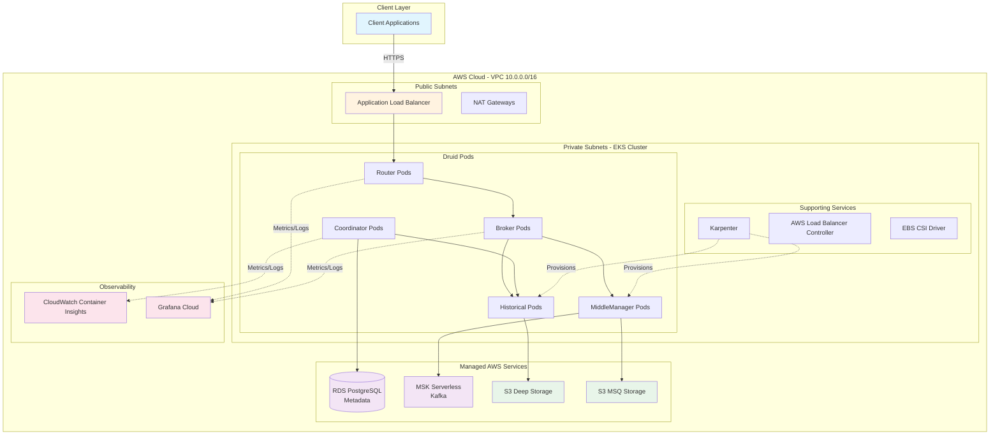
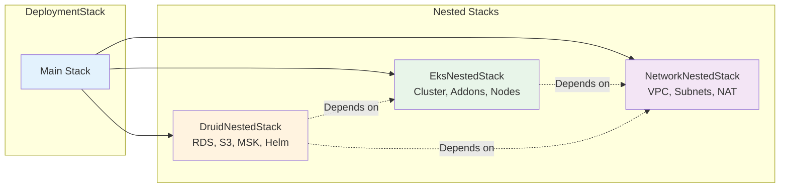
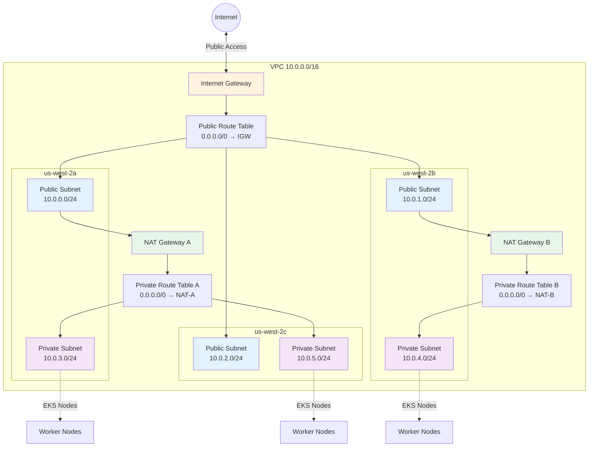
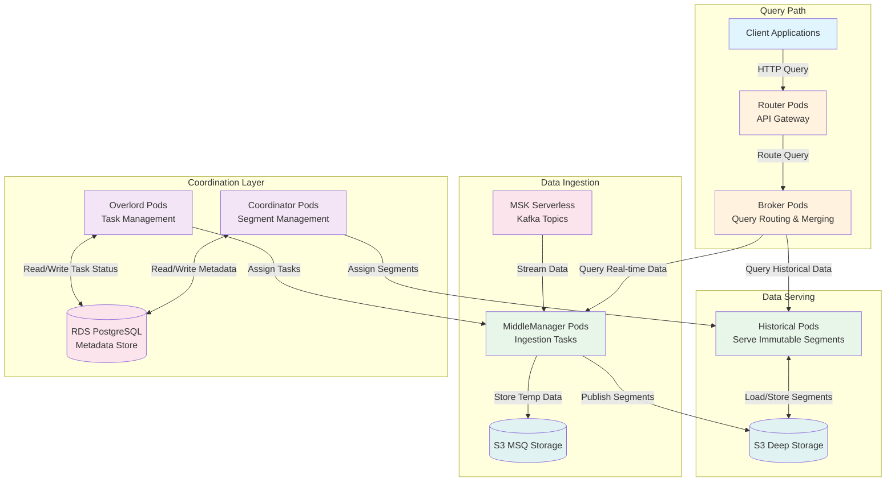
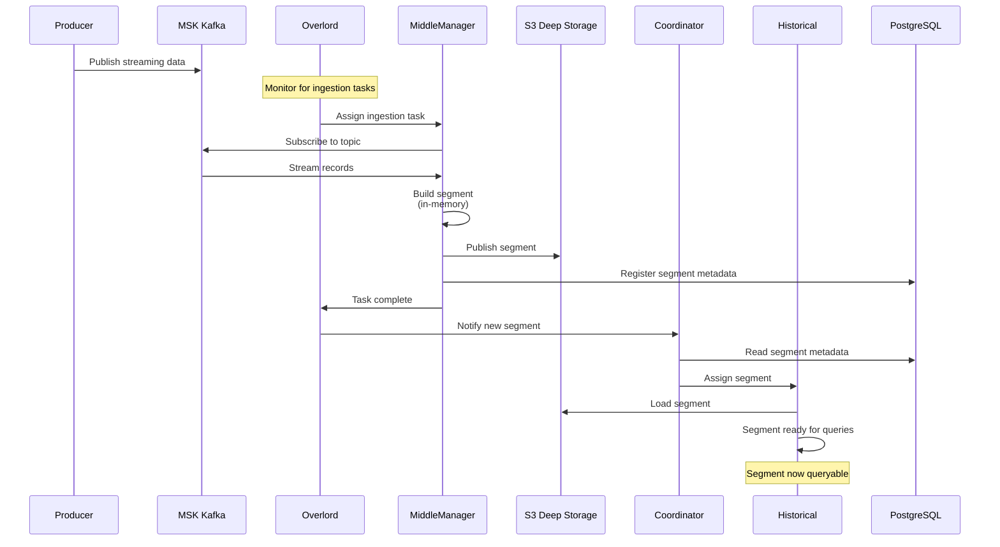

# Apache Druid on EKS

## Overview

The **aws-druid-infra** repository provides a production-ready Apache Druid deployment on Amazon EKS (Elastic Kubernetes Service) using AWS CDK and Java. This infrastructure enables real-time analytics at scale with sub-second OLAP queries on streaming and batch data.

**Repository**: `/Users/bs/codes/fastish/v2/aws-druid-infra`

## What is Apache Druid?

[Apache Druid](https://druid.apache.org/) is a high-performance, column-oriented distributed data store designed for:
- **Real-time ingestion**: Stream data from Kafka/Kinesis with immediate queryability
- **Sub-second queries**: OLAP queries at scale with automatic indexing
- **Time-series data**: Optimized for timestamp-based data with automatic partitioning
- **Scalable architecture**: Horizontal scaling with specialized node types

**Use cases:**
- Real-time analytics dashboards
- User behavior analytics
- Application performance monitoring (APM)
- IoT sensor data analysis
- Clickstream analytics
- Network traffic monitoring

## Architecture Components

### High-Level Architecture



### Infrastructure Stack

The deployment creates a complete analytics platform with three nested stacks:



**Stack naming pattern:**
```
{organization}-{name}-{alias}
```

**Example:** `data-analytics-eks` (organization: data, name: analytics, alias: eks)

### Network Layer (VPC)

**VPC Configuration:**
- CIDR: `10.0.0.0/16`
- Availability Zones: 3 (a, b, c)
- NAT Gateways: 2 (for high availability)
- DNS Support: Enabled
- DNS Hostnames: Enabled

**Subnets:**
- **Public Subnets** (`/24` per AZ)
  - Internet Gateway access
  - Load balancers
  - Bastion hosts (if needed)
  - Tagged for Karpenter discovery

- **Private Subnets with Egress** (`/24` per AZ)
  - EKS worker nodes
  - Druid pods
  - NAT Gateway egress
  - Tagged for Karpenter discovery

**Tags:**
```yaml
Tags:
  "{domain}:resource-type": vpc
  "{domain}:category": network
  "{domain}:component": {id}-vpc
  "{domain}:part-of": "{organization}.{name}.{alias}"
  "karpenter.sh/discovery": {id}-vpc  # Enables Karpenter subnet discovery
```

### Network Topology



### Compute Layer
- **Amazon EKS**: Managed Kubernetes v1.33 for container orchestration
- **Karpenter**: Intelligent node provisioning and scaling
- **Bottlerocket OS**: Purpose-built container operating system
- **Managed Node Groups**: Minimum 2, maximum 10 nodes

### Data Processing
- **Apache Druid**: Real-time OLAP database with specialized node types
- **Amazon MSK**: Managed Kafka for streaming ingestion
- **RDS PostgreSQL**: Metadata storage for Druid

### Storage Layer
- **Deep Storage (S3)**: Long-term segment storage
- **MSQ Storage (S3)**: Multi-stage query temporary storage
- **EBS Volumes**: High-performance persistent storage with KMS encryption

### Observability
- **Grafana Cloud**: Metrics (Prometheus), logs (Loki), traces (Tempo), profiles (Pyroscope)
- **CloudWatch Container Insights**: AWS-native monitoring with X-Ray integration
- **OpenTelemetry**: Vendor-neutral observability collection

## EKS Cluster

### Cluster Configuration

**Kubernetes Version**: 1.33
**Endpoint Access**: Public and Private
**Control Plane Logging**: API, Audit, Authenticator, Controller Manager, Scheduler
**Cluster Name**: `{id}-eks`

**Example**: `fff-eks` (where id: fff)

### AWS Managed Addons

| Addon | Purpose | Configuration |
|-------|---------|---------------|
| **VPC CNI** | Pod networking using AWS VPC | IRSA-enabled with custom IAM role |
| **EBS CSI Driver** | Persistent storage with EBS volumes | KMS encryption, custom storage class |
| **CoreDNS** | Kubernetes DNS for service discovery | Cluster-internal DNS resolution |
| **Kube-proxy** | Network proxy for services | Manages iptables rules |
| **Pod Identity Agent** | IAM roles for service accounts (IRSA) | Provides AWS credentials to pods |
| **CloudWatch Container Insights** | AWS-native monitoring | Metrics, logs, and X-Ray traces |

### Helm Chart Addons

| Chart | Namespace | Purpose |
|-------|-----------|---------|
| **cert-manager** | cert-manager | TLS certificate automation |
| **CSI Secrets Store** | aws-secrets-store | Mount AWS secrets as volumes |
| **AWS Secrets Store Provider** | aws-secrets-store | AWS Secrets Manager integration |
| **Karpenter** | kube-system | Advanced Kubernetes autoscaler |
| **AWS Load Balancer Controller** | aws-load-balancer | Manage ALB/NLB from Kubernetes |
| **Alloy Operator** | alloy-system | Grafana Alloy management |
| **Grafana k8s-monitoring** | monitoring | Complete observability stack |

### Node Groups

**Managed Node Groups with Bottlerocket OS:**

```yaml
nodeGroups:
  - name: managed-bottlerocket
    ami: bottlerocket  # Purpose-built OS for containers
    instanceTypes:
      - t3.medium
      - t3.large
    minSize: 2
    maxSize: 10
    desiredSize: 3
```

**Bottlerocket OS Benefits:**
- Minimal attack surface
- Automatic security updates
- Image-based deployments
- Reliable rollbacks
- Optimized for container workloads

## Apache Druid Deployment

### Druid Architecture

Apache Druid uses specialized node types for different functions:



### Data Ingestion Flow



### Druid Components

**1. Coordinator**
- Manages data availability on historical nodes
- Balances segment distribution across cluster
- Handles segment lifecycle (load, drop, replicate)

**2. Overlord**
- Manages data ingestion tasks
- Distributes tasks to MiddleManagers/Peons
- Monitors task execution

**3. Broker**
- Query routing to appropriate nodes
- Result merging and aggregation
- Query caching for performance

**4. Historical**
- Serves immutable data segments
- Loads segments from deep storage (S3)
- Handles most queries for historical data

**5. MiddleManager**
- Executes ingestion tasks
- Creates new segments from streaming data
- Hands off segments to historical nodes

**6. Router (Optional)**
- API gateway for Druid cluster
- Routes queries to brokers
- Provides unified endpoint

### AWS Resources for Druid

**1. RDS PostgreSQL (Metadata Storage)**
```yaml
Database:
  Engine: PostgreSQL
  Purpose: Store Druid metadata
  Contains:
    - Segment metadata
    - Task metadata
    - Datasource schemas
    - Configuration
```

**2. S3 Buckets**

**Deep Storage Bucket:**
```yaml
DeepStorage:
  Purpose: Long-term segment storage
  Naming: {id}-druid-deep-storage
  Encryption: AES256
  Versioning: Enabled
  Lifecycle: Configurable
```

**Multi-Stage Query Bucket:**
```yaml
MSQStorage:
  Purpose: Temporary storage for multi-stage queries
  Naming: {id}-druid-msq-storage
  Encryption: AES256
  Lifecycle: Short retention (7-30 days)
```

**3. Amazon MSK (Kafka)**
```yaml
MSK:
  Purpose: Real-time data ingestion
  Kafka Version: Latest
  Brokers: 3 (across AZs)
  Storage: EBS-backed
  Encryption:
    In-transit: TLS
    At-rest: KMS
```

**4. Secrets Manager**
```yaml
Secrets:
  - Name: {id}-druid-rds-credentials
    Content:
      - username
      - password
      - host
      - port
      - database
```

### Helm Chart Configuration

**Chart Details:**
```yaml
chart:
  name: druid
  namespace: druid
  release: streaming  # Release name
  repository: oci://public.ecr.aws/q9l5h9b2/stxkxs.io/v1/helm/druid
  version: 0.1.0
```

**Values Template:** `src/main/resources/prototype/v1/druid/values.mustache`

The Helm chart deploys all Druid components with:
- Resource requests/limits
- Persistent volume claims
- Service accounts with IRSA
- ConfigMaps for Druid configuration
- Services (ClusterIP, LoadBalancer)
- Ingress rules (optional)

## Configuration Flow

### Input → CloudFormation Flow

**User Input (cdk.context.json):**
```json
{
  "hosted:id": "fff",
  "hosted:organization": "data",
  "hosted:account": "000000000000",
  "hosted:region": "us-west-2",
  "hosted:name": "analytics",
  "hosted:alias": "eks",
  "hosted:environment": "prototype",
  "hosted:version": "v1",
  "hosted:domain": "data.stxkxs.io",
  "hosted:eks:druid:release": "streaming"
}
```

**Flows to Mustache Template (conf.mustache):**
```yaml
hosted:
  common:
    id: {{hosted:id}}                    # fff
    organization: {{hosted:organization}} # data
    domain: {{hosted:domain}}            # data.stxkxs.io

  vpc:
    name: {{hosted:id}}-vpc              # fff-vpc

  eks:
    name: {{hosted:id}}-eks              # fff-eks
    version: "1.33"

  druid:
    chart:
      release: {{hosted:eks:druid:release}}  # streaming
```

**Generates AWS Resources:**
```yaml
VPC:
  Name: fff-vpc
  CIDR: 10.0.0.0/16

EKS Cluster:
  Name: fff-eks
  Version: 1.33

RDS Database:
  Identifier: fff-druid-metadata
  Engine: postgresql

S3 Buckets:
  - fff-druid-deep-storage
  - fff-druid-msq-storage

MSK Cluster:
  Name: fff-druid-kafka

Helm Release:
  Name: streaming
  Namespace: druid
```

### Template Resolution

**Directory Structure:**
```
src/main/resources/
└── prototype/
    └── v1/
        ├── conf.mustache           # Main configuration
        ├── eks/
        │   ├── addons.mustache     # EKS addon configuration
        │   ├── node-groups.mustache # Node group definitions
        │   ├── observability.mustache # Monitoring setup
        │   ├── rbac.mustache       # RBAC policies
        │   ├── sqs.mustache        # SQS for interruptions
        │   └── tenancy.mustache    # Multi-tenancy config
        └── druid/
            ├── values.mustache     # Druid Helm values
            └── setup/
                ├── access.mustache    # IAM roles/policies
                ├── ingestion.mustache # MSK configuration
                ├── secrets.mustache   # Secrets Manager
                └── storage.mustache   # S3 and RDS
```

**Resolution Process:**
1. CDK reads `cdk.context.json`
2. Loads template at `{environment}/{version}/conf.mustache`
3. Resolves nested templates (eks/*, druid/*)
4. Processes Mustache variables
5. Generates Java configuration objects
6. Creates CloudFormation resources

## User Inputs Explained

### Core Identity

| Input | Purpose | Example | Used In |
|-------|---------|---------|---------|
| `hosted:id` | Unique deployment identifier | `fff` | All resource names |
| `hosted:organization` | Organization name | `data` | Tags, billing |
| `hosted:account` | AWS account ID | `000000000000` | Cross-account policies |
| `hosted:region` | AWS region | `us-west-2` | Resource deployment |
| `hosted:name` | Deployment name | `analytics` | Stack naming |
| `hosted:alias` | Deployment alias | `eks` | Resource categorization |
| `hosted:domain` | Domain name | `data.stxkxs.io` | Tags, DNS |

### EKS Configuration

| Input | Purpose | Example |
|-------|---------|---------|
| `hosted:eks:grafana:instanceId` | Grafana Cloud instance | `000000` |
| `hosted:eks:grafana:key` | API key for Grafana | `glc_xyz...` |
| `hosted:eks:grafana:lokiHost` | Loki logs endpoint | `https://logs-prod-000.grafana.net` |
| `hosted:eks:grafana:prometheusHost` | Prometheus metrics endpoint | `https://prometheus-prod-000...` |
| `hosted:eks:grafana:tempoHost` | Tempo traces endpoint | `https://tempo-prod-000...` |

### Access Control

**Administrators:**
```json
{
  "hosted:eks:administrators": [
    {
      "username": "administrator001",
      "role": "arn:aws:iam::000000000000:role/AWSReservedSSO_AdministratorAccess_abc",
      "email": "admin@example.com"
    }
  ]
}
```

**Users (Read-only):**
```json
{
  "hosted:eks:users": [
    {
      "username": "developer001",
      "role": "arn:aws:iam::000000000000:role/AWSReservedSSO_DeveloperAccess_abc",
      "email": "dev@example.com"
    }
  ]
}
```

**How it's used:**
- Creates AWS Auth ConfigMap entries
- Maps IAM roles to Kubernetes RBAC groups
- Grants cluster access via `aws eks update-kubeconfig`

### Druid-Specific

| Input | Purpose | Example |
|-------|---------|---------|
| `hosted:eks:druid:release` | Helm release name | `streaming` |

## Resource Tagging

All resources are tagged for cost allocation, access control, and discovery:

```yaml
Tags:
  "{domain}:billing": {organization}
  "{domain}:managed-by": {organization}
  "{domain}:account": {account}
  "{domain}:region": {region}
  "{domain}:name": {name}
  "{domain}:alias": {alias}
  "{domain}:environment": {environment}
  "{domain}:version": {version}
  "{domain}:part-of": "{organization}.{name}.{alias}"
```

**Example with domain `data.stxkxs.io`:**
```yaml
Tags:
  "data.stxkxs.io:billing": data
  "data.stxkxs.io:managed-by": data
  "data.stxkxs.io:account": "000000000000"
  "data.stxkxs.io:region": us-west-2
  "data.stxkxs.io:name": analytics
  "data.stxkxs.io:alias": eks
  "data.stxkxs.io:environment": prototype
  "data.stxkxs.io:version": v1
  "data.stxkxs.io:part-of": data.analytics.eks
```

**Special Tags:**
- `karpenter.sh/discovery`: Enables Karpenter to discover VPC/subnets for node provisioning

## Deployment Process

### Prerequisites

1. **Java 21+** - CDK application runtime
2. **Maven** - Build and dependency management
3. **AWS CLI** - AWS account interaction
4. **AWS CDK CLI** - Infrastructure deployment
5. **Grafana Cloud Account** - Observability integration

### Build and Deploy

**1. Build Projects:**
```bash
# Build shared CDK constructs
mvn -f cdk-common/pom.xml clean install

# Build Druid infrastructure
mvn -f aws-druid-infra/pom.xml clean install
```

**2. Configure Context:**
```bash
# Create cdk.context.json from template
cp cdk.context.template.json cdk.context.json

# Edit with your AWS account and Grafana details
vi cdk.context.json
```

**3. Synthesize CloudFormation:**
```bash
cd aws-druid-infra
cdk synth
```

This generates CloudFormation templates in `cdk.out/`:
- `eks.platform.template.json` (main stack)
- `eks.platform-NetworkNestedStack-*.template.json`
- `eks.platform-EksNestedStack-*.template.json`
- `eks.platform-DruidNestedStack-*.template.json`

**4. Deploy Infrastructure:**
```bash
cdk deploy
```

**Deployment timeline:** 40-60 minutes
- VPC creation: 5-10 minutes
- EKS cluster: 15-20 minutes
- EKS addons: 10-15 minutes
- Druid resources (RDS, S3, MSK): 5-10 minutes
- Druid Helm chart: 5-10 minutes

### Verify Deployment

**1. Update kubeconfig:**
```bash
aws eks update-kubeconfig --name {hosted:id}-eks --region {region}
```

**Example:**
```bash
aws eks update-kubeconfig --name fff-eks --region us-west-2
```

**2. Check cluster:**
```bash
kubectl get nodes
kubectl get pods -A
```

**3. Verify Druid:**
```bash
# Check Druid namespace
kubectl get pods -n druid

# Check Druid services
kubectl get svc -n druid

# Port-forward to Druid router (optional)
kubectl port-forward -n druid svc/druid-router 8888:8888

# Access Druid console
open http://localhost:8888
```

## Stack Outputs

After deployment, the stack provides outputs for integration:

```yaml
Outputs:
  VpcId:
    Value: vpc-abc123
    Export: {stackName}-VpcId

  EksClusterName:
    Value: fff-eks
    Export: {stackName}-EksClusterName

  EksClusterEndpoint:
    Value: https://ABC123.gr7.us-west-2.eks.amazonaws.com
    Export: {stackName}-EksClusterEndpoint

  DruidDeepStorageBucket:
    Value: fff-druid-deep-storage
    Export: {stackName}-DruidDeepStorageBucket

  DruidMetadataDbEndpoint:
    Value: fff-druid-metadata.abc123.us-west-2.rds.amazonaws.com
    Export: {stackName}-DruidMetadataDbEndpoint

  DruidKafkaBootstrapServers:
    Value: b-1.fff-druid-kafka.abc123.kafka.us-west-2.amazonaws.com:9092,...
    Export: {stackName}-DruidKafkaBootstrapServers
```

## Monitoring & Observability

### Grafana Cloud Integration

The deployment integrates with Grafana Cloud for complete observability:

**Metrics (Prometheus):**
- EKS node metrics
- Pod resource usage
- Druid query performance
- JVM metrics from Druid processes

**Logs (Loki):**
- EKS control plane logs
- Pod logs from all namespaces
- Druid component logs
- Application logs

**Traces (Tempo):**
- Distributed tracing for queries
- Service dependency mapping
- Latency analysis

**Profiles (Pyroscope):**
- Continuous profiling
- CPU/memory flamegraphs
- Performance optimization

### CloudWatch Container Insights

**Metrics:**
- Container CPU/memory
- Pod network I/O
- Node performance
- EKS control plane

**Logs:**
- Cluster audit logs
- API server logs
- Controller manager logs
- Scheduler logs

**X-Ray Traces:**
- AWS service calls
- Lambda invocations (if applicable)

## Next Steps

- [WebApp Architecture →](/webapp/overview.md)
- [Workflow Overview →](/workflow/overview.md)
- [Getting Started →](/getting-started/overview.md)