# Usage Examples

Real-world deployment scenarios demonstrating Fastish infrastructure patterns across different use cases, from legacy modernization to AI/ML workloads. Each example includes architecture diagrams, configuration templates, and cost estimates based on [AWS Pricing](https://aws.amazon.com/pricing/).

For architectural guidance, see the [AWS Well-Architected Framework](https://aws.amazon.com/architecture/well-architected/) and [AWS Architecture Center](https://aws.amazon.com/architecture/).

---

## Table of Contents

1. [Legacy Application Modernization](#1-legacy-application-modernization)
2. [SaaS Platform Launch](#2-saas-platform-launch)
3. [Real-Time Analytics Pipeline](#3-real-time-analytics-pipeline)
4. [AI/ML Inference Platform](#4-aiml-inference-platform)
5. [Multi-Tenant B2B Application](#5-multi-tenant-b2b-application)
6. [Event-Driven Microservices](#6-event-driven-microservices)
7. [IoT Data Processing](#7-iot-data-processing)
8. [Rapid Prototyping Environment](#8-rapid-prototyping-environment)

---

## 1. Legacy Application Modernization

**Scenario**: Migrate a monolithic Java application to serverless architecture while maintaining existing API contracts.

**Reference Architecture**: [Strangler Fig Pattern](https://docs.aws.amazon.com/prescriptive-guidance/latest/modernization-aspnet-web-services/fig-pattern.html) | [Serverless Application Lens](https://docs.aws.amazon.com/wellarchitected/latest/serverless-applications-lens/welcome.html)

### Architecture

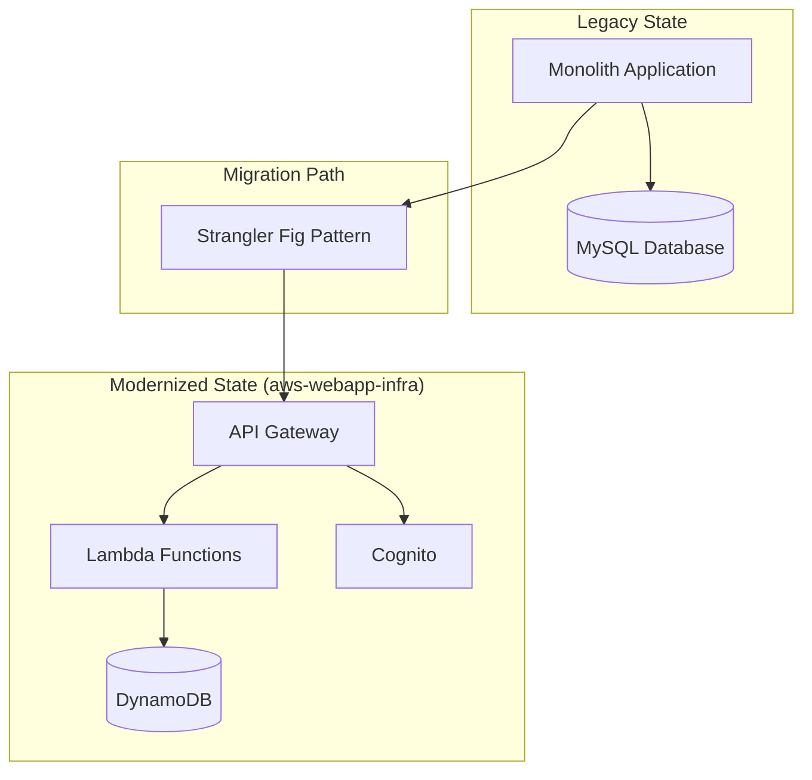

### Implementation Steps

| Phase | Action | Fastish Component | Reference |
|-------|--------|-------------------|-----------|
| **1. Foundation** | Deploy VPC, Cognito, API Gateway | aws-webapp-infra | [VPC Best Practices](https://docs.aws.amazon.com/vpc/latest/userguide/vpc-security-best-practices.html) |
| **2. Data Migration** | Migrate MySQL to DynamoDB | Manual + aws-webapp-infra DB module | [DynamoDB Migration](https://docs.aws.amazon.com/prescriptive-guidance/latest/dynamodb-data-modeling/step5.html) |
| **3. API Facade** | Route traffic through API Gateway | aws-webapp-infra API module | [API Gateway REST APIs](https://docs.aws.amazon.com/apigateway/latest/developerguide/apigateway-rest-api.html) |
| **4. Function Extraction** | Extract services to Lambda | aws-webapp-infra Lambda module | [Lambda Best Practices](https://docs.aws.amazon.com/lambda/latest/dg/best-practices.html) |
| **5. Cutover** | Retire monolith | N/A | [Migration Strategies](https://docs.aws.amazon.com/prescriptive-guidance/latest/migration-retiring-applications/welcome.html) |

### CDK Context Configuration

```json
{
  ":account": "123456789012",
  ":region": "us-west-2",
  ":environment": "prototype",
  ":version": "v1",
  ":domain": "legacy-app.example.com",
  "deployment:api:throttling": {
    "rateLimit": 10000,
    "burstLimit": 5000
  },
  "deployment:db:tables": [
    {
      "name": "users",
      "partitionKey": "userId",
      "billingMode": "PAY_PER_REQUEST"
    },
    {
      "name": "orders",
      "partitionKey": "orderId",
      "sortKey": "createdAt",
      "gsi": [
        {
          "name": "userId-index",
          "partitionKey": "userId"
        }
      ]
    }
  ]
}
```

### Benefits

| Metric | Before | After | Improvement |
|--------|--------|-------|-------------|
| **Deployment Time** | 4 hours | 15 minutes | 94% reduction |
| **Monthly Infrastructure Cost** | $2,500 | $400 | 84% reduction |
| **Scaling Time** | Manual, hours | Automatic, seconds | Eliminated manual intervention |
| **MTTR** | 2 hours | 5 minutes | 96% reduction |

---

## 2. SaaS Platform Launch

**Scenario**: Launch a multi-tenant SaaS application with authentication, billing integration, and tenant isolation.

**Reference Architecture**: [SaaS Lens](https://docs.aws.amazon.com/wellarchitected/latest/saas-lens/saas-lens.html) | [Multi-Tenant Architecture](https://docs.aws.amazon.com/whitepapers/latest/saas-architecture-fundamentals/multi-tenant-architecture.html) | [SaaS Journey Framework](https://aws.amazon.com/partners/programs/saas-factory/)

### Architecture

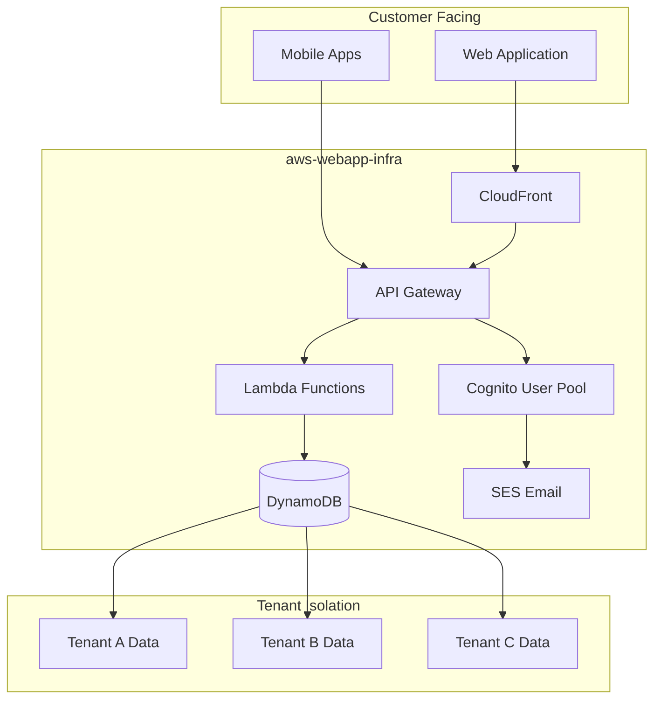

### Multi-Tenant Data Model

```mermaid
erDiagram
    TENANT ||--o{ USER : has
    TENANT ||--o{ SUBSCRIPTION : has
    USER ||--o{ SESSION : creates
    TENANT ||--o{ RESOURCE : owns

    TENANT {
        string tenantId PK
        string name
        string plan
        timestamp createdAt
    }

    USER {
        string tenantId PK
        string userId SK
        string email
        string role
    }

    RESOURCE {
        string tenantId PK
        string resourceId SK
        string type
        json data
    }
```

### Implementation

```bash
# Deploy complete SaaS infrastructure
gh repo clone fast-ish/aws-webapp-infra
cd aws-webapp-infra

# Configure for multi-tenant SaaS
cat > infra/cdk.context.json << 'EOF'
{
  ":account": "123456789012",
  ":region": "us-west-2",
  ":environment": "prototype",
  ":version": "v1",
  ":domain": "app.yoursaas.com",
  "deployment:cognito:customAttributes": [
    { "name": "tenantId", "type": "String", "mutable": false },
    { "name": "role", "type": "String", "mutable": true }
  ],
  "deployment:cognito:triggers": {
    "preSignUp": "validate-tenant",
    "postConfirmation": "provision-tenant"
  },
  "deployment:db:tables": [
    {
      "name": "tenants",
      "partitionKey": "tenantId",
      "stream": "NEW_AND_OLD_IMAGES"
    },
    {
      "name": "resources",
      "partitionKey": "tenantId",
      "sortKey": "resourceId",
      "gsi": [
        { "name": "type-index", "partitionKey": "tenantId", "sortKey": "type" }
      ]
    }
  ]
}
EOF

# Deploy
mvn clean install
cd infra && cdk deploy
```

### Cost Model

Based on [AWS Pricing Calculator](https://calculator.aws/) estimates for us-west-2:

| Tier | Monthly Users | API Calls/Month | Estimated Cost | Primary Cost Drivers |
|------|---------------|-----------------|----------------|---------------------|
| **Starter** | 100 | 100K | $50-75 | [Cognito](https://aws.amazon.com/cognito/pricing/), [API Gateway](https://aws.amazon.com/api-gateway/pricing/) |
| **Growth** | 1,000 | 1M | $150-250 | [Lambda](https://aws.amazon.com/lambda/pricing/), [DynamoDB](https://aws.amazon.com/dynamodb/pricing/) |
| **Scale** | 10,000 | 10M | $500-800 | DynamoDB WCU/RCU, Lambda concurrency |
| **Enterprise** | 100,000+ | 100M+ | $2,000+ | Reserved capacity, dedicated support |

---

## 3. Real-Time Analytics Pipeline

**Scenario**: Build a real-time analytics platform for processing clickstream data with sub-second query latency.

**Reference Architecture**: [Real-Time Analytics on AWS](https://aws.amazon.com/big-data/datalakes-and-analytics/real-time-analytics/) | [Apache Druid Documentation](https://druid.apache.org/docs/latest/) | [Amazon MSK Best Practices](https://docs.aws.amazon.com/msk/latest/developerguide/bestpractices.html)

### Architecture

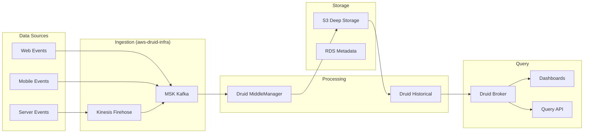

### Data Flow Timeline

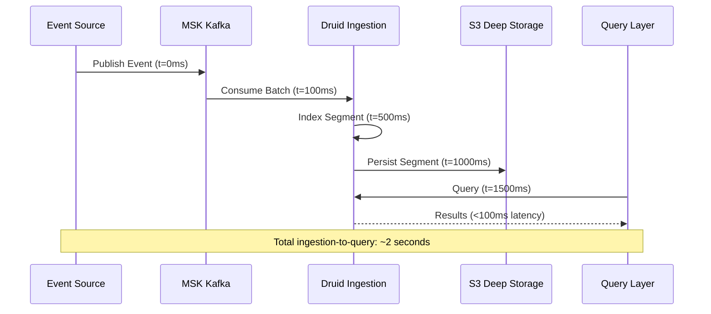

### Druid Schema Definition

```json
{
  "dataSource": "clickstream",
  "timestampSpec": {
    "column": "event_time",
    "format": "iso"
  },
  "dimensionsSpec": {
    "dimensions": [
      "user_id",
      "session_id",
      "page_url",
      "referrer",
      "device_type",
      "browser",
      "country",
      "region"
    ]
  },
  "metricsSpec": [
    { "type": "count", "name": "event_count" },
    { "type": "longSum", "name": "duration_ms", "fieldName": "duration" },
    { "type": "hyperUnique", "name": "unique_users", "fieldName": "user_id" }
  ],
  "granularitySpec": {
    "segmentGranularity": "HOUR",
    "queryGranularity": "MINUTE",
    "rollup": true
  }
}
```

### Performance Characteristics

| Metric | Value | Notes | Reference |
|--------|-------|-------|-----------|
| **Ingestion Rate** | 100K+ events/sec | Per MSK partition | [MSK Throughput](https://docs.aws.amazon.com/msk/latest/developerguide/msk-throughput.html) |
| **Query Latency (p50)** | <100ms | Cached segments | [Druid Query Performance](https://druid.apache.org/docs/latest/querying/performance.html) |
| **Query Latency (p99)** | <500ms | Cold segments | [Historical Process](https://druid.apache.org/docs/latest/design/historical.html) |
| **Data Retention** | Unlimited | S3 deep storage | [S3 Storage Classes](https://aws.amazon.com/s3/storage-classes/) |
| **Concurrent Queries** | 100+ | Broker horizontal scaling | [Druid Broker](https://druid.apache.org/docs/latest/design/broker.html) |

---

## 4. AI/ML Inference Platform

**Scenario**: Deploy a scalable ML inference platform with GPU support for real-time predictions.

**Reference Architecture**: [Machine Learning Lens](https://docs.aws.amazon.com/wellarchitected/latest/machine-learning-lens/machine-learning-lens.html) | [EKS GPU Best Practices](https://aws.github.io/aws-eks-best-practices/cost_optimization/instance_type_selection/) | [Karpenter GPU Provisioning](https://karpenter.sh/docs/concepts/nodepools/)

### Architecture

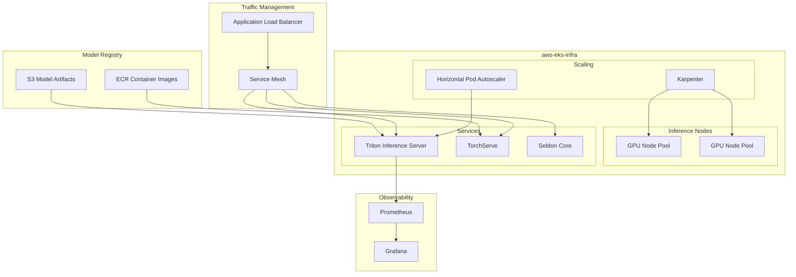

### Karpenter GPU Provisioner

```yaml
# NodePool for GPU inference workloads
apiVersion: karpenter.sh/v1beta1
kind: NodePool
metadata:
  name: gpu-inference
spec:
  template:
    spec:
      requirements:
        - key: node.kubernetes.io/instance-type
          operator: In
          values:
            - g4dn.xlarge
            - g4dn.2xlarge
            - g5.xlarge
            - g5.2xlarge
        - key: karpenter.sh/capacity-type
          operator: In
          values:
            - on-demand
            - spot
        - key: kubernetes.io/arch
          operator: In
          values:
            - amd64
      nodeClassRef:
        name: bottlerocket-gpu
  limits:
    cpu: 1000
    memory: 4000Gi
    nvidia.com/gpu: 100
  disruption:
    consolidationPolicy: WhenUnderutilized
    consolidateAfter: 30s
```

### Inference Service Deployment

```yaml
apiVersion: serving.kserve.io/v1beta1
kind: InferenceService
metadata:
  name: llm-inference
spec:
  predictor:
    model:
      modelFormat:
        name: pytorch
      storageUri: s3://models/llm-v1
      resources:
        limits:
          nvidia.com/gpu: 1
          memory: 16Gi
        requests:
          nvidia.com/gpu: 1
          memory: 16Gi
    minReplicas: 2
    maxReplicas: 10
    scaleTarget: 70
    scaleMetric: concurrency
```

### Cost Optimization Strategies

| Strategy | Implementation | Savings | Reference |
|----------|----------------|---------|-----------|
| **Spot Instances** | Karpenter Spot integration for batch inference | 60-70% | [EC2 Spot Instances](https://aws.amazon.com/ec2/spot/) |
| **Right-sizing** | GPU instance selection based on model size | 20-30% | [EC2 Instance Types](https://aws.amazon.com/ec2/instance-types/) |
| **Scale-to-zero** | KEDA for idle workloads | Variable | [KEDA Scalers](https://keda.sh/docs/2.12/scalers/) |
| **Model Optimization** | Quantization, pruning | Reduced GPU requirements | [SageMaker Neo](https://aws.amazon.com/sagemaker/neo/) |

---

## 5. Multi-Tenant B2B Application

**Scenario**: Enterprise B2B platform with strict tenant isolation, compliance requirements, and SSO integration.

**Reference Architecture**: [SaaS Tenant Isolation](https://docs.aws.amazon.com/whitepapers/latest/saas-tenant-isolation-strategies/saas-tenant-isolation-strategies.html) | [Cognito SAML Federation](https://docs.aws.amazon.com/cognito/latest/developerguide/cognito-user-pools-saml-idp.html) | [KMS Encryption](https://docs.aws.amazon.com/kms/latest/developerguide/concepts.html)

### Architecture

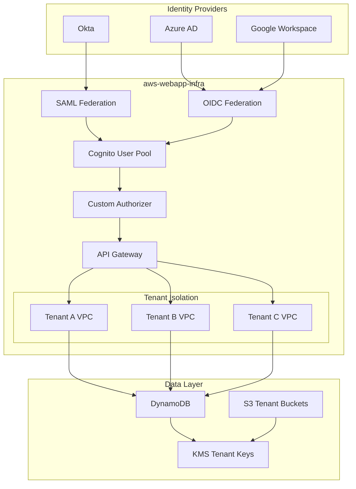

### Tenant Isolation Model

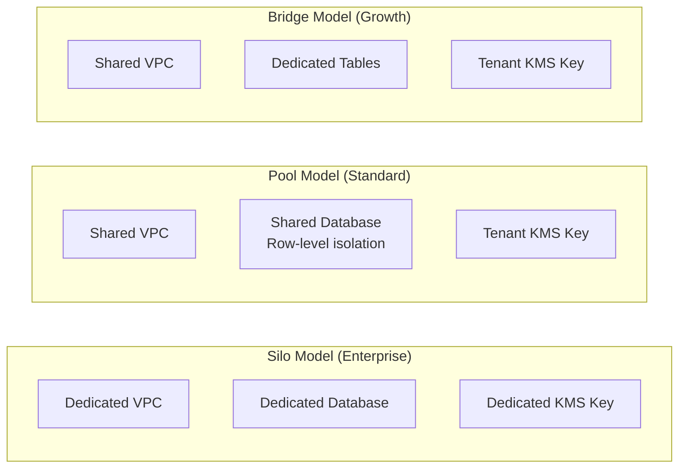

### Compliance Configuration

```json
{
  "deployment:compliance": {
    "dataResidency": "us",
    "encryption": {
      "atRest": "AES-256",
      "inTransit": "TLS-1.3",
      "keyRotation": "90-days"
    },
    "logging": {
      "cloudtrail": true,
      "vpcFlowLogs": true,
      "apiGatewayLogs": true,
      "retention": "7-years"
    },
    "backup": {
      "rpo": "1-hour",
      "rto": "4-hours",
      "crossRegion": true
    }
  }
}
```

---

## 6. Event-Driven Microservices

**Scenario**: Build a loosely-coupled microservices architecture with event sourcing and CQRS patterns.

**Reference Architecture**: [Event-Driven Architecture](https://docs.aws.amazon.com/prescriptive-guidance/latest/cloud-design-patterns/event-driven-architecture.html) | [CQRS Pattern](https://docs.aws.amazon.com/prescriptive-guidance/latest/modernization-data-persistence/cqrs-pattern.html) | [Amazon EventBridge](https://docs.aws.amazon.com/eventbridge/latest/userguide/eb-what-is.html)

### Architecture

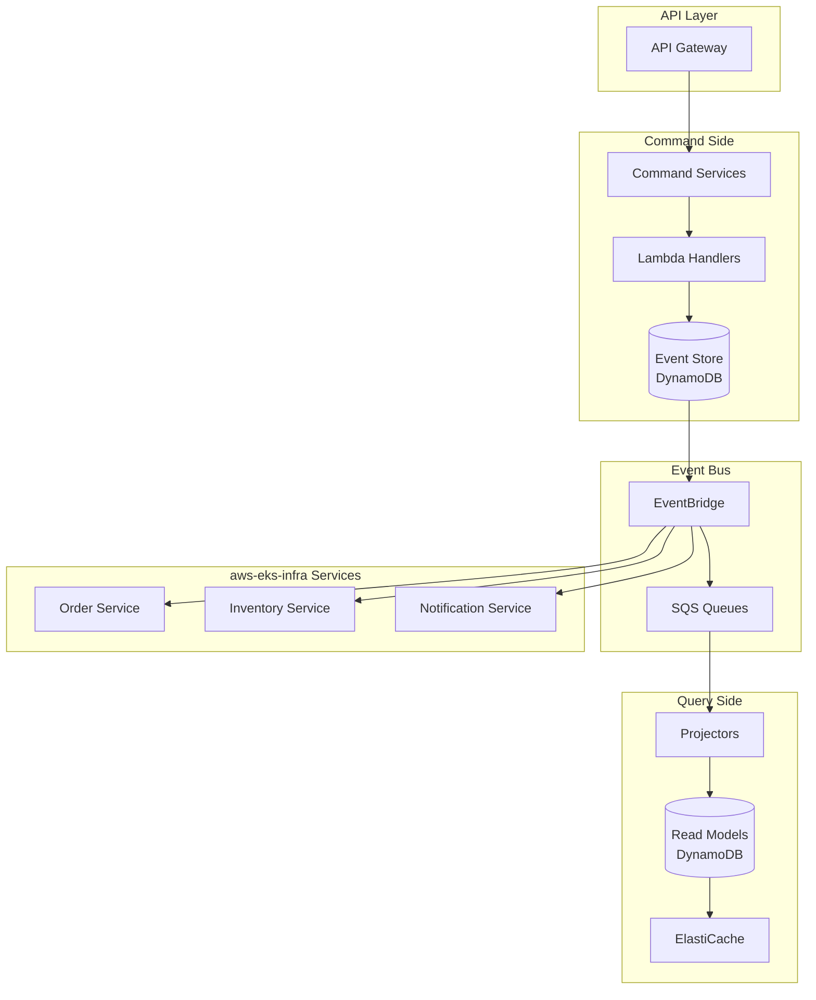

### Event Flow

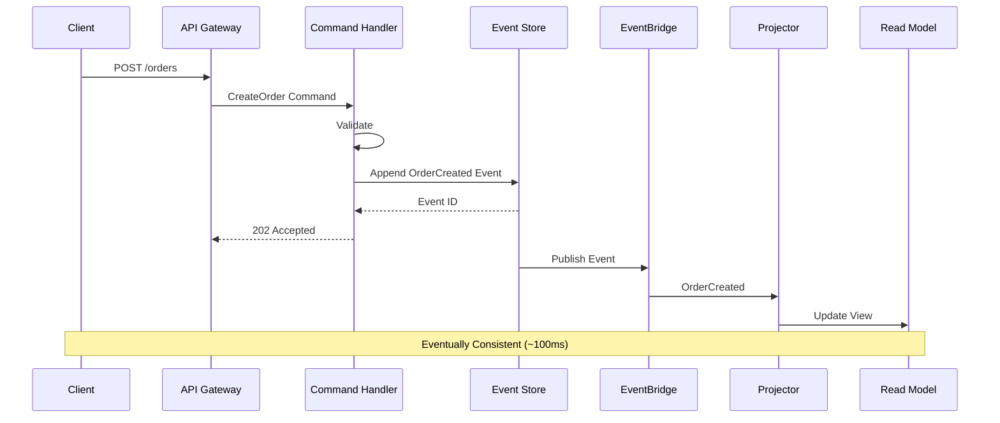

### Event Schema

```json
{
  "eventId": "evt_abc123",
  "eventType": "OrderCreated",
  "aggregateType": "Order",
  "aggregateId": "ord_xyz789",
  "version": 1,
  "timestamp": "2024-01-15T10:30:00Z",
  "correlationId": "corr_123",
  "causationId": "cmd_456",
  "metadata": {
    "userId": "user_789",
    "tenantId": "tenant_abc"
  },
  "payload": {
    "customerId": "cust_123",
    "items": [
      { "productId": "prod_1", "quantity": 2, "price": 29.99 }
    ],
    "total": 59.98
  }
}
```

---

## 7. IoT Data Processing

**Scenario**: Process high-volume IoT sensor data with real-time anomaly detection and historical analysis.

**Reference Architecture**: [IoT Lens](https://docs.aws.amazon.com/wellarchitected/latest/iot-lens/welcome.html) | [AWS IoT Core](https://docs.aws.amazon.com/iot/latest/developerguide/what-is-aws-iot.html) | [Kinesis Data Streams](https://docs.aws.amazon.com/streams/latest/dev/introduction.html)

### Architecture

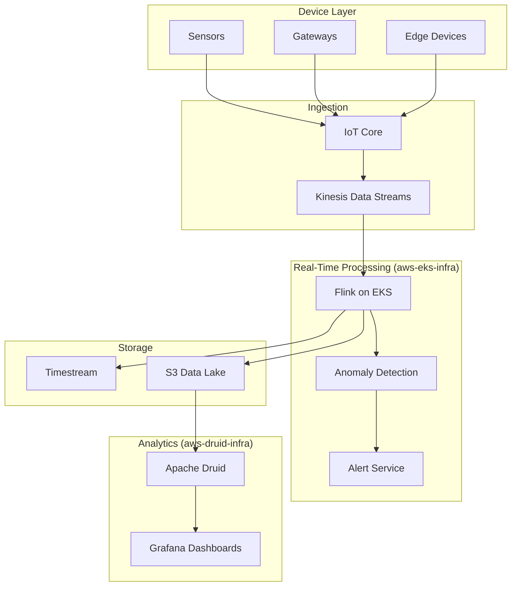

### Data Pipeline Stages

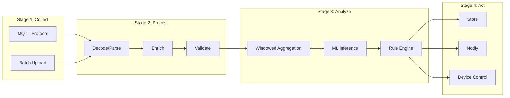

### Throughput Characteristics

| Stage | Throughput | Latency | Reference |
|-------|------------|---------|-----------|
| **IoT Core** | 1M msg/sec | <100ms | [IoT Core Limits](https://docs.aws.amazon.com/iot/latest/developerguide/quotas.html) |
| **Kinesis** | 1K records/sec/shard | ~200ms | [Kinesis Limits](https://docs.aws.amazon.com/streams/latest/dev/service-sizes-and-limits.html) |
| **Flink** | 100K events/sec | ~500ms | [Flink on EKS](https://aws.amazon.com/blogs/big-data/run-apache-flink-applications-on-amazon-eks/) |
| **Druid** | 100K events/sec | ~1s | [Druid Kafka Ingestion](https://druid.apache.org/docs/latest/development/extensions-core/kafka-ingestion.html) |

---

## 8. Rapid Prototyping Environment

**Scenario**: Quickly spin up development and testing environments for new product features with production parity.

**Reference Architecture**: [Environment Management](https://docs.aws.amazon.com/prescriptive-guidance/latest/patterns/manage-multiple-environments-in-the-aws-cdk.html) | [CodePipeline](https://docs.aws.amazon.com/codepipeline/latest/userguide/welcome.html) | [CDK Best Practices](https://docs.aws.amazon.com/cdk/v2/guide/best-practices.html)

### Architecture

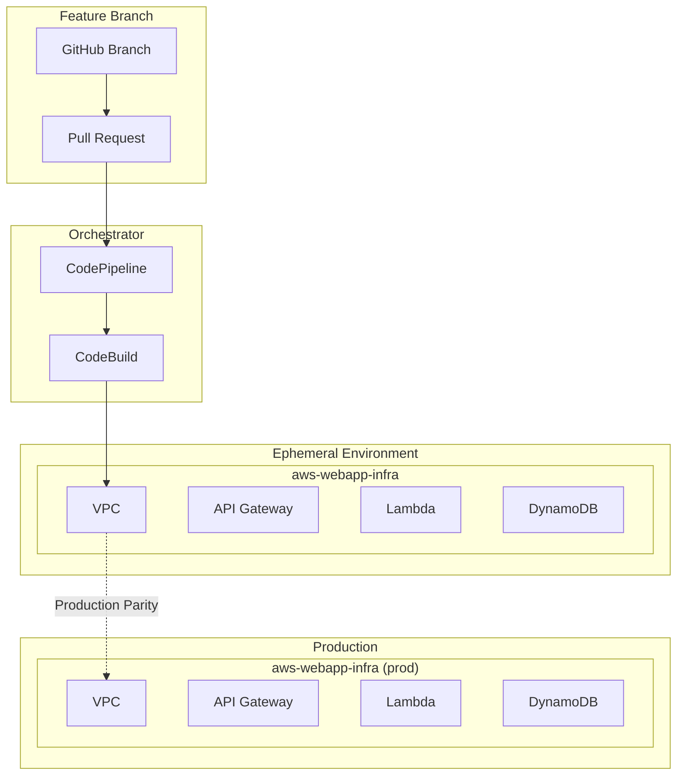

### Environment Lifecycle

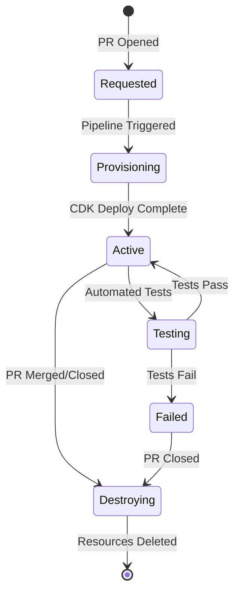

### CDK Context for Ephemeral Environments

```json
{
  ":account": "123456789012",
  ":region": "us-west-2",
  ":environment": "ephemeral",
  ":version": "v1",
  "deployment:ephemeral": {
    "ttl": "7-days",
    "autoDestroy": true,
    "scaledDown": true,
    "resourcePrefix": "pr-${PR_NUMBER}"
  },
  "deployment:vpc": {
    "maxAzs": 2,
    "natGateways": 1
  },
  "deployment:db": {
    "billingMode": "PAY_PER_REQUEST",
    "pointInTimeRecovery": false
  }
}
```

### Cost Comparison

| Environment Type | Monthly Cost | Use Case |
|------------------|--------------|----------|
| **Production** | $500-2000 | Live traffic |
| **Staging** | $200-500 | Pre-release testing |
| **Ephemeral (active)** | $50-100 | Feature development |
| **Ephemeral (idle)** | $5-10 | Scaled-down, waiting |

### Automation Script

```bash
#!/bin/bash
# deploy-ephemeral.sh

PR_NUMBER=$1
BRANCH_NAME=$2

# Generate unique stack name
STACK_NAME="pr-${PR_NUMBER}-webapp"

# Configure context
cat > cdk.context.json << EOF
{
  ":account": "${AWS_ACCOUNT_ID}",
  ":region": "us-west-2",
  ":environment": "ephemeral",
  ":version": "v1",
  "deployment:id": "pr-${PR_NUMBER}",
  "deployment:branch": "${BRANCH_NAME}"
}
EOF

# Deploy
cdk deploy --require-approval never

# Output environment URL
aws cloudformation describe-stacks \
  --stack-name $STACK_NAME \
  --query 'Stacks[0].Outputs[?OutputKey==`ApiEndpoint`].OutputValue' \
  --output text
```

---

## Deployment Decision Matrix

Use this matrix to select the appropriate Fastish project for your use case. For additional guidance, see the [AWS Architecture Center](https://aws.amazon.com/architecture/) and [Well-Architected Lenses](https://aws.amazon.com/architecture/well-architected/).

| Use Case | Primary Project | Secondary Projects | Key Considerations | Reference |
|----------|-----------------|--------------------|--------------------|-----------|
| **Web Application** | aws-webapp-infra | - | Serverless, API-first | [Serverless Lens](https://docs.aws.amazon.com/wellarchitected/latest/serverless-applications-lens/welcome.html) |
| **Container Workloads** | aws-eks-infra | - | Kubernetes expertise required | [EKS Best Practices](https://aws.github.io/aws-eks-best-practices/) |
| **Real-Time Analytics** | aws-druid-infra | aws-eks-infra | High data volume | [Analytics Lens](https://docs.aws.amazon.com/wellarchitected/latest/analytics-lens/analytics-lens.html) |
| **ML/AI Inference** | aws-eks-infra | - | GPU support, model serving | [ML Lens](https://docs.aws.amazon.com/wellarchitected/latest/machine-learning-lens/machine-learning-lens.html) |
| **SaaS Platform** | aws-webapp-infra | aws-eks-infra | Multi-tenancy, scaling | [SaaS Lens](https://docs.aws.amazon.com/wellarchitected/latest/saas-lens/saas-lens.html) |
| **IoT Processing** | aws-druid-infra | aws-eks-infra | Time-series, streaming | [IoT Lens](https://docs.aws.amazon.com/wellarchitected/latest/iot-lens/welcome.html) |
| **Microservices** | aws-eks-infra | aws-webapp-infra | Service mesh, observability | [Containers Lens](https://docs.aws.amazon.com/wellarchitected/latest/container-build-lens/welcome.html) |
| **Rapid Prototyping** | aws-webapp-infra | - | Fast iteration, low cost | [Startup Lens](https://docs.aws.amazon.com/wellarchitected/latest/aws-for-startups-lens/overview.html) |

---

## Next Steps

1. **Select a pattern** that matches your use case
2. **Clone the appropriate repository** from [github.com/fast-ish](https://github.com/fast-ish)
3. **Configure CDK context** with your AWS account details
4. **Deploy** with `cdk deploy`
5. **Iterate** based on your specific requirements

For questions or custom implementations, open an issue in the relevant repository.

---

**Support**: [GitHub Issues](https://github.com/fast-ish/fast-ish.github.io/issues) | **Source**: [github.com/fast-ish](https://github.com/fast-ish)
