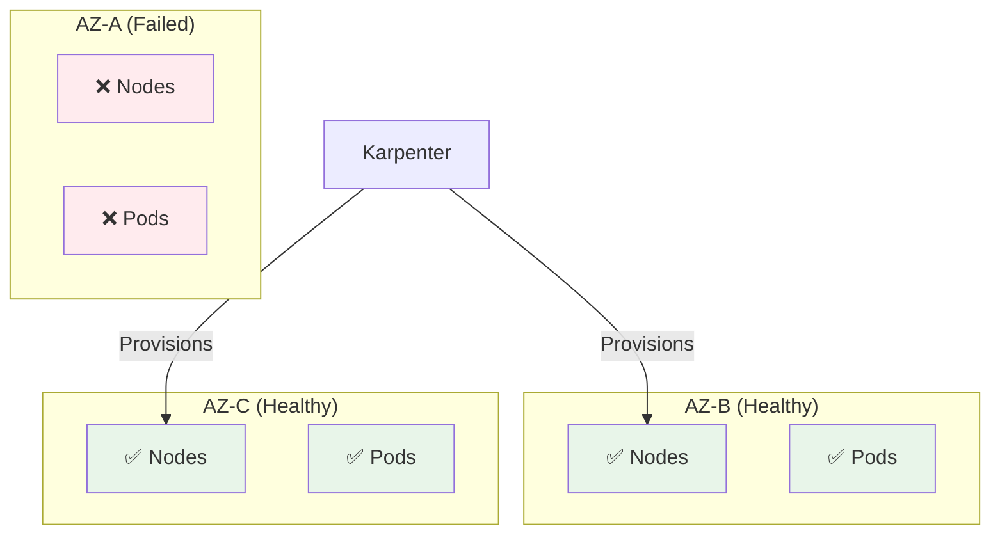

# Disaster Recovery Guide

## Overview

This guide covers disaster recovery (DR) procedures for both Druid and WebApp architectures, including backup strategies, recovery procedures, and RTO/RPO targets.

## Recovery Objectives

### Druid Architecture

| Scenario | RTO (Recovery Time) | RPO (Data Loss) | Cost Impact |
|----------|---------------------|-----------------|-------------|
| **Pod Failure** | < 5 minutes | None | Minimal |
| **Node Failure** | < 10 minutes | None | Minimal |
| **AZ Failure** | < 30 minutes | None | Moderate |
| **Region Failure** | 2-4 hours | < 5 minutes | High |
| **Data Corruption** | 1-2 hours | Snapshot interval | Moderate |

### WebApp Architecture

| Scenario | RTO (Recovery Time) | RPO (Data Loss) | Cost Impact |
|----------|---------------------|-----------------|-------------|
| **Lambda Failure** | < 1 minute | None | Minimal |
| **API Gateway Failure** | < 1 minute | None | Minimal |
| **AZ Failure** | < 5 minutes | None | Minimal |
| **Region Failure** | 1-2 hours | < 1 second | High |
| **Data Corruption** | 30-60 minutes | PITR interval | Moderate |

## Backup Strategy

### Druid Architecture Backups

#### 1. RDS PostgreSQL (Metadata)

**Automated Backups:**
```bash
# Enable automated backups (already configured via CDK)
aws rds modify-db-instance \
  --db-instance-identifier druid-metadata \
  --backup-retention-period 30 \
  --preferred-backup-window "03:00-04:00" \
  --apply-immediately
```

**Manual Snapshots:**
```bash
# Create manual snapshot
aws rds create-db-snapshot \
  --db-instance-identifier druid-metadata \
  --db-snapshot-identifier druid-metadata-manual-$(date +%Y%m%d)

# List snapshots
aws rds describe-db-snapshots \
  --db-instance-identifier druid-metadata

# Copy snapshot to another region (DR)
aws rds copy-db-snapshot \
  --source-db-snapshot-identifier arn:aws:rds:us-west-2:xxx:snapshot:druid-metadata-manual-20240115 \
  --target-db-snapshot-identifier druid-metadata-dr-20240115 \
  --region us-east-1
```

**Point-in-Time Recovery (PITR):**
```bash
# Restore to specific timestamp
aws rds restore-db-instance-to-point-in-time \
  --source-db-instance-identifier druid-metadata \
  --target-db-instance-identifier druid-metadata-restored \
  --restore-time 2024-01-15T10:30:00Z
```

#### 2. S3 Deep Storage (Druid Segments)

**Versioning** (already enabled via CDK):
```bash
# Verify versioning
aws s3api get-bucket-versioning \
  --bucket fff-druid-deep-storage
```

**Cross-Region Replication:**
```bash
# Configure replication to DR region
aws s3api put-bucket-replication \
  --bucket fff-druid-deep-storage \
  --replication-configuration file://replication.json
```

**replication.json:**
```json
{
  "Role": "arn:aws:iam::xxx:role/S3ReplicationRole",
  "Rules": [
    {
      "Status": "Enabled",
      "Priority": 1,
      "DeleteMarkerReplication": { "Status": "Enabled" },
      "Filter": {},
      "Destination": {
        "Bucket": "arn:aws:s3:::fff-druid-deep-storage-dr",
        "ReplicationTime": {
          "Status": "Enabled",
          "Time": { "Minutes": 15 }
        }
      }
    }
  ]
}
```

#### 3. EKS Configuration Backup

**Export Kubernetes Resources:**
```bash
# Backup all Druid resources
kubectl get all -n druid -o yaml > druid-backup-$(date +%Y%m%d).yaml

# Backup Helm releases
helm list -n druid -o yaml > helm-releases-$(date +%Y%m%d).yaml

# Backup ConfigMaps and Secrets
kubectl get configmap -n druid -o yaml > configmaps-$(date +%Y%m%d).yaml
kubectl get secret -n druid -o yaml > secrets-$(date +%Y%m%d).yaml
```

**Store in S3:**
```bash
aws s3 cp druid-backup-$(date +%Y%m%d).yaml \
  s3://fff-druid-backups/kubernetes/
```

### WebApp Architecture Backups

#### 1. DynamoDB Tables

**Point-in-Time Recovery (PITR):**
```bash
# Enable PITR (already configured via CDK)
aws dynamodb update-continuous-backups \
  --table-name webapp-users \
  --point-in-time-recovery-specification PointInTimeRecoveryEnabled=true

# Restore to specific timestamp
aws dynamodb restore-table-to-point-in-time \
  --source-table-name webapp-users \
  --target-table-name webapp-users-restored \
  --restore-date-time 2024-01-15T10:30:00Z
```

**On-Demand Backups:**
```bash
# Create backup
aws dynamodb create-backup \
  --table-name webapp-users \
  --backup-name webapp-users-backup-$(date +%Y%m%d)

# List backups
aws dynamodb list-backups \
  --table-name webapp-users

# Restore from backup
aws dynamodb restore-table-from-backup \
  --target-table-name webapp-users-restored \
  --backup-arn arn:aws:dynamodb:us-west-2:xxx:table/webapp-users/backup/xxx
```

**Export to S3:**
```bash
# Export entire table to S3
aws dynamodb export-table-to-point-in-time \
  --table-arn arn:aws:dynamodb:us-west-2:xxx:table/webapp-users \
  --s3-bucket fff-dynamodb-exports \
  --export-format DYNAMODB_JSON
```

#### 2. Lambda Function Code

**Version Control:**
```bash
# All Lambda code is in Git (primary backup)
git tag webapp-v1.0.0
git push origin webapp-v1.0.0

# Publish Lambda versions
aws lambda publish-version \
  --function-name webapp-user-api \
  --description "Stable release v1.0.0"
```

#### 3. Cognito User Pool

**Export Users:**
```bash
# List users
aws cognito-idp list-users \
  --user-pool-id us-west-2_xxxxxxxxx \
  --output json > cognito-users-$(date +%Y%m%d).json

# Store in S3
aws s3 cp cognito-users-$(date +%Y%m%d).json \
  s3://fff-webapp-backups/cognito/
```

## Recovery Procedures

### Scenario 1: Pod Failure (Druid)

**Symptoms:**
- Pod status: CrashLoopBackOff, Error, or ImagePullBackOff
- Druid queries failing

**Recovery:**
```bash
# 1. Identify failed pod
kubectl get pods -n druid

# 2. Check logs
kubectl logs <pod-name> -n druid --previous

# 3. Delete pod (auto-recreates)
kubectl delete pod <pod-name> -n druid

# 4. Verify recovery
kubectl get pods -n druid --watch
```

**RTO:** < 5 minutes
**RPO:** None (stateless pods, data in S3/RDS)

### Scenario 2: Node Failure (Druid)

**Symptoms:**
- Node status: NotReady
- Pods stuck in Pending or Unknown

**Recovery:**
```bash
# 1. Identify failed node
kubectl get nodes

# 2. Cordon node (prevent new pods)
kubectl cordon <node-name>

# 3. Drain node (evict pods)
kubectl drain <node-name> --ignore-daemonsets --delete-emptydir-data

# 4. Karpenter provisions new node automatically
kubectl get nodes --watch

# 5. Delete failed node
kubectl delete node <node-name>
```

**RTO:** < 10 minutes (Karpenter auto-scales)
**RPO:** None

### Scenario 3: RDS Database Corruption

**Symptoms:**
- Druid Coordinator cannot connect to metadata DB
- Database errors in logs

**Recovery:**

**Option 1: Point-in-Time Restore**
```bash
# 1. Identify corruption time
# Check Druid logs for first error

# 2. Restore to 5 minutes before corruption
aws rds restore-db-instance-to-point-in-time \
  --source-db-instance-identifier druid-metadata \
  --target-db-instance-identifier druid-metadata-restored \
  --restore-time 2024-01-15T10:25:00Z

# 3. Wait for restore (10-20 minutes)
aws rds describe-db-instances \
  --db-instance-identifier druid-metadata-restored \
  --query 'DBInstances[0].DBInstanceStatus'

# 4. Update Druid configuration to use new endpoint
# Update Secrets Manager secret
aws secretsmanager update-secret \
  --secret-id druid-metadata-secret \
  --secret-string '{"host":"druid-metadata-restored.xxx.rds.amazonaws.com","username":"druid","password":"xxx"}'

# 5. Restart Druid pods to pick up new endpoint
kubectl rollout restart statefulset druid-coordinator -n druid
kubectl rollout restart statefulset druid-overlord -n druid
```

**RTO:** 30-60 minutes
**RPO:** < 5 minutes (PITR granularity)

### Scenario 4: Availability Zone Failure

**Druid Architecture:**



**Recovery:**
1. Kubernetes detects unhealthy nodes (< 5 minutes)
2. Marks pods as Failed
3. Scheduler reschedules pods to healthy AZs
4. Karpenter provisions new nodes in healthy AZs

**RTO:** < 30 minutes
**RPO:** None (multi-AZ RDS, S3 multi-AZ replication)

**WebApp Architecture:**

Lambda and API Gateway are inherently multi-AZ. No action required.

**RTO:** < 1 minute (automatic failover)
**RPO:** None

### Scenario 5: Region Failure

**Druid Architecture DR:**

```bash
# Prerequisites:
# - RDS snapshot copied to DR region
# - S3 cross-region replication enabled
# - Infrastructure code in Git

# 1. Update cdk.context.json for DR region
{
  "hosted:region": "us-east-1"  // DR region
}

# 2. Deploy infrastructure in DR region
cd aws-druid-infra
cdk deploy --region us-east-1

# 3. Restore RDS from cross-region snapshot
aws rds restore-db-instance-from-db-snapshot \
  --db-instance-identifier druid-metadata \
  --db-snapshot-identifier druid-metadata-dr-20240115 \
  --region us-east-1

# 4. Update S3 deep storage bucket in Druid config
# Point to replicated bucket: fff-druid-deep-storage-dr

# 5. Deploy Druid Helm chart
# CDK automatically deploys Druid with new config

# 6. Update DNS (Route 53)
aws route53 change-resource-record-sets \
  --hosted-zone-id Z1234567890ABC \
  --change-batch file://failover-dns.json
```

**RTO:** 2-4 hours
**RPO:** < 5 minutes (RDS PITR) + < 15 minutes (S3 replication lag)

**WebApp Architecture DR:**

```bash
# 1. Deploy WebApp stack in DR region
cd aws-webapp-infra/infra
cdk deploy --region us-east-1

# 2. Restore DynamoDB from backup
aws dynamodb restore-table-from-backup \
  --target-table-name webapp-users \
  --backup-arn <cross-region-backup-arn> \
  --region us-east-1

# 3. Migrate Cognito users (manual process)
# Export from primary, import to DR
# Or use Cognito global table (if configured)

# 4. Update Route 53 for failover
aws route53 change-resource-record-sets \
  --hosted-zone-id Z1234567890ABC \
  --change-batch file://failover-api-dns.json
```

**RTO:** 1-2 hours
**RPO:** < 1 second (DynamoDB PITR)

### Scenario 6: Accidental Data Deletion

**Druid (S3 Segment Deletion):**

```bash
# 1. List deleted segment versions
aws s3api list-object-versions \
  --bucket fff-druid-deep-storage \
  --prefix segments/datasource_2024-01-15/ \
  --query 'DeleteMarkers'

# 2. Restore from version
aws s3api delete-object \
  --bucket fff-druid-deep-storage \
  --key segments/datasource_2024-01-15/segment.gz \
  --version-id <delete-marker-version-id>

# 3. Reload segments in Druid
curl -X POST http://localhost:8888/druid/coordinator/v1/datasources/datasource/markUsed \
  -H 'Content-Type: application/json' \
  -d '{"interval":"2024-01-15/2024-01-16"}'
```

**WebApp (DynamoDB Item Deletion):**

```bash
# 1. Restore table to point before deletion
aws dynamodb restore-table-to-point-in-time \
  --source-table-name webapp-users \
  --target-table-name webapp-users-restored \
  --restore-date-time 2024-01-15T09:00:00Z

# 2. Export deleted items
aws dynamodb scan \
  --table-name webapp-users-restored \
  --filter-expression "id = :id" \
  --expression-attribute-values '{":id":{"S":"deleted-user-id"}}' \
  > deleted-items.json

# 3. Re-import to production table
aws dynamodb batch-write-item \
  --request-items file://restore-items.json
```

## Disaster Recovery Testing

### Monthly DR Drill

```bash
# Test 1: RDS snapshot restore (non-prod)
aws rds restore-db-instance-from-db-snapshot \
  --db-instance-identifier druid-metadata-test \
  --db-snapshot-identifier druid-metadata-latest

# Test 2: DynamoDB PITR restore
aws dynamodb restore-table-to-point-in-time \
  --source-table-name webapp-users \
  --target-table-name webapp-users-test \
  --use-latest-restorable-time

# Test 3: Kubernetes resource restore
kubectl apply -f druid-backup-latest.yaml --dry-run=client

# Test 4: Cross-region failover
# Verify DNS failover routing
dig @8.8.8.8 api.example.com
```

### Quarterly Full DR Test

1. **Week 1:** Schedule DR test, notify team
2. **Week 2:** Deploy DR infrastructure
3. **Week 3:** Restore all data, validate
4. **Week 4:** Conduct failover test, document lessons learned

## Backup Retention Policy

### Druid Architecture

| Backup Type | Retention | Storage Class |
|-------------|-----------|---------------|
| RDS Automated | 30 days | Standard |
| RDS Manual Snapshots | 90 days | Standard |
| S3 Segments (current) | Indefinite | Standard |
| S3 Segments (> 30 days) | Indefinite | Standard-IA |
| S3 Segments (> 90 days) | Indefinite | Glacier IR |
| Kubernetes Backups | 30 days | S3 Standard |

### WebApp Architecture

| Backup Type | Retention | Storage Class |
|-------------|-----------|---------------|
| DynamoDB PITR | 35 days | Managed |
| DynamoDB On-Demand | 90 days | Managed |
| Lambda Versions | 10 versions | Managed |
| Cognito User Exports | 90 days | S3 Standard |
| CloudWatch Logs | 30 days | CloudWatch |

## Monitoring & Alerting for DR

### CloudWatch Alarms

```bash
# RDS backup alarm
aws cloudwatch put-metric-alarm \
  --alarm-name druid-rds-backup-failed \
  --alarm-description "Alert when RDS backup fails" \
  --metric-name DatabaseBackupOperation \
  --namespace AWS/RDS \
  --statistic Sum \
  --period 86400 \
  --threshold 1 \
  --comparison-operator LessThanThreshold

# S3 replication alarm
aws cloudwatch put-metric-alarm \
  --alarm-name s3-replication-failed \
  --metric-name ReplicationLatency \
  --namespace AWS/S3 \
  --statistic Average \
  --period 3600 \
  --threshold 900 \
  --comparison-operator GreaterThanThreshold
```

### Health Checks

```bash
# DR region health check
aws route53 create-health-check \
  --type HTTPS \
  --resource-path /health \
  --fully-qualified-domain-name api-dr.example.com \
  --port 443
```

## Cost Optimization for DR

### Reduce DR Costs

1. **Use S3 Lifecycle Policies:**
   - Standard → IA (30 days)
   - IA → Glacier (90 days)
   - **Savings:** 70% on old backups

2. **Automated Snapshot Deletion:**
```bash
# Delete snapshots older than 90 days
aws rds describe-db-snapshots \
  --snapshot-type manual \
  --query "DBSnapshots[?SnapshotCreateTime<='$(date -d '90 days ago' -I)'].DBSnapshotIdentifier" \
  --output text | xargs -n1 aws rds delete-db-snapshot --db-snapshot-identifier
```

3. **Cross-Region Replication On-Demand:**
   - Replicate only critical data
   - Use S3 Batch Replication for one-time sync
   - **Savings:** 80% on replication costs

## Recovery Checklist

### Immediate Response (0-15 minutes)
- [ ] Identify scope of failure
- [ ] Activate incident response team
- [ ] Update status page
- [ ] Begin recovery procedure

### Recovery Phase (15 minutes - 4 hours)
- [ ] Restore from backups
- [ ] Verify data integrity
- [ ] Update DNS/routing
- [ ] Conduct smoke tests

### Validation Phase (4-24 hours)
- [ ] Full system testing
- [ ] Monitor for issues
- [ ] Communicate status to users
- [ ] Document incident

### Post-Recovery (1-7 days)
- [ ] Conduct post-mortem
- [ ] Update runbooks
- [ ] Implement preventive measures
- [ ] Test recovery procedures

## Next Steps

- [Migration Checklist →](migration-checklist.md)
- [Upgrading Guide →](upgrading.md)
- [Troubleshooting →](/troubleshooting/common-errors.md)
- [Architecture →](/architecture/decisions.md)
