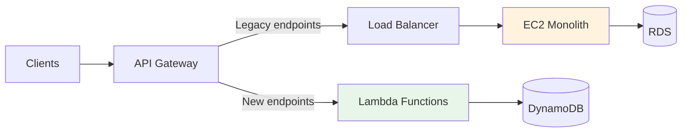

# Migration Checklist

## Overview

This guide provides step-by-step checklists for migrating Fastish infrastructure from prototype to production, and from other systems to Fastish.

## Prototype → Production Migration

### Pre-Migration (1-2 weeks before)

#### 1. Review Configuration
- [ ] Audit `cdk.context.json` for production values
- [ ] Change `hosted:environment` from `prototype` to `production`
- [ ] Verify all secrets are in AWS Secrets Manager (not hardcoded)
- [ ] Review resource sizing (RDS instance types, node counts)
- [ ] Confirm cost estimates with updated configuration

#### 2. Security Hardening
- [ ] Enable MFA for all IAM users
- [ ] Review IAM policies (principle of least privilege)
- [ ] Enable CloudTrail logging
- [ ] Enable GuardDuty (threat detection)
- [ ] Enable Security Hub (compliance monitoring)
- [ ] Configure AWS Config rules
- [ ] Review security group rules (remove overly permissive rules)

#### 3. Backup & Disaster Recovery
- [ ] Enable RDS automated backups (retention: 30 days)
- [ ] Enable RDS point-in-time recovery
- [ ] Enable DynamoDB point-in-time recovery
- [ ] Enable S3 versioning on deep storage buckets
- [ ] Configure S3 cross-region replication (optional)
- [ ] Document RTO/RPO requirements
- [ ] Test restore procedures

#### 4. Monitoring & Alerting
- [ ] Configure CloudWatch alarms (CPU, memory, disk)
- [ ] Set up billing alerts ($500, $1000, $1500 thresholds)
- [ ] Configure Grafana alerts (query latency, errors)
- [ ] Set up PagerDuty/Opsgenie integration
- [ ] Create runbooks for common issues
- [ ] Test alert notification delivery

### Migration Day

#### 1. Deploy Production Stack
```bash
# Update configuration
vi cdk.context.json
# Change:
# - hosted:environment: "production"
# - hosted:id: "prod" (new namespace)

# Synthesize
cdk synth

# Deploy with approval
cdk deploy --require-approval broadening
```

#### 2. Data Migration (if applicable)
- [ ] Export data from prototype
- [ ] Import data to production
- [ ] Verify data integrity (row counts, checksums)
- [ ] Test queries on production data

#### 3. DNS Cutover
- [ ] Update Route 53 DNS records
- [ ] Lower TTL to 60 seconds (for quick rollback)
- [ ] Monitor traffic shift
- [ ] Verify application functionality

#### 4. Smoke Tests
- [ ] Test authentication flow
- [ ] Test API endpoints
- [ ] Verify database connectivity
- [ ] Check log aggregation
- [ ] Confirm metric collection

### Post-Migration (1 week after)

#### 1. Optimization
- [ ] Review CloudWatch metrics for right-sizing
- [ ] Enable Spot instances for non-critical workloads
- [ ] Implement cost optimization strategies
- [ ] Configure auto-scaling based on usage patterns

#### 2. Cleanup
- [ ] Delete prototype stack (after 1 week of stable production)
- [ ] Remove unused resources
- [ ] Clean up old EBS snapshots
- [ ] Archive old logs to Glacier

#### 3. Documentation
- [ ] Update architecture diagrams
- [ ] Document production configuration
- [ ] Create operational playbooks
- [ ] Update team access documentation

## From Athena to Druid

### Assessment Phase
- [ ] Identify current Athena queries and usage patterns
- [ ] Estimate data volume and ingestion rate
- [ ] Define query latency requirements
- [ ] Calculate Druid cluster size needed
- [ ] Estimate cost comparison

### Data Migration
- [ ] Design Druid datasource schema
- [ ] Create ingestion specifications
- [ ] Test with sample data (1% of production)
- [ ] Validate query results match Athena
- [ ] Performance benchmark queries

### Cutover Strategy
- [ ] Deploy Druid infrastructure
- [ ] Run Druid in parallel with Athena (1-2 weeks)
- [ ] Gradually shift queries to Druid
- [ ] Monitor performance and costs
- [ ] Decommission Athena when confident

## From EC2 Monolith to WebApp

### Application Assessment
- [ ] Identify API endpoints to migrate
- [ ] List database tables and access patterns
- [ ] Review authentication mechanism
- [ ] Identify long-running processes (> 15 minutes)
- [ ] Calculate request volume and patterns

### Decomposition Strategy
- [ ] Map monolith endpoints to Lambda functions
- [ ] Design DynamoDB schema (denormalized)
- [ ] Plan Cognito User Pool migration
- [ ] Identify batch jobs (cannot run in Lambda)

### Migration Approach

**Option 1: Strangler Fig Pattern** (recommended)


1. Deploy WebApp infrastructure (Cognito, Lambda, DynamoDB)
2. Keep EC2 monolith running
3. Migrate endpoints one-by-one to Lambda
4. Use API Gateway to route traffic
5. Decommission EC2 when all endpoints migrated

**Option 2: Big Bang** (higher risk)
1. Freeze feature development
2. Migrate all data to DynamoDB
3. Deploy WebApp stack
4. Cutover DNS
5. Monitor closely

### Data Migration
- [ ] Export relational data from RDS
- [ ] Transform to DynamoDB format (denormalize)
- [ ] Import to DynamoDB
- [ ] Verify data integrity
- [ ] Test queries

### User Migration (Cognito)
```bash
# Export users from existing system
# Import to Cognito User Pool
aws cognito-idp admin-create-user \
  --user-pool-id <pool-id> \
  --username <email> \
  --user-attributes Name=email,Value=<email> \
  --message-action SUPPRESS

# Force password reset on first login
```

## From Self-Managed Kafka to MSK

### Planning
- [ ] Inventory Kafka topics and configurations
- [ ] Calculate throughput requirements (MB/s)
- [ ] Decide: MSK Serverless vs Provisioned
- [ ] Plan IAM authentication migration

### Migration Steps

**Option 1: MirrorMaker 2** (zero downtime)
```bash
# 1. Deploy MSK cluster
cdk deploy

# 2. Configure MirrorMaker 2
kafka-mirror-maker.sh --consumer.config source.properties \
  --producer.config target.properties \
  --whitelist ".*"

# 3. Update producers to dual-write (old + MSK)
# 4. Update consumers to read from MSK
# 5. Decommission old Kafka
```

**Option 2: Topic-by-Topic Migration**
1. Create topics in MSK
2. Pause producers
3. Drain consumers (process all messages)
4. Update producer configs to MSK
5. Start producers and consumers

### Validation
- [ ] Verify all topics exist in MSK
- [ ] Check partition counts match
- [ ] Validate consumer lag is zero
- [ ] Test end-to-end data flow

## General Migration Best Practices

### 1. Test in Staging First
- Deploy identical infrastructure in non-prod account
- Run production-like load tests
- Validate all integrations
- Practice rollback procedures

### 2. Incremental Migration
- Migrate low-traffic components first
- Validate each step before proceeding
- Keep old system running during transition
- Use feature flags for gradual rollout

### 3. Rollback Plan
```bash
# Always have a rollback plan
# Example: DNS rollback
aws route53 change-resource-record-sets \
  --hosted-zone-id Z1234567890ABC \
  --change-batch file://rollback-dns.json

# Example: API Gateway stage rollback
aws apigateway update-stage \
  --rest-api-id abc123 \
  --stage-name production \
  --patch-operations op=replace,path=/deploymentId,value=<old-deployment-id>
```

### 4. Monitor During Migration
- CloudWatch metrics (errors, latency)
- Application logs (errors, warnings)
- User feedback (support tickets)
- Business metrics (conversion rates)

### 5. Communication Plan
- Notify users of maintenance window
- Keep stakeholders informed of progress
- Have escalation path ready
- Post-mortem after migration

## Migration Timeline Examples

### Small Deployment (< 1TB data, < 100K requests/day)
- **Week 1**: Planning, configuration review
- **Week 2**: Security hardening, backup setup
- **Week 3**: Staging deployment and testing
- **Week 4**: Production deployment
- **Week 5**: Monitoring and optimization

### Large Deployment (> 10TB data, > 1M requests/day)
- **Month 1**: Planning, proof-of-concept
- **Month 2**: Staging deployment, load testing
- **Month 3**: Incremental production migration (10% traffic)
- **Month 4**: Full production migration (100% traffic)
- **Month 5-6**: Optimization, cost reduction

## Troubleshooting Migration Issues

### Issue: Stack deployment fails
**Solution:** Check CloudFormation events for root cause
```bash
aws cloudformation describe-stack-events \
  --stack-name <stack-name> \
  --query 'StackEvents[?ResourceStatus==`CREATE_FAILED`]'
```

### Issue: Data import fails
**Solution:** Check item size and throughput
```bash
# DynamoDB: Increase write capacity temporarily
aws dynamodb update-table \
  --table-name <table-name> \
  --provisioned-throughput ReadCapacityUnits=5,WriteCapacityUnits=100
```

### Issue: High latency after migration
**Solution:** Enable caching, provision Lambda concurrency
```bash
# API Gateway caching
aws apigateway update-stage \
  --rest-api-id <api-id> \
  --stage-name production \
  --patch-operations op=replace,path=/cacheClusterEnabled,value=true
```

## Next Steps

- [Upgrading Guide →](upgrading.md)
- [Disaster Recovery →](disaster-recovery.md)
- [Architecture Decisions →](/architecture/decisions.md)
- [Troubleshooting →](/troubleshooting/common-errors.md)
