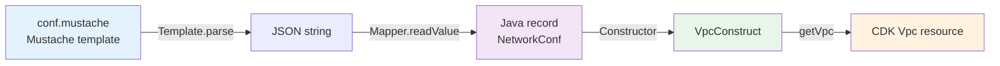

# CDK Constructs Reference

## Overview

The `cdk-common` library provides 47 reusable AWS CDK constructs in Java for building production-ready infrastructure. All constructs follow the **yaml → model → construct** pattern used throughout Fastish.

## Construct Categories

### Core Infrastructure

| Construct | Purpose | Used In |
|-----------|---------|---------|
| [VpcConstruct](vpc.md) | VPC with subnets, NAT gateways, security groups | Druid, WebApp |
| [SecurityGroupConstruct](security-group.md) | Security group with ingress/egress rules | Druid, WebApp |
| [KmsConstruct](kms.md) | KMS encryption keys | Druid |

### EKS & Kubernetes

| Construct | Purpose | Used In |
|-----------|---------|---------|
| [AddonsConstruct](eks-addons.md) | EKS Helm chart addons orchestrator | Druid |
| [ManagedAddonsConstruct](eks-managed-addons.md) | AWS-managed EKS addons (VPC CNI, CSI) | Druid |
| [NodeGroupsConstruct](eks-node-groups.md) | EKS managed node groups | Druid |
| [ServiceAccountConstruct](eks-service-account.md) | Kubernetes service accounts with IRSA | Druid |
| [PodIdentityConstruct](eks-pod-identity.md) | Pod identity agent configuration | Druid |
| [NamespaceConstruct](eks-namespace.md) | Kubernetes namespace creation | Druid |
| [ObservabilityConstruct](eks-observability.md) | Grafana Cloud integration | Druid |

### EKS Addons (Helm Charts)

| Construct | Purpose | Used In |
|-----------|---------|---------|
| [KarpenterConstruct](karpenter.md) | Karpenter autoscaler addon | Druid |
| [CertManagerConstruct](cert-manager.md) | cert-manager addon | Druid |
| [GrafanaConstruct](grafana.md) | Grafana k8s-monitoring addon | Druid |
| [AwsLoadBalancerConstruct](aws-load-balancer.md) | AWS Load Balancer Controller | Druid |
| [CsiSecretsStoreConstruct](csi-secrets-store.md) | CSI Secrets Store driver | Druid |
| [AwsSecretsStoreConstruct](aws-secrets-store.md) | AWS Secrets Manager provider | Druid |

### Data Services

| Construct | Purpose | Used In |
|-----------|---------|---------|
| [RdsConstruct](rds.md) | RDS PostgreSQL database | Druid |
| [DynamoDbConstruct](dynamodb.md) | DynamoDB table | WebApp |
| [MskConstruct](msk.md) | MSK Serverless Kafka cluster | Druid |
| [BucketConstruct](s3.md) | S3 bucket with policies | Druid, WebApp |

### Serverless

| Construct | Purpose | Used In |
|-----------|---------|---------|
| [LambdaConstruct](lambda.md) | Lambda function | WebApp |
| [AsyncLambdaConstruct](async-lambda.md) | Async Lambda with DLQ | WebApp |
| [RestApiConstruct](api-gateway.md) | API Gateway REST API | WebApp |
| [LambdaIntegrationConstruct](lambda-integration.md) | API Gateway Lambda integration | WebApp |
| [UsagePlanConstruct](usage-plan.md) | API Gateway usage plan | WebApp |

### Authentication

| Construct | Purpose | Used In |
|-----------|---------|---------|
| [UserPoolConstruct](cognito-user-pool.md) | Cognito User Pool | WebApp |
| [UserPoolClientConstruct](cognito-user-pool-client.md) | Cognito User Pool Client | WebApp |
| [UserPoolTriggersConstruct](cognito-triggers.md) | Cognito Lambda triggers | WebApp |
| [IdentityPoolConstruct](cognito-identity-pool.md) | Cognito Identity Pool | WebApp |

### Email & Messaging

| Construct | Purpose | Used In |
|-----------|---------|---------|
| [IdentityConstruct](ses.md) | SES email identity | WebApp |
| [SqsConstruct](sqs.md) | SQS queue | WebApp |

### Supporting Services

| Construct | Purpose | Used In |
|-----------|---------|---------|
| [SecretConstruct](secrets-manager.md) | Secrets Manager secret | Druid, WebApp |
| [LogGroupConstruct](cloudwatch-logs.md) | CloudWatch log group | Druid, WebApp |
| [RoleConstruct](iam-role.md) | IAM role with policies | Druid, WebApp |
| [EcrRepositoryConstruct](ecr.md) | ECR container repository | Bootstrap |

### CI/CD

| Construct | Purpose | Used In |
|-----------|---------|---------|
| [PipelineConstruct](codebuild-pipeline.md) | CodePipeline | Bootstrap (optional) |
| [ProjectConstruct](codebuild-project.md) | CodeBuild project | Bootstrap (optional) |

### Bootstrap

| Construct | Purpose | Used In |
|-----------|---------|---------|
| [SynthesizerConstruct](synthesizer.md) | CDK bootstrap synthesizer | Bootstrap |
| [SystemRolesConstruct](system-roles.md) | CDK system IAM roles | Bootstrap |
| [SystemStorageConstruct](system-storage.md) | CDK asset storage (S3, ECR) | Bootstrap |

### Load Balancing

| Construct | Purpose | Used In |
|-----------|---------|---------|
| [NetworkLoadBalancerConstruct](nlb.md) | Network Load Balancer | Druid (optional) |
| [NetworkTargetGroupConstruct](nlb-target-group.md) | NLB target group | Druid (optional) |

### Networking

| Construct | Purpose | Used In |
|-----------|---------|---------|
| [NetworkLookupConstruct](network-lookup.md) | Lookup existing VPC/subnets | All |

## Usage Pattern

All constructs follow this pattern:

```java
import fasti.sh.execute.aws.vpc.VpcConstruct;
import fasti.sh.model.aws.vpc.NetworkConf;
import fasti.sh.model.main.Common;

// 1. Configuration from yaml → model
NetworkConf conf = // ... loaded from conf.mustache

// 2. Create construct
VpcConstruct vpcConstruct = new VpcConstruct(this, common, conf);

// 3. Access underlying CDK resources
Vpc vpc = vpcConstruct.getVpc();
```

## Configuration Flow



## Common Parameters

### `Common` Object

Every construct receives a `Common` parameter containing shared configuration:

```java
public record Common(
  Maps maps,        // Tag key-value pairs
  String domain,    // Domain name (e.g., "data.stxkxs.io")
  String id         // Deployment ID (e.g., "fff")
) {}
```

### Configuration Records

Each construct has a corresponding configuration record (Java record):

| Construct | Configuration Record | Template Path |
|-----------|---------------------|---------------|
| VpcConstruct | `NetworkConf` | `conf.mustache` → vpc |
| RdsConstruct | `RdsConf` | `conf.mustache` → rds |
| MskConstruct | `MskConf` | `conf.mustache` → msk |

## Examples by Use Case

### Creating a VPC

```java
// 1. Configuration in conf.mustache
vpc:
  name: {{deployment:id}}-vpc
  cidr: 10.0.0.0/16
  natGateways: 2
  subnets:
    - name: public
      type: PUBLIC
      cidrMask: 24
    - name: private
      type: PRIVATE_WITH_EGRESS
      cidrMask: 24

// 2. Java code in DeploymentStack
var networkConf = Mapper.get().readValue(
  Template.parse(this, conf.network()),
  NetworkConf.class
);

var vpcConstruct = new VpcConstruct(this, common, networkConf);

// 3. Use VPC in other constructs
Vpc vpc = vpcConstruct.getVpc();
```

### Creating an EKS Cluster with Addons

```java
// 1. Configuration
eks:
  name: {{deployment:id}}-eks
  version: "1.33"
  addons:
    karpenter:
      enabled: true
      version: v0.33.0
    certManager:
      enabled: true
      version: v1.13.0

// 2. Java code
var eksConf = // ... parse configuration

// Create managed addons (AWS-managed)
var managedAddons = new ManagedAddonsConstruct(this, common, eksConf, cluster);

// Create Helm chart addons
var addons = new AddonsConstruct(this, common, eksConf, cluster);
addons.getNode().addDependency(managedAddons);
```

### Creating a Lambda Function

```java
// 1. Configuration
lambda:
  functionName: {{deployment:id}}-user-api
  runtime: NODEJS_20_X
  handler: index.handler
  code: fn/api/user
  environment:
    TABLE_NAME: !Ref UserTable

// 2. Java code
var lambdaConf = // ... parse configuration

var lambdaConstruct = new LambdaConstruct(this, common, lambdaConf);
Function lambda = lambdaConstruct.getFunction();
```

## Dependency Management

Constructs manage dependencies using CDK's `addDependency`:

```java
// Example from AddonsConstruct
this.certManager = new CertManagerConstruct(this, common, conf, cluster);
this.certManager().getNode().addDependency(this.grafana());

// Ensures Grafana is deployed before cert-manager
```

## Resource Naming

All constructs use the `id()` helper for consistent resource naming:

```java
import static fasti.sh.execute.serialization.Format.id;

// Creates ID: "eks.addons.fff-eks"
super(scope, id("eks.addons", conf.name()));
```

## Tagging Strategy

Constructs automatically apply tags via the `Common` object:

```java
Tags.of(this).add(domain + ":resource-type", "vpc");
Tags.of(this).add(domain + ":category", "network");
Tags.of(this).add(domain + ":component", conf.name());
```

## Next Steps

- [VPC Construct →](vpc.md)
- [EKS Addons Construct →](eks-addons.md)
- [RDS Construct →](rds.md)
- [Lambda Construct →](lambda.md)
- [Architecture Decisions →](/architecture/decisions.md)
