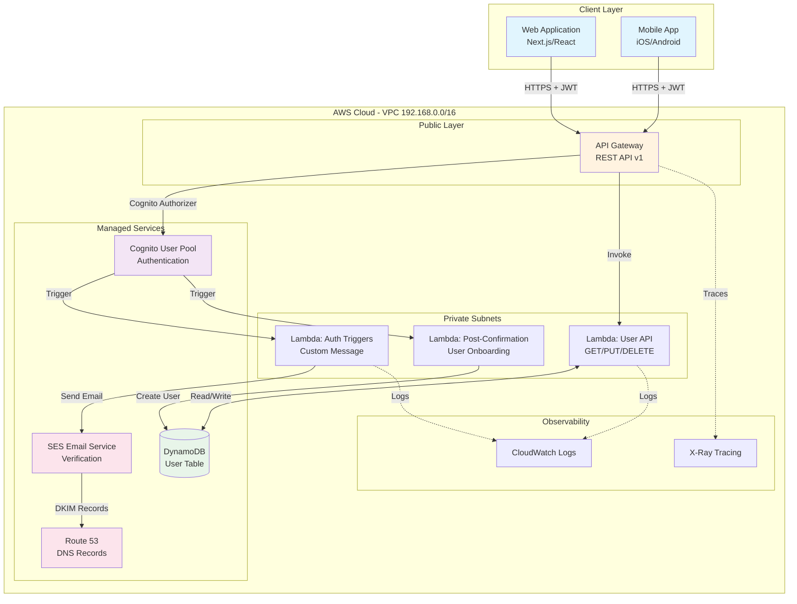
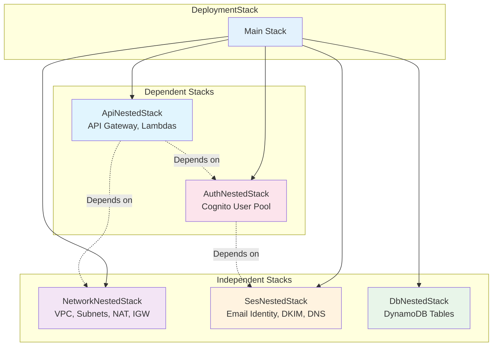
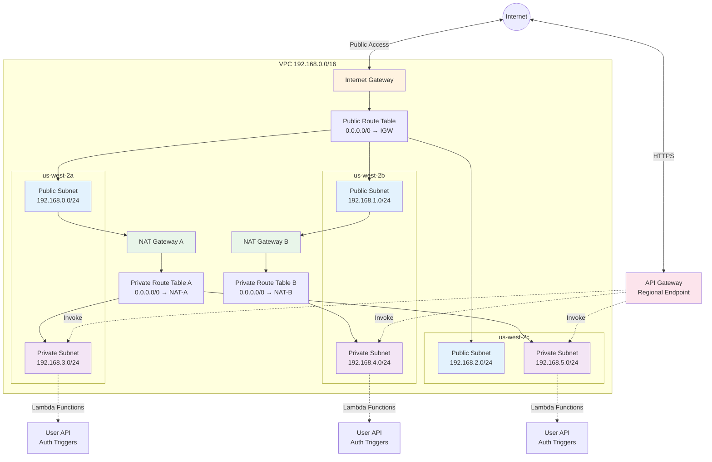
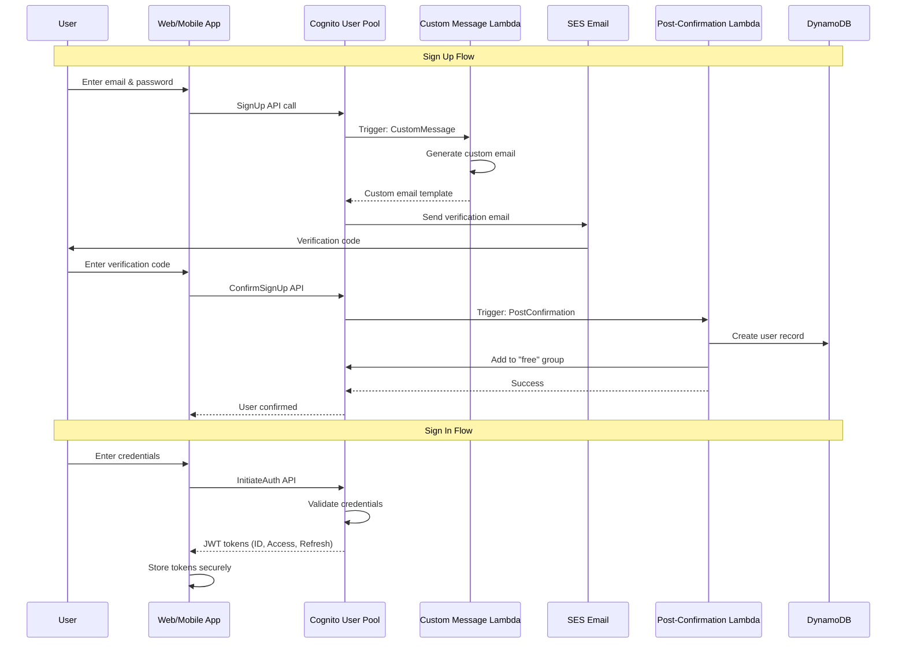
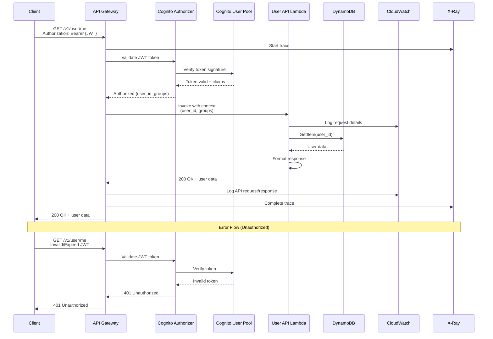

# Webapp Architecture Overview

## Introduction

The Webapp architecture provides a production-ready serverless web application infrastructure built entirely on AWS managed services. Implemented using **AWS CDK in Java** ([aws-webapp-infra](https://github.com/fast-ish/aws-webapp-infra)), this architecture deploys a complete backend stack including authentication, database, API layer, and email services - everything needed to build and scale a modern web application.

## Repository Structure

The infrastructure is defined in the [aws-webapp-infra](https://github.com/fast-ish/aws-webapp-infra) repository:

```
aws-webapp-infra/
├── infra/                              # CDK infrastructure code
│   └── src/main/java/fasti/sh/webapp/
│       ├── Launch.java                 # CDK app entry point
│       ├── stack/
│       │   ├── DeploymentStack.java    # Main stack orchestrator
│       │   ├── DeploymentConf.java     # Configuration model
│       │   └── nested/                 # Nested CloudFormation stacks
│       │       ├── NetworkNestedStack.java   # VPC infrastructure
│       │       ├── SesNestedStack.java       # Email service
│       │       ├── AuthNestedStack.java      # Cognito authentication
│       │       ├── DbNestedStack.java        # DynamoDB tables
│       │       └── ApiNestedStack.java       # API Gateway + Lambda
│       └── model/                      # Configuration models
├── fn/                                 # Lambda function code
│   ├── auth/                          # Cognito trigger handlers
│   │   ├── message/                   # Custom email messages
│   │   └── post-confirmation/         # User onboarding
│   ├── api/                           # API endpoints
│   │   └── user/                      # User management API
│   └── layer/                         # Shared Lambda layers
│       ├── auth/                      # Authentication utilities
│       ├── api/                       # API utilities
│       └── shared/                    # Common code
└── cdk.context.json                   # Deployment configuration
```

## Stack Architecture

### High-Level Architecture



### Nested Stack Architecture

The infrastructure uses a **nested stack architecture** for modularity and clear dependency management:



**Dependency Chain:**
1. **Network**, **SES**, and **DB** deploy first (independent)
2. **Auth** waits for SES (needs email for verification)
3. **API** waits for Auth (needs Cognito User Pool for authorizer) and Network (VPC for Lambda)

## Architecture Components

### Network Layer (VPC)

**File:** `infra/src/main/java/fasti/sh/webapp/stack/nested/NetworkNestedStack.java`

**Resources Created:**
- **VPC** with CIDR `192.168.0.0/16`
- **3 Availability Zones** (a, b, c)
- **Public Subnets** (CIDR /24) - Host NAT Gateways
- **Private Subnets with Egress** (CIDR /24) - Host Lambda functions
- **2 NAT Gateways** for high availability
- **Internet Gateway** for public internet access
- **Route Tables** managing traffic flow

**Key Configuration:**
```java
VpcProps.builder()
    .ipAddresses(IpAddresses.cidr("192.168.0.0/16"))
    .maxAzs(3)
    .natGateways(2)
    .subnetConfiguration(Arrays.asList(
        SubnetConfiguration.builder()
            .name("public")
            .subnetType(SubnetType.PUBLIC)
            .cidrMask(24)
            .build(),
        SubnetConfiguration.builder()
            .name("private-with-egress")
            .subnetType(SubnetType.PRIVATE_WITH_EGRESS)
            .cidrMask(24)
            .build()
    ))
    .build()
```

### Network Topology



### Email Service (SES)

**File:** `infra/src/main/java/fasti/sh/webapp/stack/nested/SesNestedStack.java`

**Resources Created:**
- **Email Identity** (domain or email address)
- **DKIM Signing** for email authentication
- **Route 53 DNS Records** (automated via CDK)
- **Configuration Set** for bounce/complaint tracking
- **SNS Topics** for email notifications
- **S3 Bucket** for received emails (if enabled)

**CloudFormation Outputs:**
```yaml
Outputs:
  webappsesidentityarn:
    Description: SES Identity ARN
    Export:
      Name: webappsesidentityarn
    Value: !GetAtt EmailIdentity.Arn

  webappsesidentityreceivingruleset:
    Description: SES Receipt Rule Set
    Export:
      Name: webappsesidentityreceivingruleset
    Value: !Ref ReceiptRuleSet
```

### Authentication (Cognito)

**File:** `infra/src/main/java/fasti/sh/webapp/stack/nested/AuthNestedStack.java`

**Resources Created:**
- **User Pool** with configurable policies
- **User Pool Client** for web application
- **User Groups** (free, startup, enterprise)
- **Lambda Triggers** for custom workflows
- **VPC Endpoints** for private subnet access

**User Pool Features:**
- Self-signup enabled
- Email verification required
- Optional MFA (TOTP and SMS)
- Password policy: 12+ chars, mixed case, digits, symbols
- Custom attributes: `mfa`, `subscription`, `terms`
- Device tracking for security

**Lambda Triggers:**
1. **Custom Message** (`fn/auth/message/`)
   - Customizes verification emails
   - Password reset emails
   - User attribute update notifications

2. **Post-Confirmation** (`fn/auth/post-confirmation/`)
   - Creates user record in DynamoDB
   - Adds user to "free" group automatically
   - Initializes user preferences

### Authentication Flow Diagram



**CloudFormation Outputs:**
```yaml
Outputs:
  webappuserpoolarn:
    Description: Cognito User Pool ARN
    Export:
      Name: webappuserpoolarn
    Value: !GetAtt UserPool.Arn

  webappuserpoolid:
    Description: Cognito User Pool ID
    Export:
      Name: webappuserpoolid
    Value: !Ref UserPool

  webappuserpoolclientid:
    Description: User Pool Client ID
    Export:
      Name: webappuserpoolclientid
    Value: !Ref UserPoolClient
```

### Database (DynamoDB)

**File:** `infra/src/main/java/fasti/sh/webapp/stack/nested/DbNestedStack.java`

**Resources Created:**
- **User Table**
  - Partition Key: `id` (string) - User's Cognito sub
  - Billing Mode: On-demand (pay-per-request)
  - Encryption: AWS-managed (default)
  - Contributor Insights: Enabled
  - Point-in-time Recovery: Optional
  - Deletion Protection: Configurable

**Table Schema:**
```json
{
  "id": "cognito-user-sub-uuid",
  "email": "user@example.com",
  "mfa": {
    "enabled": true,
    "method": "TOTP"
  },
  "subscription": {
    "tier": "free",
    "status": "active"
  },
  "preferences": {
    "theme": "dark",
    "notifications": true
  },
  "createdAt": "2024-01-15T10:30:00Z",
  "updatedAt": "2024-01-20T15:45:00Z"
}
```

**CloudFormation Outputs:**
```yaml
Outputs:
  webappusertablearn:
    Description: DynamoDB User Table ARN
    Export:
      Name: webappusertablearn
    Value: !GetAtt UserTable.Arn

  webappusertableid:
    Description: DynamoDB User Table Name
    Export:
      Name: webappusertableid
    Value: !Ref UserTable
```

### API Layer (API Gateway + Lambda)

**File:** `infra/src/main/java/fasti/sh/webapp/stack/nested/ApiNestedStack.java`

**Resources Created:**
- **REST API Gateway** (regional endpoint)
- **Cognito User Pool Authorizer**
- **Lambda Functions** for business logic
- **Lambda Layers** for shared code
- **IAM Roles** with least-privilege permissions
- **CloudWatch Log Groups** for API and Lambda logs

**API Configuration:**
- Stage: `v1`
- CloudWatch Logging: Full request/response
- X-Ray Tracing: Enabled
- API Caching: Enabled (configurable)
- Throttling: 50 req/sec rate limit, 20 burst

**Lambda Functions:**

1. **User API** (`fn/api/user/`)
   - GET `/user/{user}` - Fetch user profile
   - PUT `/user/{user}` - Update user profile
   - DELETE `/user/{user}/unsubscribe` - Delete account
   - Authorization: Cognito JWT required
   - Integration: Lambda Proxy

**Lambda Layers:**
- **Auth Layer** (`fn/layer/auth/`) - Cognito client utilities
- **API Layer** (`fn/layer/api/`) - API response formatting
- **Shared Layer** (`fn/layer/shared/`) - Common models and utilities

### API Request Flow



**CloudFormation Outputs:**
```yaml
Outputs:
  webappapigwid:
    Description: API Gateway REST API ID
    Export:
      Name: webappapigwid
    Value: !Ref RestApi

  webappapigwendpoint:
    Description: API Gateway Invoke URL
    Value: !Sub https://${RestApi}.execute-api.${AWS::Region}.amazonaws.com/v1
```

### Security Features
- **VPC Isolation**: Lambda functions run in private subnets
- **Encryption at Rest**: DynamoDB and S3 with AWS KMS
- **Encryption in Transit**: HTTPS/TLS for all endpoints
- **IAM Roles**: Least-privilege access for all resources
- **CloudTrail Logging**: Audit trail for all API calls
- **WAF Integration**: Optional (via API Gateway)

## Configuration

### CDK Context Parameters

The infrastructure is configured via `cdk.context.json`:

```json
{
  "hosted:id": "xyz",
  "hosted:organization": "your-org",
  "hosted:account": "123456789012",
  "hosted:region": "us-west-2",
  "hosted:name": "production",
  "hosted:alias": "webapp",
  "hosted:environment": "production",
  "hosted:version": "v1",
  "hosted:domain": "example.com",
  "hosted:ses:hosted:zone": "Z1234567890ABC",
  "hosted:ses:email": "no-reply@example.com"
}
```

**Required Parameters:**

| Parameter | Description | Example |
|-----------|-------------|---------|
| `hosted:account` | AWS account ID (12 digits) | `123456789012` |
| `hosted:region` | AWS region | `us-west-2` |
| `hosted:domain` | Route 53 domain for SES | `example.com` |
| `hosted:ses:hosted:zone` | Route 53 Hosted Zone ID | `Z1234567890ABC` |
| `hosted:ses:email` | SES verified email | `no-reply@example.com` |
| `hosted:environment` | Environment name (maps to resources path) | `production` |
| `hosted:version` | Version (maps to resources path) | `v1` |

**Configuration Flow:**

1. `cdk.context.json` → Mustache template (`conf.mustache`)
2. Template parsed with context values
3. Converted to `DeploymentConf` Java object
4. Passed to nested stacks
5. Used in CloudFormation resource creation

### Resource Configuration Templates

Located in `infra/src/main/resources/{environment}/{version}/`:

- `conf.mustache` - Main configuration
- `auth/userpool.mustache` - Cognito configuration
- `auth/triggers.mustache` - Lambda trigger configuration
- `api/user.mustache` - API endpoint configuration

## Deployment

### Prerequisites

1. Java 21+ ([SDKMAN](https://sdkman.io/) recommended)
2. Maven 3.8+
3. AWS CLI configured
4. AWS CDK CLI: `npm install -g aws-cdk`
5. Domain registered in Route 53
6. CDK Bootstrap completed: `cdk bootstrap aws://ACCOUNT/REGION`

### Build and Deploy

```bash
# Clone repositories
gh repo clone fast-ish/cdk-common
gh repo clone fast-ish/aws-webapp-infra

# Build common library
mvn -f cdk-common/pom.xml clean install

# Build webapp infrastructure
mvn -f aws-webapp-infra/pom.xml clean install

# Configure deployment
cd aws-webapp-infra/infra
cp cdk.context.template.json cdk.context.json
# Edit cdk.context.json with your values

# Preview changes
cdk synth

# Deploy infrastructure
cdk deploy
```

**Deployment creates:**
- 1 main CloudFormation stack
- 5 nested CloudFormation stacks
- VPC with 3 AZs, public/private subnets
- Cognito User Pool with VPC endpoints
- DynamoDB user table
- SES domain/email identity with DKIM
- API Gateway with Lambda integrations

**Typical deployment time:** 20-30 minutes

### Post-Deployment

1. **Verify SES Email:**
   - Check inbox for SES verification email
   - Click verification link
   - Cognito cannot send emails until verified

2. **Export Stack Outputs:**
```bash
# Get all outputs
aws cloudformation describe-stacks \
  --stack-name <stack-name> \
  --query 'Stacks[0].Outputs'

# Save to file for Next.js
aws cloudformation describe-stacks \
  --stack-name <stack-name> \
  --query 'Stacks[0].Outputs' \
  | jq -r '.[] | "NEXT_PUBLIC_\(.OutputKey | ascii_upcase)=\(.OutputValue)"' \
  > .env.local
```

## Using Stack Outputs in Next.js

### Method 1: Environment Variables

Create `.env.local` in your Next.js project:

```bash
# Retrieve from CloudFormation exports
export USER_POOL_ID=$(aws cloudformation list-exports \
  --query "Exports[?Name=='webappuserpoolid'].Value" --output text)

export USER_POOL_CLIENT_ID=$(aws cloudformation list-exports \
  --query "Exports[?Name=='webappuserpoolclientid'].Value" --output text)

export API_GATEWAY_ID=$(aws cloudformation list-exports \
  --query "Exports[?Name=='webappapigwid'].Value" --output text)

# Write to .env.local
cat > .env.local << EOF
NEXT_PUBLIC_AWS_REGION=us-west-2
NEXT_PUBLIC_USER_POOL_ID=${USER_POOL_ID}
NEXT_PUBLIC_USER_POOL_CLIENT_ID=${USER_POOL_CLIENT_ID}
NEXT_PUBLIC_API_ENDPOINT=https://${API_GATEWAY_ID}.execute-api.us-west-2.amazonaws.com/v1
EOF
```

### Method 2: AWS Amplify Configuration

Create `lib/amplify-config.ts`:

```typescript
import { ResourcesConfig } from 'aws-amplify';

export const amplifyConfig: ResourcesConfig = {
  Auth: {
    Cognito: {
      userPoolId: process.env.NEXT_PUBLIC_USER_POOL_ID!,
      userPoolClientId: process.env.NEXT_PUBLIC_USER_POOL_CLIENT_ID!,
      signUpVerificationMethod: 'code',
      loginWith: {
        email: true,
      },
    }
  },
  API: {
    REST: {
      'webapp-api': {
        endpoint: process.env.NEXT_PUBLIC_API_ENDPOINT!,
        region: process.env.NEXT_PUBLIC_AWS_REGION!,
      }
    }
  }
};
```

Configure in `app/layout.tsx`:

```typescript
import { Amplify } from 'aws-amplify';
import { amplifyConfig } from '@/lib/amplify-config';

Amplify.configure(amplifyConfig, { ssr: true });
```

### Method 3: Direct API Calls

```typescript
// lib/api.ts
const API_BASE_URL = process.env.NEXT_PUBLIC_API_ENDPOINT;

export async function getUserProfile(userId: string, token: string) {
  const response = await fetch(`${API_BASE_URL}/user/${userId}`, {
    headers: {
      'Authorization': token,
      'Content-Type': 'application/json',
    },
  });

  if (!response.ok) {
    throw new Error(`API error: ${response.statusText}`);
  }

  return response.json();
}
```

## Authentication Flow Integration

### Sign Up Flow

```typescript
import { signUp, confirmSignUp } from 'aws-amplify/auth';

// 1. User registers
async function handleSignUp(email: string, password: string) {
  const { userId } = await signUp({
    username: email,
    password,
    options: {
      userAttributes: { email },
    }
  });

  // Cognito Custom Message Lambda sends verification email
  // Post-Confirmation Lambda creates DynamoDB record after verification

  return userId;
}

// 2. User verifies email
async function handleConfirmSignUp(email: string, code: string) {
  await confirmSignUp({
    username: email,
    confirmationCode: code,
  });

  // Post-Confirmation Lambda triggers:
  // - Creates user in DynamoDB
  // - Adds user to "free" group
}
```

### Sign In Flow

```typescript
import { signIn, fetchAuthSession } from 'aws-amplify/auth';

async function handleSignIn(email: string, password: string) {
  const { isSignedIn } = await signIn({
    username: email,
    password,
  });

  if (isSignedIn) {
    // Get JWT tokens
    const session = await fetchAuthSession();
    const idToken = session.tokens?.idToken?.toString();

    // Use token for API calls
    return idToken;
  }
}
```

### API Request with Auth

```typescript
import { get } from 'aws-amplify/api';

async function fetchUserData() {
  const restOperation = get({
    apiName: 'webapp-api',
    path: '/user/me',
  });

  const { body } = await restOperation.response;
  const userData = await body.json();

  return userData;
}
```

## Use Cases

This architecture is ideal for:
- **B2B SaaS Platforms** - Multi-tenant applications with user management
- **Membership Sites** - Content platforms with tiered access
- **API-First Applications** - Mobile/web apps with backend API
- **Enterprise Web Apps** - Internal tools with SSO integration
- **Marketplace Platforms** - Multi-vendor applications

## Monitoring & Observability

### CloudWatch Integration

All components automatically log to CloudWatch:

- **API Gateway Logs**: Request/response, latency, errors
- **Lambda Logs**: Function execution, errors, custom logs
- **Cognito Logs**: Authentication attempts, failures
- **DynamoDB Metrics**: Read/write capacity, throttles

**View logs:**
```bash
# API Gateway logs
aws logs tail /aws/apigateway/webapp-api --follow

# Lambda logs
aws logs tail /aws/lambda/webapp-user-api --follow

# Cognito logs (via CloudTrail)
aws cloudtrail lookup-events \
  --lookup-attributes AttributeKey=ResourceType,AttributeValue=AWS::Cognito::UserPool
```

### X-Ray Tracing

Distributed tracing enabled for API Gateway and Lambda:

```bash
# View service map
aws xray get-service-graph \
  --start-time $(date -u -d '1 hour ago' +%s) \
  --end-time $(date -u +%s)
```

### Cost Monitoring

Track costs by environment/stack:

```bash
# Get cost by stack
aws ce get-cost-and-usage \
  --time-period Start=$(date -d '1 month ago' +%Y-%m-%d),End=$(date +%Y-%m-%d) \
  --granularity MONTHLY \
  --metrics BlendedCost \
  --filter file://cost-filter.json
```

## Best Practices

1. **Use CDK Outputs**: Reference resources via CloudFormation exports, not hardcoded values
2. **Environment Separation**: Deploy separate stacks for dev/staging/production
3. **Secrets Management**: Use AWS Secrets Manager for sensitive data, not environment variables
4. **API Versioning**: Use `/v1`, `/v2` prefixes for backward compatibility
5. **Error Handling**: Implement retry logic and exponential backoff for API calls
6. **Caching**: Enable API Gateway caching and CloudFront for static content
7. **Monitoring**: Set up CloudWatch alarms for error rates, latency, costs
8. **Backup**: Enable DynamoDB point-in-time recovery for production

## Troubleshooting

### Common Issues

**SES Email Not Sending:**
- Verify email address in SES console
- Check SES sending limits (sandbox: 200 emails/day)
- Review bounce/complaint rates

**Cognito SignUp Fails:**
- Verify password meets policy requirements
- Check email format is valid
- Ensure SES email is verified

**API Gateway 403 Forbidden:**
- Verify Cognito JWT token is valid
- Check API Gateway authorizer configuration
- Ensure User Pool ID matches

**Lambda Function Errors:**
- Check IAM role permissions
- Verify environment variables are set
- Review CloudWatch logs for stack traces

## Next Steps

- [VPC Configuration Details →](/webapp/vpc.md)
- [Cognito Authentication Setup →](/webapp/authentication.md)
- [API Gateway Configuration →](/webapp/api-gateway.md)
- [DynamoDB Schema Design →](/webapp/dynamodb.md)
- [Route 53 DNS Setup →](/webapp/route53.md)